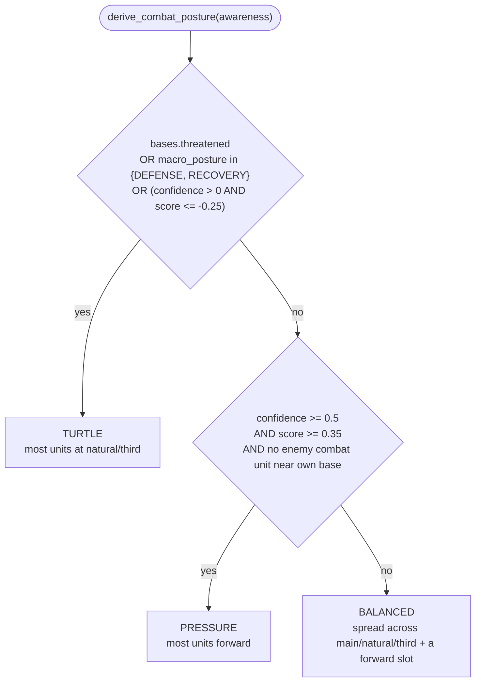
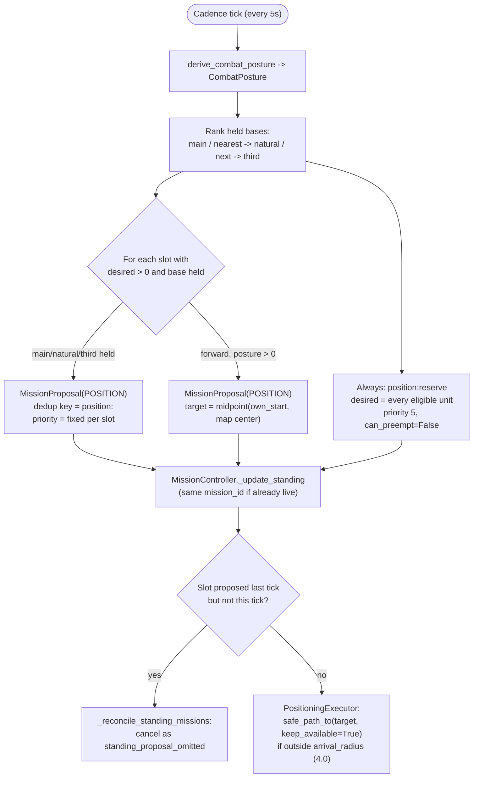

# Standing army disposition

`DispositionPlanner` (`bot/behavior/army/`) gives every otherwise-idle combat
unit a home. Without it, a unit released by a finished `SCOUT`/`HARASS`/
`DEFENSE` mission sits with no lease at all until some other planner happens
to want it -- invisible to "where is my army" logging and to the allocator's
priority ordering alike. It is the lowest-priority planner in
`BotRuntime._mission_planners` on purpose: every proposal it emits is a
fallback, freely preemptible by any of the five task-shaped planners in
[harass-and-defense-planners.md](harass-and-defense-planners.md) and
[base-model.md](base-model.md).

## Why `MissionMode.STANDING` exists

Every other planner's proposals are `MissionMode.FINITE`: admitted once, run
to completion/failure/cancellation, and a second proposal for the same
`deduplication_key` while one is live is rejected as a duplicate. That model
does not fit "the army should always have somewhere to stand" -- there is no
completion condition, and the desired shape changes continuously with
`CombatPosture`. `MissionMode.STANDING` proposals are instead re-declared by
their planner every cadence tick; a live standing mission has its
`Mission.proposal` replaced in place (`MissionController._update_standing`),
keeping the same `mission_id`, lease history, and running executor instance --
only `requirement`/`priority`/`target` change. A standing mission is torn down
only when its planner stops declaring that key at all in a tick where it
proposed something else (`MissionController._reconcile_standing_missions`) --
silence (cadence not ready) is not the same as omission.

## `CombatPosture` (`bot/behavior/army/combat_posture.py`)

A small, deterministic policy over signals Awareness already computes --
deliberately a different axis from the economic `MacroPosture`
(`bot.world.awareness.MacroPosture`): `MacroPosture` decides how risky
*spending* is; `CombatPosture` only decides where the *standing army* should
sit when nothing more urgent needs it.

## Standing slots (`disposition_config.py`, `disposition_planner.py`)

Each cadence tick (`proposal_cadence`, default 5s), `DispositionPlanner`:

1. Derives `CombatPosture` and looks up its `PostureDesired(main, natural,
   third, forward)` unit counts.
2. Ranks currently held bases via `awareness.bases`: the `is_main` base is
   `main`; the two nearest remaining held bases by distance from
   `map.own_start` are named `natural` and `third` (the project has no
   first-class natural/third concept -- this is a data-derived stand-in, not
   a hardcoded map fact). A base beyond that gets no named slot.
3. Emits one `MissionProposal(POSITION)` per slot whose desired count is `> 0`
   *and* whose base is currently held, plus always one `position:reserve`
   catch-all sized to every currently eligible unit
   (`max(1, eligible_unit_count)` -- no arbitrary ceiling).

Priorities are fixed **per slot**, not per posture -- how exposed `third` is
relative to `main` is a geography fact, so only the *desired count* per slot
changes with `CombatPosture`, never its priority:

| Slot | Priority | desired: TURTLE | desired: BALANCED | desired: PRESSURE |
| --- | --- | --- | --- | --- |
| `position:reserve` | 5 | catch-all | catch-all | catch-all |
| `position:main` | 12 | 2 | 2 | 1 |
| `position:natural` | 18 | 4 | 3 | 1 |
| `position:forward` | 25 | 0 (no slot) | 2 | 6 |
| `position:third` | 30 | 6 | 3 | 1 |

## `PositioningExecutor`

Never fails and never completes on its own -- a standing mission's lifecycle
is driven entirely by proposals/allocation, not executor outcomes. A unit
already within `arrival_radius` is left alone (idle is the correct state for
a standing responsibility); a unit that drifted out of tolerance gets
`safe_path_to` with `keep_available=True`, which leaves it in Ares'
`UnitRole.IDLE` rather than `MAP_CONTROL` -- a standing claim must stay
invisible to `available_for_mission` gating in every higher-priority planner
(see the `keep_available` docstring in `AresMissionCommands.safe_path_to`).
With zero assigned units (fully preempted) it simply does nothing that tick.

## Diagnostics: `BotRuntime._log_disposition`

Every tick, `BotRuntime` groups live missions by `deduplication_key`/`kind`
straight off the `MissionBoard` (not `MissionSnapshot`, which drops
`requirement.desired`) and emits `disposition.updated` with each standing
slot's desired/assigned counts, allocation by mission kind, and how many
combat-eligible units currently have no lease at all
(`allocator.owner_of(unit.tag) is None`). If that count stays non-zero for
`_UNASSIGNED_WARNING_AFTER` (15s), `disposition.unassigned_units_persisting`
fires with the offending tags -- this should not normally happen, since
`position:reserve` is sized to absorb every eligible unit. This is pure
diagnostics: ownership itself still lives only in `UnitAllocator`.

## Deliberately not built in this slice

- Hysteresis on `CombatPosture` itself (only `MacroPosture` has
  `posture_min_hold`/`greed_safe_after`/`defense_release_after` today) -- a
  posture flapping between BALANCED/PRESSURE every frame would just reshuffle
  standing slots with no combat benefit.
- Any positioning smarter than a fixed per-slot anchor point (no spreading
  units around the anchor, no facing/formation).
- Letting `CombatPosture` and `MacroPosture` share derivation logic --
  deliberately kept as two separate questions answered from the same
  underlying Awareness signals.
