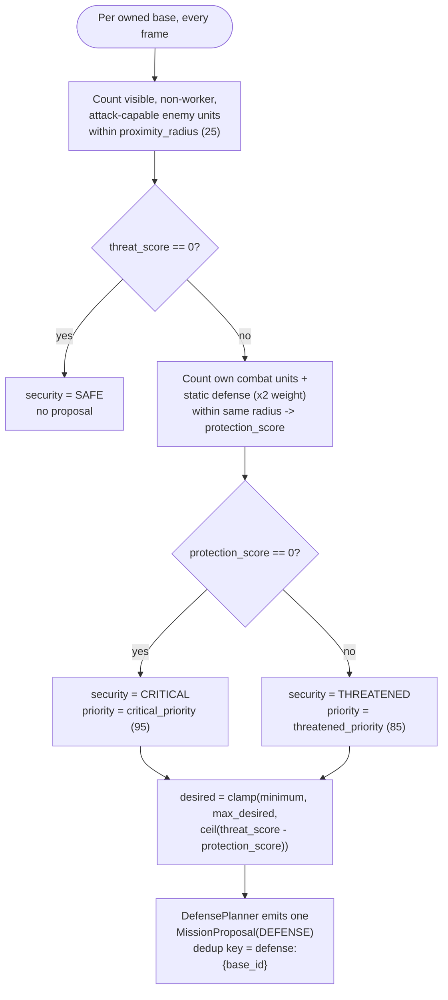

# Base model

Adds a per-base view of "what do I hold and how safe is it" so `DefensePlanner`
can react to each threatened base independently instead of treating the whole
army as defending one global `own_base` point. Follows the existing
Attention/Awareness split from [overview.md](overview.md): the base inventory
itself is a fact (`BaseSnapshot`, `attention`), the threat/protection reading
is a belief (`BaseAssessment`, `awareness`).

## `BaseSnapshot` (attention, `bot/world/attention/facts/base_facts.py`)

```python
BaseSnapshot(base_id, position, is_main, townhall: UnitSnapshot | None)
```

One entry per owned townhall (`TOWNHALL_TYPES` lives beside the snapshot in
`base_facts.py`). Exposed as `WorldFacts.bases`, a computed property rather
than a stored field: it is a pure, lossless transform of `own_structures` plus
`map.own_start`, so it stays correct whether `WorldFacts` was built by
`AttentionBuilder` or constructed by hand in a test, with no extra constructor
argument to keep in sync. `base_id` is `f"base:{townhall.tag}"`.

Before any townhall is observed (the first frame or two of a real game, or a
sparse test fixture) `bases` returns a single placeholder,
`base_id="own_base"` at `map.own_start`, `is_main=True`, `townhall=None` --
this is what `DefenseConfig`'s old fixed `target_key="own_base"` used
to hardcode, now just the natural empty case of the general rule.

## `BaseAssessment` / `BaseAwareness` (awareness, `bot/world/awareness/bases/`)

Mirrors the existing `bot/world/awareness/enemy/` split: `security.py`
holds the immutable state and `security_assessor.py` derives it. This is
where the scoring logic is expected to grow.

`BaseSecurityAssessor.update(world) -> BaseAwareness` scores each
`BaseSnapshot`, stateless for now (recomputed every frame, no memory):

- `threat_score`: count of visible, non-worker, attack-capable enemy units
  within `proximity_radius` (25, matching the old `DefenseConfig.
  detection_radius` default) of the base position.
- `protection_score`: count of own non-worker attack-capable units within the
  same radius, plus own static defense (`BUNKER`, `MISSILETURRET`,
  `PLANETARYFORTRESS`) weighted `x2`.
- `security`: `SAFE` (no threat), `CRITICAL` (threat present, zero
  protection), `THREATENED` (threat present, some protection).
- `nearest_threat_position`: closest qualifying enemy to the base, used as
  the mission's rally/engage point (same semantics as the old
  `DefensePlanner._closest_threat`).

`AwarenessSnapshot.bases: BaseAwareness` is populated by `AwarenessService.
update` alongside `enemy`/`relative_strength`/`threat`/`macro_posture`.



Protection only ever picks `CRITICAL` vs `THREATENED` (and sizes
`desired_units`) -- it never suppresses the proposal outright; see "Why
protection never suppresses a proposal" below.

### Why protection never suppresses a proposal

An earlier version of this slice made `THREATENED`/`CRITICAL` require
`protection_score < threat_score`, i.e. "don't propose if already enough
units are nearby." That broke `DefensePreemptionTests` and the runtime pilot
test: a Reaper already committed to a live `SCOUT` mission happened to be
sitting near the base when a Marine appeared, so it counted as "protection"
and the DEFENSE proposal was silently dropped -- the preemption path (defense
priority 95 stealing a lower-priority Reaper from an active Harass/Intel
mission, see [harass-and-defense-planners.md](harass-and-defense-planners.md))
never got a proposal to admit. `BaseSecurityAssessor` cannot know a nearby
unit is already leased elsewhere -- only `UnitAllocator` knows that, and it
runs after planners propose. So: `security` is `SAFE` only when
`threat_score` is `0`; any real threat always yields a proposal (matching the
pre-existing single-base behavior exactly), and `protection_score` only
picks `CRITICAL` vs `THREATENED` (priority) and sizes `desired_units`.

## `DefensePlanner`

Iterates `awareness.bases.threatened` (every `BaseAssessment` with
`needs_defense`) and emits one `MissionProposal` per base:

- `deduplication_key = f"defense:{base.base_id}"` -- was the fixed
  `"defense:own_base"`; now one live defense mission per base, so a two-front
  attack gets two independent missions instead of one mission reacting to
  whichever threat is geometrically closest to any structure.
- `priority`: `DefenseConfig.critical_priority` (95, was the old fixed
  `priority`) for `CRITICAL`, `threatened_priority` (85) otherwise -- an
  undefended base preempts harder than one that already has some defenders.
- `requirement.desired`: `clamp(minimum_units, max_desired_units, ceil(threat_score
  - protection_score))` -- scales with how outnumbered the base is, instead
  of the old fixed `desired_units=2`.
- `target`: `base.nearest_threat_position`, falling back to `base.position`.

The proposal cadence gate (`proposal_cadence`, default 5s) stays a single
scalar on the planner, not per-base -- all overdue bases get their proposals
in the same tick, so this only throttles how often the planner re-evaluates,
not fairness between bases.

`DefendBaseExecutor` is unchanged: it still attack-moves the assigned team at
the mission's `target` and completes when no matching threat remains within
`engagement_radius`. This slice is about *positioning defenders at the right
base*, not combat micro -- see the "not built" list below and
`_botdev/notebook/01_combat_micro.txt`.

## Deliberately not built in this slice

- Any combat micro (stutter-step, retreat-when-losing). `DefendBaseExecutor`
  is untouched on purpose.
- Hysteresis on `BaseSecurityLevel` (a base flapping between `SAFE` and
  `THREATENED` as a scout unit wanders in and out of `proximity_radius`).
  `MacroPosture` already has this pattern (`defense_release_after`,
  `posture_min_hold`) if it's needed later.
- Air vs ground defender selection. `DefenseAssessor` now reports the
  split (`ThreatenedBase.air_threats`/`ground_threats`) and
  `UnitRequirement.type_desirability` can express the preference, but the
  planner still asks for every defender type equally.
  `DefenseConfig.unit_types` is
  still one flat set for all bases regardless of whether the threat is
  ground or air.
- Combat-sim-based scoring (`mediator.can_win_fight`) instead of raw unit
  counts for `threat_score`/`protection_score`.
- Worker-rush detection -- still excluded from `threat_score` by the
  `not enemy.is_worker` filter, same as before this slice.

## Deferred decisions

- Whether `proposal_cadence` should become per-base once a real game has
  enough simultaneous multi-base pressure for a shared cadence to visibly
  delay one base behind another.
- Whether `BaseAssessment` should track "already has a live DEFENSE mission"
  so `DefensePlanner` can taper `desired_units` for a base already being
  reinforced instead of re-asking the full gap every cadence tick.
