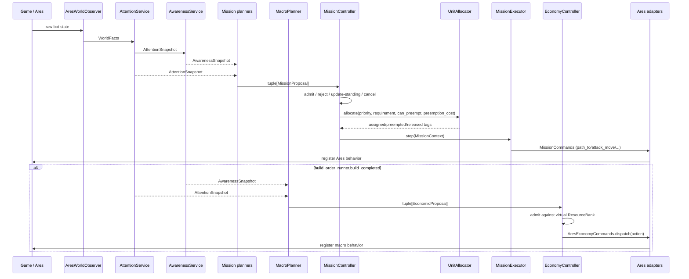
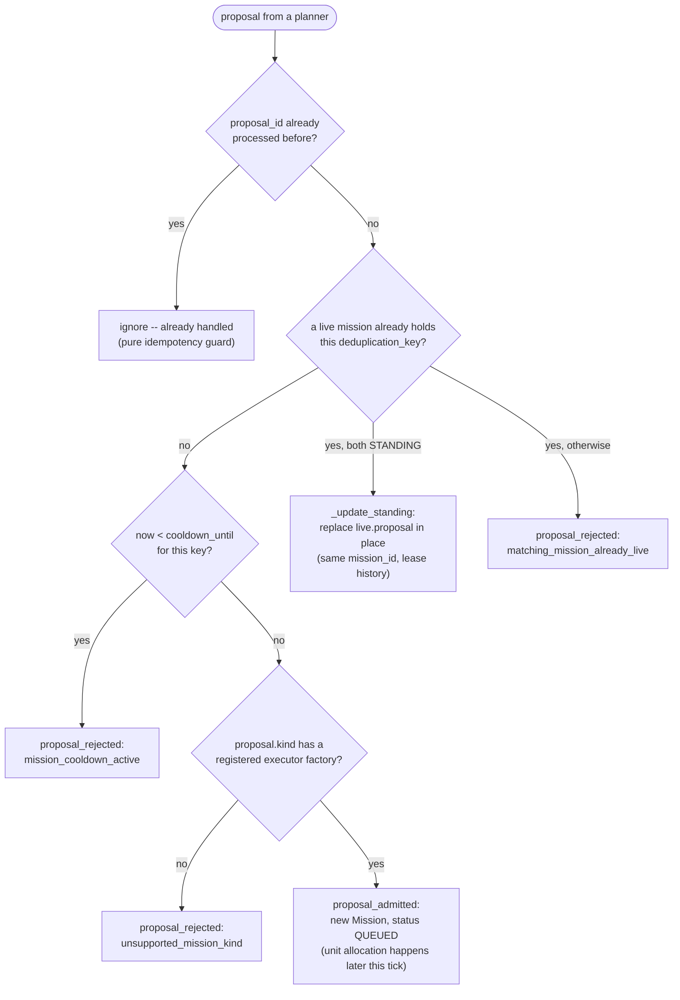

# Module contracts

## Dependency rules

1. Attention contains only selected state observable in the current frame.
2. Attention exposes Ares' own visible/memory distinction per enemy unit
   (`UnitSnapshot.visible_now`) instead of discarding memory units; it never leaks
   mutable Ares objects. Awareness (`EnemyKnowledge`) owns persistent first/last-seen
   sighting history on top of that, keeping a sighting only as long as Ares itself
   keeps reporting the tag -- once Ares drops it (confirmed destroyed, or its own
   out-of-vision memory expired), the sighting is dropped too, instead of being kept
   forever.
3. Awareness describes the world. Controller state, leases, cooldowns, and mission
   status never enter Awareness.
4. A behavior assessment reads Attention and Awareness only -- never mission
   state, leases, or `bot.engine` -- and returns a plain reading.
5. A planner reads Attention and Awareness (through its own assessment) and
   returns immutable proposals. A proposal cannot claim a unit or start
   itself.
6. `MissionController` alone admits/rejects proposals and changes mission status.
7. `UnitAllocator` alone mutates the bidirectional unit-to-mission leases.
   `SquadController` records persistent membership and allocation preferences;
   it is not a second ownership authority and never issues commands.
8. Executors cannot import Ares or infrastructure. They issue requests via
   `MissionCommands` (`path_to`, `safe_path_to`, `attack_move`, `release`) and
   every result contains a non-empty reason.
9. Only the Ares adapter assigns Ares roles or registers Ares behaviors. Each
   command port hardcodes one role regardless of the calling mission's kind:
   `path_to` assigns `UnitRole.SCOUTING`, `safe_path_to` assigns
   `UnitRole.MAP_CONTROL`, `attack_move` assigns `UnitRole.ATTACKING`, and
   `release` restores `GATHERING`/`IDLE`.

## Mission kinds and priorities

`MissionKind` (`SCOUT`, `HARASS`, `AIR_HARASS`, `DEFENSE`, `MAP_CONTROL`,
`HOLD_RALLY`, `POSITION`) is the shared mission vocabulary. `POSITION` remains
available for compatible unit-based callers; the squad pilot uses
`HOLD_RALLY`. Default priorities set the
intended arbitration order under `UnitAllocator`'s preemption margin (10):

| Kind | Priority | `can_preempt` |
| --- | --- | --- |
| `HOLD_RALLY` (`main_army`) | 20 | yes |
| `MAP_CONTROL` | 40 | yes |
| `HARASS` | 60 | yes |
| `AIR_HARASS` | 62 | yes |
| `SCOUT` | 65 | no |
| `DEFENSE` (threatened base) | 85 | yes |
| `DEFENSE` (critical base) | 95 | yes |

`HOLD_RALLY` (`StandingPlanner`) is kept comfortably below `MAP_CONTROL` and
`HARASS`/`AIR_HARASS`/`SCOUT` so a standing slot is always freely preemptible
by any of them. `SCOUT` is the only proposal that cannot preempt another
mission itself -- every other kind
gained `can_preempt=True` once `StandingPlanner`'s standing slots started
holding most otherwise-idle units, so an opportunistic mission needs it just
to pull a unit out of standing duty; priority order among the preemptible
kinds still decides who wins a contested unit. Map Control is described in
[map-control.md](map-control.md), the standing default-owner behavior in
[standing-behavior.md](standing-behavior.md), and the opportunistic/defense
missions in [harass-and-defense-planners.md](harass-and-defense-planners.md).

## Frame lifecycle

```text
observe current Ares state (AresWorldObserver)
build AttentionSnapshot (AttentionService)
update AwarenessSnapshot and freshness (AwarenessService)
collect mission proposals from every behavior planner (Intel/ReaperHarass/
    BansheeHarass/Defense/MapControl/Standing)
MissionController.tick:
    fail missions that lost their whole team
    admit/reject/update-standing each proposal (cooldown, duplicate, unsupported kind)
    reconcile standing missions a planner stopped declaring this tick
    bind capability-only temporary requests to a compatible squad when possible
    sort live missions by priority, allocate or preempt after the commitment window
    step each active mission's executor through the Ares command port
if build_order_runner.build_completed:
    MacroPlanner.propose -> EconomyController.tick against a virtual bank
    dispatch admitted economic actions through AresEconomyCommands
log build order progress, world/knowledge snapshots, and disposition state
```

`PathUnitToTarget` and `Mining` are registered every frame because Ares executes and
clears registered behaviors in `_after_step`.



### `MissionController._consider`: admitting one proposal

The "admit / reject / update-standing" step above is, per proposal, this
decision (run once per proposal per frame, before any allocation happens):



A rejected or ignored proposal is simply not created as a `Mission` -- the
planner will just propose again (subject to its own cadence) next tick if the
condition that produced it still holds. `cooldown_until` is only set when a
mission *finishes* (`_finish`, using `proposal.cooldown_seconds`), so a
freshly rejected duplicate does not itself start a new cooldown.

## Causal logging

Local event logs are JSONL files with one `{event, component, game_time, data}`
record per line. Transition events include a reason and their correlation keys
where applicable (`proposal_id`, `mission_id`, `deduplication_key`, or
`action_id`). The current catalog is:

- Application lifecycle: `game.started`, `game.ended`.
- Opening progress: `macro.build_order_progress`.
- Periodic/changed observation: `observation.updated` contains resources,
  supply, economy/harvester facts, and visible entity counts.
- Periodic/changed knowledge: `knowledge.updated` contains macro posture,
  relative strength, threat counts, enemy sightings, and the active-mission
  count. It is emitted alongside `observation.updated`; both share the same
  change signature and ten-second heartbeat. `attention.world_state`,
  `awareness.updated`, and `attention.snapshot` are retired legacy events that
  the standalone viewer can still read.
- Mission proposals: `proposal_created`, `proposal_admitted`,
  `proposal_rejected`.
- Mission lifecycle: `mission_queued`, `mission_started`, `mission_blocked`,
  `mission_completed`, `mission_failed`, `mission_cancelled`.
- Unit leases: `units_assigned`, `units_reassigned`, `units_released`.
- Economic proposals: `economic_proposal_created`,
  `economic_proposal_deferred`, `economic_proposal_rejected`.
- Economic actions: `economic_action_admitted`, `economic_action_pending`,
  `economic_action_dispatched`, `economic_action_confirmed`,
  `economic_action_failed`, `economic_action_timed_out`.
- Invalid economic feedback: `economic_feedback_rejected`.
- Standing army: `standing.updated` (posture, standing slot desired/assigned
  counts, per-kind allocation, unassigned eligible unit count) and
  `standing.unassigned_units_persisting` when eligible combat units have gone
  without any mission for `_UNASSIGNED_WARNING_AFTER` (15s) -- see
  [standing-behavior.md](standing-behavior.md).
- Behavior lifecycle (emitted by each behavior through `BehaviorLog`, with
  the behavior's own component name, e.g. `behavior.harass.banshee`):
  `behavior.assessed` (the assessment's `log_fields()` plus the
  propose/withhold decision), `behavior.proposed` (the plan), and
  `behavior.state_changed` (an executor's tactical phase, e.g. the Banshee
  raid entering STRIKE, or the standing army's anchor moving).

Local runs opt in with `--bot-log events` and write under `_botdev/logs/`.
Ladder runs retain `NullBotLogger` and do not open files. The standalone
`scripts/log_viewer.html` keeps mission and economic histories separate from the
event timeline and derives its Observation, Knowledge, and Economy views
exclusively from the structured events above. Component names mirror the current
package layout (`app.runtime`, `world.attention`, `world.awareness`,
`behavior.standing`, `behavior.harass.banshee`, `engine.missions.controller`, and
`engine.economy.controller`); the viewer's `COMPONENT_ALIASES` table maps
older component strings (`application.runtime`, `ego.mission_controller`,
`economy.controller`, `behavior.army.disposition`) onto the current names -- and, for a log old enough that
every event still shared the single `application.runtime` component, further
splits it into `world.observation`/`world.knowledge` pseudo-components purely
by event name -- so pre-restructure logs still group correctly in the
Observation/Knowledge/Economy views.

## Mission loss and cleanup

- After allocator synchronization, a started mission that has lost its entire
  assigned team fails with `all_assigned_units_lost`, before replacement allocation.
- Partial losses allow replenishment. Below the allocation minimum, the mission
  stays blocked with its surviving leases and does not step its executor. Once
  replenished, it resumes the same executor and retains its original start time.
- Total preemption fails the donor with `all_assigned_units_preempted`. The donor
  cannot restart if the recipient releases the units later in the same frame.
  Partial preemption updates the donor's assignments before it is reconsidered.
- Transferred units have their execution role reset through the command port using
  the new lease owner, before the recipient executor runs. Terminal cleanup restores
  surviving workers to GATHERING and other units to IDLE through the Ares adapter.
- Timeout remains cancellation, measured from admission, including blocked time.
  Executor construction and step exceptions fail with the exception type and message
  in `executor_error`. Terminal missions release leases and discard their executor.
