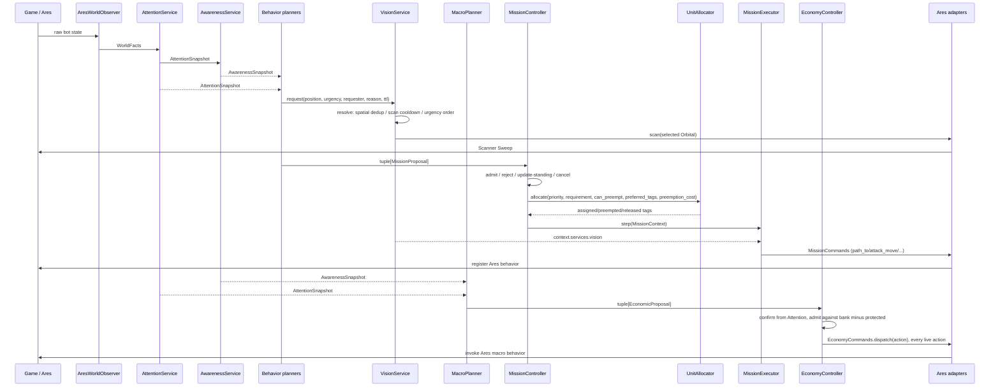
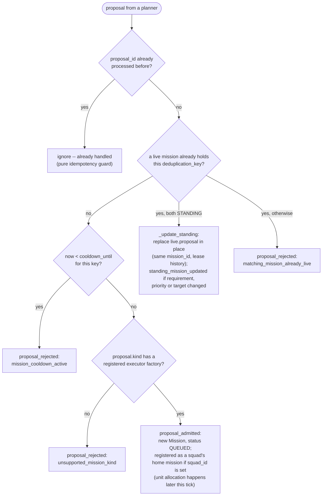

# Module contracts

## Dependency rules

1. Attention contains only selected state observable in the current frame.
2. Attention exposes Ares' own visible/memory distinction per enemy unit
   (`UnitSnapshot.visible_now`) instead of discarding memory units; it never leaks
   mutable Ares objects. A scouted enemy structure in fog arrives as a game
   snapshot rather than an Ares memory unit, and is flagged `visible_now=False`
   the same way. Awareness (`EnemyKnowledge`) owns persistent first/last-seen
   sighting history on top of that, keeping a sighting only as long as Ares itself
   keeps reporting the tag -- once Ares drops it (confirmed destroyed, or its own
   out-of-vision memory expired), the sighting is dropped too, instead of being kept
   forever. Enemy force clusters, derived from those sightings, inherit that
   lifetime rather than inventing a longer one.
3. Awareness describes the world. Controller state, leases, cooldowns, and mission
   status never enter Awareness. It performs no I/O either: a stable belief change
   travels as `AwarenessSnapshot.belief_changes`, and `FrameProcessor` logs it.
4. A behavior assessment reads Attention and Awareness only -- never mission
   state, leases, `bot.engine` or `bot.app` -- and returns a plain reading.
   `tests/test_behavior_architecture.py` checks the imports.
5. A planner reads Attention and Awareness (through its own assessment) and
   returns immutable proposals. A proposal cannot claim a unit or start
   itself. A planner may also ask a shared service for an outcome (rule 12).
6. `MissionController` alone admits/rejects proposals and changes mission status.
   It never names a `MissionKind` or a behavior: it looks each kind up in the
   executor table that `bot/app/mission_registry.py` hands it.
7. `UnitAllocator` alone mutates the bidirectional unit-to-mission leases.
   `SquadController` records persistent membership and allocation preferences;
   it is not a second ownership authority and never issues commands.
8. Executors cannot import Ares or adapters. They issue requests via
   `MissionCommands` (`path_to`, `safe_path_to`, `attack_move`, `attack_unit`,
   `use_ability`, `release`), may use `context.services`, and every result
   contains a non-empty reason. `AresMissionCommands` refuses any command for a
   unit the calling mission does not lease (`UnauthorizedUnitCommand`).
9. Only the Ares adapters assign Ares roles or register Ares behaviors. Each
   command hardcodes its role regardless of the calling mission's kind:

   | Command | Ares behavior | Role left behind |
   | --- | --- | --- |
   | `path_to` | `KeepUnitSafe` + `PathUnitToTarget` (climber grid for Reapers) | `SCOUTING`; a worker also leaves its mineral line |
   | `safe_path_to` | `MoveToSafeTarget` (climber grid for Reapers, ground grid otherwise) | `MAP_CONTROL`, or `IDLE` with `keep_available=True` |
   | `attack_move` | `AMove` | `ATTACKING` |
   | `attack_unit` | `ReaperGrenade` (Reapers only) + `StutterUnitForward` | `HARASSING` |
   | `use_ability` | `UseAbility` | unchanged |
   | `release` | -- | `GATHERING` for workers, `IDLE` otherwise |

   Attention reports every unit whose role is neither `GATHERING` nor `IDLE` as
   `available_for_mission=False`, which is why a parked standing unit keeps
   `IDLE`.
10. `bot.behavior` and `bot.macro` never import each other. A behavior may
    read what exists (unit counts, upgrade progress) through Attention but
    never proposes spend; macro never names a unit tag, mission, squad or
    lease. Neither engine (`bot.engine.missions`, `bot.engine.economy`)
    imports either domain. `tests/test_macro_architecture.py` enforces this.
11. `EconomyController` alone admits, reserves and dispatches economic
    actions, through the `EconomyCommands` port. The SCV that lays a
    structure is chosen by the Ares behavior the adapter invokes; Ares marks
    it `UnitRole.BUILDING`, which Attention reports as unavailable for
    missions. That is builder selection, never a mission lease.
12. Shared capabilities live in `bot/engine/services` and reach behaviors as
    `BehaviorServices` (planners at construction, executors as
    `context.services`). A behavior asks for an outcome -- vision at a
    position, with an urgency and a TTL -- and never names the provider; only
    the adapter (`AresVisionCommands`) casts anything. `bot.engine` never
    imports `bot.behavior`.

## Mission kinds and priorities

`MissionKind` (`SCOUT`, `HARASS`, `AIR_HARASS`, `DEFENSE`, `MAP_CONTROL`,
`HOLD_RALLY`, `POSITION`) is the shared mission vocabulary. `POSITION` remains
available for compatible unit-based callers (it runs the standing executor);
the squad pilot uses `HOLD_RALLY`. Default priorities set the
intended arbitration order under `UnitAllocator`'s preemption margin (10):

| Kind | Priority | `can_preempt` |
| --- | --- | --- |
| `HOLD_RALLY` (`main_army`) | 20 | yes |
| `MAP_CONTROL` | 40 | yes |
| `HARASS` | 60 | yes |
| `AIR_HARASS` | 62 | yes |
| `SCOUT` | 65 | no |
| `DEFENSE` (threatened base) | 85 | yes |
| `DEFENSE` (critical base) | 95 | yes |

`HOLD_RALLY` (`StandingPlanner`) is kept comfortably below `MAP_CONTROL` and
`HARASS`/`AIR_HARASS`/`SCOUT` so a standing slot is always freely preemptible
by any of them. `SCOUT` is the only proposal that cannot preempt another
mission itself -- every other kind
gained `can_preempt=True` once `StandingPlanner`'s standing slots started
holding most otherwise-idle units, so an opportunistic mission needs it just
to pull a unit out of standing duty; priority order among the preemptible
kinds still decides who wins a contested unit. Map Control is described in
[map-control.md](map-control.md), the standing default-owner behavior in
[standing-behavior.md](standing-behavior.md), and the opportunistic/defense
missions in [harass-and-defense-planners.md](harass-and-defense-planners.md).

## Frame lifecycle

`BotRuntime.on_start` has `OpeningSelector` pick and announce the opening (see
[opening.md](opening.md)) and logs `game.started`. Then, every frame,
`BotRuntime.on_step` hands the bot to `FrameProcessor.process`:

```text
observe current Ares state (AresWorldObserver -> WorldFacts)
build AttentionSnapshot (AttentionService)
update AwarenessSnapshot (AwarenessService): sightings, location freshness,
    enemy base memory and assessment, enemy force clusters, economy/army
    beliefs, macro posture, base security, spatial field, territory
    (on its own cadence, read by nobody yet)
log stable belief changes (awareness.belief_changed)
VisionService.begin_frame: expire requests, re-check visibility, read Orbital energy
ScoutingVisionRequester.tick (may request vision)
collect mission proposals from every behavior planner (Intel/ReaperHarass/
    BansheeHarass/Defense/MapControl/Standing); DefensePlanner may request vision
VisionService.resolve: at most one provider attempt (Scanner Sweep)
register baseline Ares behaviors (Mining, DepotToggle)
MissionController.tick:
    sync allocator leases and squad membership with living units
    fail started missions that lost their whole team (unless minimum is 0)
    admit/reject/update-standing each proposal (cooldown, duplicate, unsupported kind)
    reconcile standing missions a planner stopped declaring this tick
    for each live mission, highest priority first:
        cancel on timeout (FINITE only) or an objective observed before start
        bind a DEFENSE request to a compatible squad when possible
        shrink a home squad's request while its members are away
        allocate or preempt (commitment window, margin, utility, preemption cost)
        block, or step the executor through the Ares command port
MacroPlanner.propose (during the opening too; it only ever spends a surplus)
EconomyController.step:
    confirm live actions from Attention, apply last frame's dispatch feedback
    admit against the observed bank minus the opening's protected cost
    dispatch every live action through the EconomyCommands port
MacroDiagnostics.report (macro.status, macro.idle_producer_unexplained)
FrameTelemetry.report: log build order progress, enemy intel and model, world
    belief, territory, knowledge/observation snapshots, and standing ownership
```

Ares executes and clears registered behaviors in `_after_step`, so `Mining`,
`DepotToggle` and every mission command are registered again every frame.



### `MissionController._consider`: admitting one proposal

The "admit / reject / update-standing" step above is, per proposal, this
decision (run once per proposal per frame, before any allocation happens):



A rejected or ignored proposal is simply not created as a `Mission` -- the
planner will just propose again (subject to its own cadence) next tick if the
condition that produced it still holds. `cooldown_until` is only set when a
mission *finishes* (`_finish`, using `proposal.cooldown_seconds`), so a
freshly rejected duplicate does not itself start a new cooldown.

## Causal logging

Local event logs are JSONL files with one `{event, component, game_time, data}`
record per line. Transition events include a reason and their correlation keys
where applicable (`proposal_id`, `mission_id`, `deduplication_key`,
`action_id`, `squad_id`, or `request_id`). The current catalog is:

- Application lifecycle: `game.started`, `game.ended`.
- Opening progress: `macro.build_order_progress`.
- Periodic/changed observation: `observation.updated` contains resources,
  supply, economy/harvester facts, and visible entity counts.
- Periodic/changed knowledge: `knowledge.updated` contains macro posture,
  relative strength, threat counts, enemy sightings, and the active-mission
  count. It is emitted alongside `observation.updated`; both share the same
  change signature and ten-second heartbeat. `attention.world_state`,
  `awareness.updated`, and `attention.snapshot` are retired legacy events that
  the standalone viewer can still read.
- Enemy intel: `knowledge.enemy_intel`, on any change to the known enemy
  structures or confirmed locations.
- Enemy model: `knowledge.enemy_model` (confirmed enemy bases with economic
  value, workers, air/ground defense and their confidences; every force
  cluster with strength and confidence; the main force), on a change of
  confirmed bases or main force plus a ten-second heartbeat.
- Beliefs: `awareness.world_belief` (economy and army beliefs with raw vs
  stable state and confidence, on change plus a ten-second heartbeat) and
  `awareness.belief_changed` (one per stable state transition).
- Territory: `knowledge.territory` (samples and regions counted per control,
  mean confidence, frontline size with a few representative points, and
  control, confidence and ground security -- plus the layered model's
  security, kept for comparison -- for every held base and every region
  holding an expansion slot), when one of those regions changes control or security step, a base
  changes region, or the frontline appears or disappears, plus a ten-second
  heartbeat. See [territory.md](territory.md).
- Spatial cost: `spatial.perf` and `territory.perf`, each on a ten-second
  heartbeat, with what the last update cost and how often each cached
  component has been rebuilt.
- Mission proposals: `proposal_created`, `proposal_admitted`,
  `proposal_rejected`.
- Mission lifecycle: `mission_queued`, `mission_started`, `mission_blocked`,
  `mission_completed`, `mission_failed`, `mission_cancelled`, and
  `standing_mission_updated` when a live standing mission's requirement,
  priority or target changes in place.
- Unit leases: `units_assigned`, `units_reassigned`, `units_released`.
- Squads: `squad_created`, `squad_membership_changed`,
  `squad_mission_changed`, `squad_preempted`, `squad_returned_home` -- see
  [squads.md](squads.md).
- Active vision: `vision.request_created`, `vision.request_deduplicated`,
  `vision.request_selected`, `vision.request_satisfied`,
  `vision.request_deferred`, `vision.provider_selected`,
  `vision.scan_executed` -- see [vision.md](vision.md).
- Economic proposals: `economic_proposal_created`,
  `economic_proposal_deferred`, `economic_proposal_rejected`.
- Economic actions: `economic_action_admitted`, `economic_action_pending`,
  `economic_action_dispatched`, `economic_action_confirmed`,
  `economic_action_failed`, `economic_action_timed_out`.
- Invalid economic feedback: `economic_feedback_rejected`.
- Macro diagnostics (emitted by `bot.macro.MacroDiagnostics` once the economy
  controller has run): `macro.status` on change plus a ten-second heartbeat,
  and `macro.idle_producer_unexplained`.
- Standing army: `standing.updated` (combat posture, standing slot
  desired/assigned counts, per-kind allocation, every squad's members and
  missions, unassigned eligible unit count) and
  `standing.unassigned_units_persisting` when eligible combat units have gone
  without any mission for `_UNASSIGNED_WARNING_AFTER` (15s) -- see
  [standing-behavior.md](standing-behavior.md).
- Behavior lifecycle (emitted by each behavior through `BehaviorLog`, with
  the behavior's own component name, e.g. `behavior.harass.banshee`):
  `behavior.assessed` (the assessment's `log_fields()` plus the
  propose/withhold decision), `behavior.proposed` (the plan), and
  `behavior.state_changed` (an executor's tactical phase, e.g. the Banshee
  raid entering STRIKE, the map-control patrol retreating, a defense Tank
  sieging, or the standing army's anchor moving).

Component names mirror the current package layout:

| Component | Events |
| --- | --- |
| `app.runtime` | game lifecycle, build order progress |
| `world.attention` | `observation.updated` |
| `world.awareness` | `knowledge.updated` |
| `world.awareness.enemy` | `knowledge.enemy_intel`, `knowledge.enemy_model` |
| `world.awareness.belief` | `awareness.world_belief`, `awareness.belief_changed` |
| `world.awareness.spatial` | `spatial.perf` |
| `world.awareness.territory` | `knowledge.territory`, `territory.perf` |
| `engine.missions.controller` | proposals, mission lifecycle, unit leases |
| `engine.squads.controller` | squad events |
| `engine.services.vision` | vision requests |
| `engine.services.vision.scan_provider` | `vision.provider_selected`, `vision.scan_executed` |
| `engine.economy.controller` | economic proposals, actions, feedback |
| `macro.planner` | macro diagnostics |
| `behavior.standing` | `standing.*` and the standing behavior's lifecycle |
| `behavior.harass.banshee`, `behavior.harass.reaper`, `behavior.defense`, `behavior.map_control`, `behavior.scouting`, `behavior.scouting.vision` | behavior lifecycle |

Local runs opt in with `--bot-log events` and write under `_botdev/logs/`.
Ladder runs retain `NullBotLogger` and do not open files. The standalone
`scripts/log_viewer.html` keeps mission and economic histories separate from the
event timeline and derives its Observation, Knowledge, and Economy views
exclusively from the structured events above. Its `COMPONENT_ALIASES` table
maps older component strings (`application.runtime`, `ego.mission_controller`,
`economy.controller`, `behavior.army.disposition`, `behavior.macro.planner`)
onto the current names -- and, for a log old enough that every event still
shared the single `application.runtime` component, further splits it into
`world.observation`/`world.knowledge` pseudo-components purely by event name --
so pre-restructure logs still group correctly in the Observation/Knowledge/Economy
views.

## Mission loss and cleanup

- After allocator synchronization, a started mission that has lost its entire
  assigned team fails with `all_assigned_units_lost`, before replacement allocation.
  A requirement with `minimum=0` -- every squad-backed standing mission -- is
  exempt: holding zero units is idle, not failed.
- Partial losses allow replenishment. Below the allocation minimum, the mission
  stays blocked with its surviving leases and does not step its executor. Once
  replenished, it resumes the same executor and retains its original start time.
- Total preemption fails the donor with `all_assigned_units_preempted` (again
  unless its minimum is 0). The donor cannot restart if the recipient releases the
  units later in the same frame. Partial preemption updates the donor's
  assignments before it is reconsidered.
- A shrunk `desired`, or a unit that no longer matches the requirement's
  identity, releases the excess leases at once (`requirement_desired_reduced`).
- Transferred units have their execution role reset through the command port using
  the new lease owner, before the recipient executor runs. Terminal cleanup restores
  surviving workers to GATHERING and other units to IDLE through the Ares adapter.
- Cancellation reasons: `mission_timeout` (measured from admission, including
  blocked time; `STANDING` missions never time out),
  `objective_satisfied_before_mission_started` (the target location was
  observed after admission but before the mission started), and
  `standing_proposal_omitted`. Executor construction and step exceptions fail
  with the exception type and message in `executor_error`. Terminal missions
  release leases, discard their executor, and start the key's cooldown.
