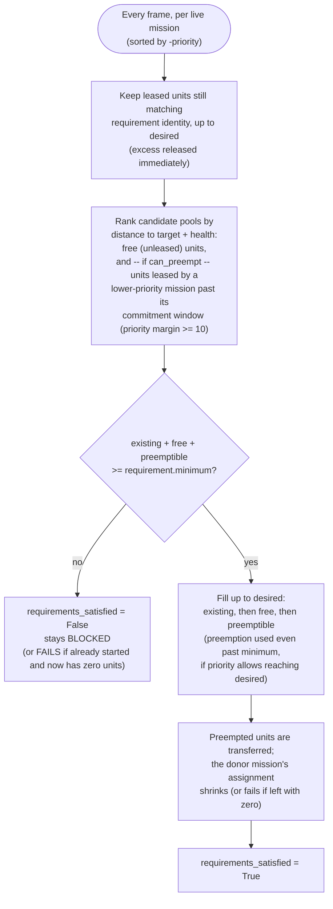
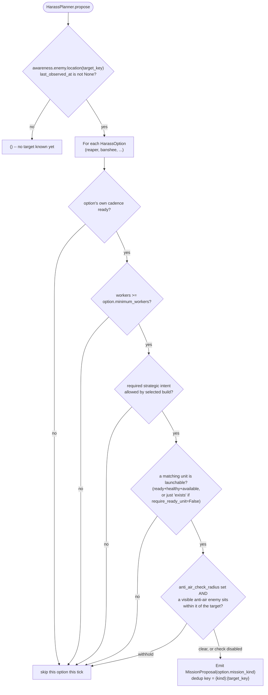

# Harass and Defense planners

This slice keeps each planner and executor together under `bot/behavior/` and
adds the second and third mission planners after
[scout-pilot-migration.md](scout-pilot-migration.md)'s `IntelPlanner`.

## Directory layout

```text
bot/behavior/
  scouting/               -> IntelPlanner / ScoutExecutor / config
  harass/                 -> HarassPlanner (options: reaper, banshee) / executors / config
  defense/                -> DefensePlanner / DefendBaseExecutor / config
  map_control/            -> MapControlPlanner / MapControlExecutor / config
  army/                   -> DispositionPlanner / PositioningExecutor / config (see army-disposition.md)
  macro/                  -> MacroPlanner / economic goals and config

bot/engine/missions/      -> controller, board, allocator, models, execution contracts
bot/app/mission_registry.py -> concrete executor wiring
```

Each executor is named after the concrete action it performs, not its planner, per
the project's rule against generic `<Kind>Executor` classes. Each behavior package
re-exports its public planner, executor, and configuration names.

`MissionKind` gained `HARASS`, `AIR_HARASS`, and `DEFENSE` in
`bot/engine/missions/models.py`; it stays the shared vocabulary in the mission
engine, alongside
`MissionProposal`/`Mission`/`MissionController`.
`BotRuntime` now holds a tuple of mission planners and concatenates their proposals
every frame instead of calling a single planner by name, so wiring in a future
planner does not require touching the admission call site.

## Arbitration: how a unit ends up on one mission and not another

Every planner only proposes; `MissionController` sorts live missions by
`-priority` each tick and asks `UnitAllocator.allocate` for units in that
order. A proposal never steals a unit directly -- only the allocator decides,
per mission, whether a candidate unit is free, already leased, or
preemptible.



A donor that loses its entire team this way fails with
`all_assigned_units_preempted`; a partial loss just updates its assignment on
the next tick. Note that preemption is not gated on the recipient being below
its *minimum* -- a mission already meeting its minimum will still preempt
further units from a lower-priority mission to climb toward its *desired*
count, as long as the priority margin and the donor's `commitment_seconds`
protection window both allow it.

`SCOUT` (65) is the only task-shaped mission with `can_preempt=False` --
scouting never steals a unit already committed elsewhere. Every other
task-shaped kind now can preempt (`HARASS`/`AIR_HARASS` at 60/62,
`MAP_CONTROL` at 40, `DEFENSE` at 85/95): once `DispositionPlanner`'s standing
`POSITION` slots (priority 5-30, see [army-disposition.md](army-disposition.md))
started absorbing most otherwise-idle combat units, every opportunistic
mission needed `can_preempt=True` just to pull a unit out of standing duty --
their own priority ordering among each other (`DEFENSE` > `SCOUT`/`AIR_HARASS`
/`HARASS` > `MAP_CONTROL`) still decides who wins when two of them want the
same unit at the same time. `SCOUT` keeps `can_preempt=False`; it remains a
unit-based request and never steals a committed squad member. See
[contracts.md](contracts.md) for the full priority table and
`tests/test_mission_arbitration.py` for the concrete preemption sequence.

## New command port

Neither harass nor defense can be expressed with `path_to` alone: both need the
assigned units to fight, not just arrive. `MissionCommands` exposes `attack_move`
for positional pressure and `attack_unit` for focused fire. The Reaper-specific
adapter translates focused fire into `ReaperGrenade` plus aggressive
`StutterUnitForward`, and assigns `UnitRole.HARASSING`.

`MissionCommands` later gained `use_ability` for the cloaked-Banshee raid
below -- an ability cast with no positional order attached, so unlike
`attack_move` it does not reassign a `UnitRole`.

## HarassPlanner

A single planner now calls every configured raid: `HarassPlanner.propose`
loops over `HarassPlannerConfig.options`, a tuple of `HarassOption` (one raid
recipe each -- unit types, `MissionKind`, priority, thresholds), gates and
rate-limits each independently with its own `ProposalCadence`, and can emit
more than one live proposal per tick -- e.g. a Reaper harassing while a
Banshee raid is also in flight, each with its own mission kind and dedup key.
There is no more separate `BansheeHarassPlanner` class; "reaper" and
"banshee" are just the two default `HarassOption`s
(`default_harass_options()`), read from `HarassPlannerConfig.options`.



| Option | Mission kind | Priority | min workers | ready-unit required | anti-air check |
| --- | --- | --- | --- | --- | --- |
| `reaper` | `HARASS` | 60 | 16 | yes (only ever 1-2 Reapers; never steal one mid-scout) | none -- tolerates local ground defenders |
| `banshee` | `AIR_HARASS` | 62 | 12 | no (Banshees are numerous; the allocator's own requirement still filters at assignment time) | compatible build intent; initial launch withholds on visible anti-air within 15 |

Both options read `awareness.enemy.location(target_key)` (default
`"enemy_natural"`) -- harass only follows up on a location `IntelPlanner` (or
a future scout) has already found; it never guesses a target. Both are
`can_preempt=True` (see "Arbitration" above) with dedup keys
`harass:<target_key>` / `air_harass:<target_key>`, so a Reaper raid and a
Banshee raid can be live at the same time without colliding.

`WorkerLineHarassExecutor` (Reaper) attack-moves into the target, focuses the
visible worker with the lowest health, and tolerates local defenders. At 40%
health it latches into retreat, follows a safe path to the own main, and
completes only after reaching within `retreat_arrival_radius` (10).

`CloakedBansheeHarassExecutor` (Banshee, for the `BansheeCloak` opening, see
[opening.md](opening.md)) attack-moves into the target and casts
`AbilityId.BEHAVIOR_CLOAKON_BANSHEE` (via `MissionCommands.use_ability`,
`AresMissionCommands` wrapping Ares's `UseAbility` behavior) every step
rather than tracking on/off state locally: `UseAbility` no-ops once the
ability is not in `unit.abilities`, which is true both before Cloaking Field
research finishes and once already cloaked, so re-issuing it is always safe.
Build compatibility is kept outside the planner behind the small
`StrategicIntent` interface. The mission is standing and squad-backed:
visible anti-air or low health latches a retreat to a safe base, recovery
returns to the same mission, and defense preemption leaves the executor
waiting for the same members instead of failing.

Deliberately not built here either: no detector-awareness (a defender that
can only detect, not attack air -- e.g. a lone Observer -- does not trigger
disengage), and no energy-aware cloak scheduling (cloak is cast blindly every
step; it simply stops taking effect once energy runs out).

## DefensePlanner

**Updated by [base-model.md](base-model.md):** proposes one `MissionProposal`
(`MissionKind.DEFENSE`) per currently threatened base, reading
`awareness.bases` (`BaseAwareness`, one `BaseAssessment` per base the bot
holds) instead of scanning all enemy units against a single `own_base`
anchor. See that doc for `BaseSnapshot`/`BaseAssessment`, why protection
never fully suppresses a proposal, and the dedup key change
(`defense:own_base` fixed -> `defense:{base.base_id}` per base). The
conditions that gate a proposal at all are unchanged: a currently visible,
non-worker, attack-capable enemy unit within `proximity_radius` (25, same
default as the old `detection_radius`) of the base.

Priority is now `critical_priority` (95, undefended base) or
`threatened_priority` (85, base has some protection already), both with
`can_preempt=True` -- still the highest of the pilot's planners on purpose,
so it can preempt a live Intel or Harass mission for the same unit once the
`UnitAllocator`'s preemption margin (10) and the donor's commitment window
allow it (see `tests/test_mission_arbitration.py` for the full preemption
sequence).

Its executor, `DefendBaseExecutor`, is unchanged by the base-model slice:
attack-moves every assigned unit toward the threat closest to where the
mission was admitted and completes with `threat_cleared_near_own_base` once
no matching enemy remains within `engagement_radius` of that point.

## Deliberately not built in this slice

- Splitting defense per base/expansion is now done, see
  [base-model.md](base-model.md); harass is still a single worker-line target.
- Worker-rush detection (an enemy worker alone is not treated as a threat).
- Changing `MacroPlanner`: it stays outside the `MissionProposal` model, as recorded
  in [macro-planner.md](macro-planner.md).

## Deferred decisions

- Whether Defense should eventually pull SCVs or request reinforcements instead of
  only reacting with existing combat units.
- Whether Harass should chain multiple targets (natural, then main) instead of a
  single fixed `target_key`.
- Whether a defended-but-currently-unseen base should be inferred from historical
  sightings when choosing between several harass targets.
