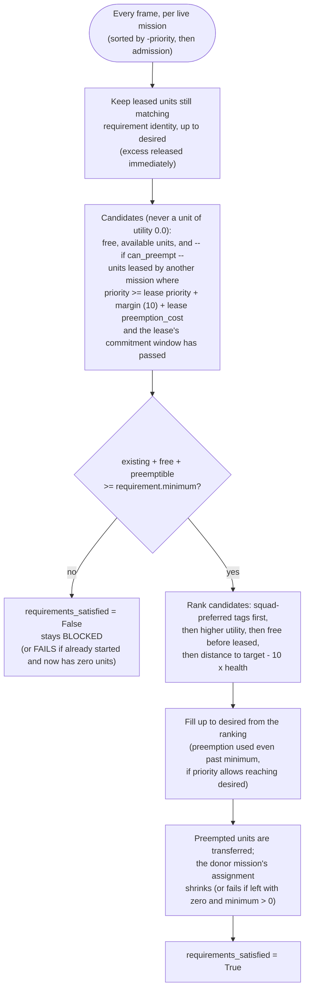
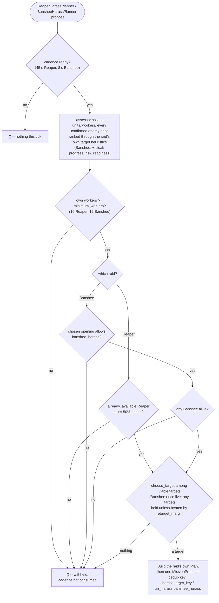
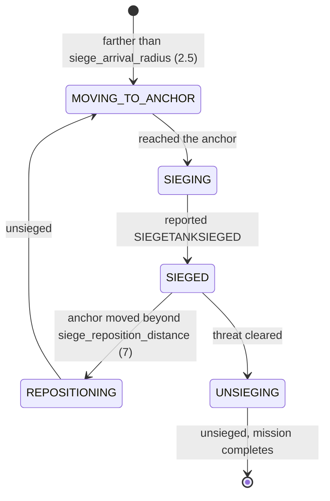

# Harass and Defense planners

This slice keeps each planner and executor together under `bot/behavior/` and
adds the second and third mission planners after
[scout-pilot-migration.md](scout-pilot-migration.md)'s `IntelPlanner`.

## Directory layout

Behaviors are organized vertically: one folder per behavior, holding
everything specific to it. See `bot/behavior/contracts.py` for the shared
`ASSESS -> PLAN -> EXECUTE` vocabulary.

```text
bot/behavior/
  contracts.py            -> BehaviorAssessment/Assessor/Planner/Executor + BehaviorLog
  strategy_intent.py      -> opening -> tactical capability table
  standing/               -> the default owner (see standing-behavior.md)
  harass/banshee/         -> cloaked Banshee raid
  harass/reaper/          -> single-Reaper worker-line raid
  defense/                -> per-base defense
  map_control/            -> the roaming patrol share
  scouting/               -> information missions (+ the scouting vision requester)
      each of the six holding exactly:
      model.py  assessment.py  planner.py  executor.py

bot/engine/missions/      -> controller, board, allocator, models, execution contracts,
                             planning.py (ProposalCadence)
bot/engine/squads/        -> persistent squad identity (see squads.md)
bot/engine/services/      -> shared capabilities, today active vision (see vision.md)
bot/app/mission_registry.py -> concrete executor wiring
bot/macro/                -> not a behavior: what to buy (see below)
```

Every mission behavior uses the same four filenames, so any behavior answers
the same four questions in the same place: `assessment.py` (what is the
situation), `planner.py` (what do we want and at what priority),
`executor.py` (how do we do it now), `model.py` (the types those three
share). A test enforces the shape.

What to *buy* is not a behavior at all. Production, construction, tech and
expansion live in `bot/macro/`, beside `bot/behavior/` rather than inside
it, and are admitted by `bot/engine/economy` against the bank -- no unit,
mission or squad involved. The Banshee raid reads how many Banshees exist;
producing them is the opening's macro profile's decision (`BansheeCloak`,
`BattleMech`). See
[macro-planner.md](macro-planner.md).

`MissionKind` gained `HARASS`, `AIR_HARASS`, and `DEFENSE` in
`bot/engine/missions/models.py`; it stays the shared vocabulary in the mission
engine, alongside
`MissionProposal`/`Mission`/`MissionController`.
`BotRuntime` holds a tuple of mission planners and concatenates their proposals
every frame instead of calling a single planner by name, so wiring in a future
planner does not require touching the admission call site.

Every planner rate-limits itself with `ProposalCadence`, which also hands out
the sequence numbers that keep `proposal_id`s unique. Only `StandingPlanner`
consumes its cadence unconditionally; the others mark it only when they
actually propose, so a withheld decision is re-assessed on the next frame.

## Arbitration: how a unit ends up on one mission and not another

Every planner only proposes; `MissionController` sorts live missions by
`-priority` each tick and asks `UnitAllocator.allocate` for units in that
order. A proposal never steals a unit directly -- only the allocator decides,
per mission, whether a candidate unit is free, already leased, or
preemptible.



A donor that loses its entire team this way fails with
`all_assigned_units_preempted`; a partial loss just updates its assignment on
the next tick. Note that preemption is not gated on the recipient being below
its *minimum* -- a mission already meeting its minimum will still preempt
further units from a lower-priority mission to climb toward its *desired*
count, as long as the priority margin and the donor's `commitment_seconds`
protection window both allow it.

`SCOUT` (65) is the only task-shaped mission with `can_preempt=False` --
scouting never steals a unit already committed elsewhere. Every other
task-shaped kind can preempt (`HARASS`/`AIR_HARASS` at 60/62,
`MAP_CONTROL` at 40, `DEFENSE` at 85/95): once `StandingPlanner`'s standing
`HOLD_RALLY` squad (priority 20, see [standing-behavior.md](standing-behavior.md))
started absorbing most otherwise-idle combat units, every opportunistic
mission needed `can_preempt=True` just to pull a unit out of standing duty --
their own priority ordering among each other (`DEFENSE` > `SCOUT`/`AIR_HARASS`
/`HARASS` > `MAP_CONTROL`) still decides who wins when two of them want the
same unit at the same time. See
[contracts.md](contracts.md) for the full priority table and
`tests/test_mission_arbitration.py` for the concrete preemption sequence.

## Command ports

Neither harass nor defense can be expressed with `path_to` alone: both need the
assigned units to fight, not just arrive. `MissionCommands` exposes `attack_move`
for positional pressure and `attack_unit` for focused fire. The adapter
translates focused fire into `ReaperGrenade` (Reapers only) plus aggressive
`StutterUnitForward`, and assigns `UnitRole.HARASSING`.

`MissionCommands` later gained `use_ability` -- an ability cast with no
positional order attached, so unlike `attack_move` it does not reassign a
`UnitRole`. The Banshee raid uses it to cloak, defense Tanks to siege and
unsiege. The full command/role table is rule 9 in [contracts.md](contracts.md).

## The two harass behaviors

Each raid is its own vertical behavior with its own assessor, planner,
executor and config -- `harass/reaper/` and `harass/banshee/`. They share
nothing but the folder above them, and `BotRuntime` wires both planners into
the same proposal tuple, so a Reaper raid and a Banshee raid can be live at
once, each with its own mission kind and dedup key.



| Behavior | Mission kind | Mode | Priority | min workers | ready-unit required | launches at |
| --- | --- | --- | --- | --- | --- | --- |
| `harass/reaper` | `HARASS` | FINITE | 60 | 16 | yes (only ever 1-2 Reapers; never steal one mid-scout) | a viable target: ground defense and anti-ground army within ceilings, light defense tolerated |
| `harass/banshee` | `AIR_HARASS` | STANDING | 62 | 12 | no (any Banshee alive; the allocator's requirement still filters readiness and 50% health at assignment) | compatible build intent; a viable target: anti-air defense and anti-air army within ceilings (once live, any target) |

Both are `can_preempt=True` (see "Arbitration" above). The Reaper raid asks
for exactly one Reaper, dedup key `harass:<target_key>`; the Banshee raid
asks for every Banshee alive, so each new Banshee joins the standing squad,
under the squad-scoped dedup key `air_harass:banshee_harass`.

### Target selection

Neither raid has a fixed target. Each assessment reads every enemy base
Awareness has confirmed (`awareness.enemy.bases.confirmed`, any
`expansion:<n>`) together with the force clusters that may be near it
(`awareness.enemy.forces.near`), and turns each base into its own
`BansheeTargetAssessment` / `ReaperTargetAssessment`, ranked by score.
Awareness describes a base once; each raid interprets it for its unit, so
the same base can rank first for one raid and last for the other. Every
weight lives in `BansheeTargetHeuristics` / `ReaperTargetHeuristics`
(`config.targeting`).

```text
Banshee score =  1.0  * opportunity          0.6 economic_value + 0.4 worker line (/16)
               - 1.0  * air_defense_risk     air_defense at its confidence; uncovered share >= 0.25
               - 0.1  * ground_defense       cannot shoot up: only a hint
               - 0.8  * army_risk            anti-air in reach (full to 10, none at 45),
                                             confidence floor 0.35, / 6 supply
               - 0.15 * (1 - base confidence)
        viable: air_defense_risk <= 0.4 and army_risk <= 0.5

Reaper score  =  1.0  * opportunity          0.3 economic_value + 0.7 worker line (/16)
               - 1.0  * ground_defense_risk  believed ground defense above 0.25, rescaled;
                                             uncovered share >= 0.35
               - 1.0  * army_risk            anti-ground in reach (full to 6, none at 25),
                                             at confidence, above 2 supply, / 6 supply
               - 0.05 * (1 - base confidence)
        viable: ground_defense_risk <= 0.6 and army_risk <= 0.6
```

The score only ranks; viability is what lets a raid launch. Unknown defense
is never read as none: the share of a reading its confidence does not cover
is assumed to hold at least the assumed amount, while defense already seen
never shrinks with age. A cluster counts by `EnemyForceCluster.distance_to`,
which already allows for its spread and for how far it may have moved, so a
split army is read part by part and a base near the main force ranks below
an equal one across the map. Units standing at a base count in both its
defense reading and the army term.

While no base is confirmed, `fallback_target_keys` (default
`("enemy_natural",)`) stand in once observed, scored as a base worth
`fallback_opportunity` with unknown defense.

The planner, not the assessment, holds the target. Both call
`bot.engine.missions.planning.choose_target`, which keeps the previous
target while it is still a candidate and nothing beats it by more than
`retarget_margin` (0.15), and drops it at once when it is no longer one.
Candidates are the viable targets; a live Banshee raid with none left takes
every target instead, so the standing squad keeps being declared. What a
retarget does follows each lifecycle:

- Banshee (STANDING): the new proposal keeps the squad-scoped dedup key, so
  `MissionController._update_standing` replaces the live proposal in place
  (same `mission_id`, leases and squad home key), and the running executor's
  `refresh` flies to the new target on its next step.
- Reaper (FINITE): a live raid keeps the base it was launched at until it
  completes, retreats or times out; the next raid is chosen from the new
  ranking, still measured against the previous raid's base.

Both planners log `behavior.target_selection` -- `change` (`SELECTED`,
`KEPT`, `RETARGETED`, `REPLACED`, `LOST`, `NONE`), `selected`, `previous`
and one line per candidate (`expansion:3 score=0.82 value=0.91 aa=0.12
army_risk=0.08 confidence=0.94`) -- whenever the target changes, and at most
every 30 s otherwise. Selection only runs once every other gate has passed.

`BansheeHarassAssessment` is the raid's whole read of the world in one
object: Banshees alive/ready/pending, cloak researched and its research
progress (from `EconomyFacts.upgrades`/`upgrades_in_progress`), every
ranked target, known anti-air, the main force's position, and a
`readiness`/`risk` pair. It describes only -- the planner's gates stay
explicit booleans rather than a threshold on those numbers, and the
assessment never sees a mission.

`ReaperHarassExecutor` focuses the lowest-health visible worker within
`worker_search_radius` (16) of the target through `attack_unit`, attack-moves
onto the target when none is visible, and tolerates local defenders. At 40%
health it latches into retreat, follows a safe path to the own main, and
completes only after reaching within `retreat_arrival_radius` (10).

`BansheeHarassExecutor` runs an explicit tactical state machine --
`ASSEMBLE -> APPROACH -> INFILTRATE -> STRIKE -> EVADE -> REPOSITION` -- and
logs every phase change as `behavior.state_changed`. With no Banshees assigned
it sits in ASSEMBLE. Otherwise the squad centroid's distance to the target
picks APPROACH (beyond `infiltration_radius`, 12), INFILTRATE (beyond
`arrival_radius`, 3) or STRIKE. All three issue the same cloak-and-attack-move
pair: closing the last tiles onto a worker line changes what is at stake, not
what the squad should be told to do. What it changes is `preemption_cost` (see
below).

A visible anti-air unit within `disengage_radius` (12) of the target, or any
Banshee at 45% health or less, latches a retreat: EVADE while that anti-air is
still visible, REPOSITION once it is not, both flying `safe_path_to` the
nearest `SAFE` base. Recovery needs only the threat gone and every Banshee
home -- not health back, since Banshees do not regenerate and nothing repairs
them -- and then the raid resumes.

It is written for the `BansheeCloak` and `BattleMech` openings (see
[opening.md](opening.md)) and, in APPROACH/INFILTRATE/STRIKE, casts
`AbilityId.BEHAVIOR_CLOAKON_BANSHEE` (via `MissionCommands.use_ability`,
`AresMissionCommands` wrapping Ares's `UseAbility` behavior) every step
rather than tracking on/off state locally: `UseAbility` no-ops once the
ability is not in `unit.abilities`, which is true both before Cloaking Field
research finishes and once already cloaked, so re-issuing it is always safe.
Build compatibility is kept outside the planner behind the small
`StrategicIntent` interface. The mission is standing and squad-backed: it
never completes or times out on its own, and defense preemption leaves the
executor waiting for the same members instead of failing.

Deliberately not built here either:

- no detector-awareness (a defender that can only detect, not attack air --
  e.g. a lone Observer -- does not trigger disengage);
- no static-defense reaction in flight: target ranking and the launch gate
  read static anti-air through `air_defense`, but the in-flight disengage
  check still looks only at visible enemy *units*, so a Missile Turret,
  Photon Cannon or Spore Crawler at the target never triggers EVADE;
- no energy-aware cloak scheduling (cloak is cast blindly every step; it
  simply stops taking effect once energy runs out);
- no air pathing: `safe_path_to` routes Banshees on the ground grid (the
  adapter only switches to the climber grid for Reapers).

## DefensePlanner

**Updated by [base-model.md](base-model.md):** proposes one `MissionProposal`
(`MissionKind.DEFENSE`) per currently threatened base, reading
`awareness.bases` (`BaseAwareness`, one `BaseAssessment` per base the bot
holds) instead of scanning all enemy units against a single `own_base`
anchor. See that doc for `BaseSnapshot`/`BaseAssessment`, why protection
never fully suppresses a proposal, and the dedup key change
(`defense:own_base` fixed -> `defense:{base.base_id}` per base). The
conditions that gate a proposal at all are unchanged: a currently visible,
non-worker, attack-capable enemy unit within `proximity_radius` (25, same
default as the old `detection_radius`) of the base.

Priority is `critical_priority` (95, undefended base) or
`threatened_priority` (85, base has some protection already), both with
`can_preempt=True` -- still the highest of the pilot's planners on purpose,
so it can preempt a live Intel or Harass mission for the same unit once the
`UnitAllocator`'s preemption margin (10) and the donor's commitment window
allow it (see `tests/test_mission_arbitration.py` for the full preemption
sequence).

`DefenseAssessor` turns `awareness.bases.threatened` into one
`ThreatenedBase` per base and adds what the global assessment does not
carry: whether the attackers are air or ground (`air_threats` /
`ground_threats`, visible threats within `engagement_radius`). The planner
turns that composition into `UnitRequirement.type_desirability`, using two
explicit tables on `DefenseConfig`:

| Attack | Siege Tank | Marauder | Marine | Reaper | Banshee |
| --- | --- | --- | --- | --- | --- |
| anything on the ground (`ground_threat_desirability`) | 1.0 | 0.7 | 0.6 | 0.4 | 0.4 |
| air only (`air_only_threat_desirability`) | 0.0 | 0.2 | 1.0 | 0.2 | 0.0 |

`UnitAllocator` only ranks candidates by those numbers and never requests a
0.0, so the matchup knowledge stays in Defense. A defense mission is FINITE
and keeps the requirement it was admitted with: an attack that turns from
ground to air mid-mission does not shed the Tanks already leased.

### Vision for a lost attacker

Before its cadence gate, every frame, `DefensePlanner` asks
`BehaviorServices.vision` for `HIGH`-urgency vision where the most recently
seen attack-capable enemy that disappeared within 25 of one of our bases was
last seen, if that was at most `remembered_threat_max_age` (12 s) ago
(`vision_request_ttl` 6 s). It knows nothing of Orbitals: whether that becomes
a Scanner Sweep is the service's call -- see [vision.md](vision.md).

### Defense roles (pilot)

A unit does not only belong to a defense mission; its type decides what it
does inside it. `DefendBaseExecutor` resolves a `DefenseRole` for each unit
it is handed -- `MissionProposal`, `MissionController` and `UnitAllocator`
carry no roles:

- `SIEGE_ANCHOR` (`SIEGETANK`/`SIEGETANKSIEGED`) attack-moves to a siege
  anchor, sieges there and holds. It is never attack-moved at the enemy.
- `SCREEN` (every other defender) attack-moves the threat nearest to where
  the mission was admitted, which is what every defender used to do.

`DefenseAnchors` is plain geometry. From the defended base
(`awareness.bases.get(target_key)`, or the main if that base is gone) toward
the centroid of the ground threats (every threat if none is on the ground), it
puts the siege anchor at `siege_anchor_offset` (6) and the screen anchor at
`screen_anchor_offset` (12). When the enemy is already inside the screen line,
both scale back proportionally, so the Tank always stands behind where the bio
fights. The screen anchor is only logged for now.



`MissionController` releases every unit the moment an executor reports
COMPLETED. So once no threat remains, the executor first unsieges its Tanks,
and waits for any Tank still mid-siege to land. After `unsiege_timeout` (6s)
it completes anyway, with `threat_cleared_unsiege_timed_out`. If threats remain
but the mission has no units left, it fails with `assigned_unit_missing`.

Role resolution and every Tank phase change are logged as
`behavior.state_changed`, once per transition. A role event carries `state`
`SIEGE_ANCHOR` or `SCREEN` with reason `role_resolved_from_unit_type`. A
phase event carries the anchors and the Tank's distance to its anchor.

Deliberately left out of the pilot:

- roles as an engine contract (role slots on `MissionProposal`, role-aware
  allocation);
- unsieging a Tank whose mission is cancelled by timeout or loses it to
  preemption;
- choke or high-ground placement;
- unsieging when the enemy is inside a sieged Tank's minimum range;
- using the screen anchor to steer the bio.

## Unit utility and preemption cost

Global mission priority alone cannot decide *which* unit a mission should
take. Two hooks exist for that, both inert by default:

- `UnitRequirement.desirability` and `type_desirability` let the requesting
  behavior say how useful each unit type is to it right now. `UnitAllocator`
  ranks candidates by that utility (after any squad-preferred tags) and
  refuses to request a unit whose utility is 0.0 -- so a Defense facing
  Mutalisks can ask for Thors and Marines and explicitly not want the
  Banshees, without the allocator learning a matchup table.
- `MissionExecutor.preemption_cost()` lets the *current owner* say what
  interrupting it costs; the value rides on `UnitLease` and is added to the
  allocator's preemption margin. `BansheeHarassExecutor` returns
  `strike_preemption_cost` (5) while INFILTRATE/STRIKE and 0 otherwise --
  small enough that `DEFENSE` (85) still wins a striking Banshee, large
  enough that a same-tier mission no longer pulls the raid apart at its most
  valuable moment.

Neither a matchup table nor a full arbitration formula is implemented. The
point is that `mission priority + unit-specific utility + current owner +
preemption cost` can all be expressed without reshaping the contracts.

## Deliberately not built in this slice

- Splitting defense per base/expansion is now done, see
  [base-model.md](base-model.md); harass targets are ranked per base too
  (see "Target selection").
- Worker-rush detection (an enemy worker alone is not treated as a threat).
- Changing `MacroPlanner`: it stays outside the `MissionProposal` model, as recorded
  in [macro-planner.md](macro-planner.md).

## Deferred decisions

- Whether Defense should eventually pull SCVs or request reinforcements instead of
  only reacting with existing combat units.
- Whether Harass should chain targets within one raid (natural, then main)
  rather than re-choosing one per proposal.
- Whether a live Reaper raid should retarget mid-mission, which would need a
  FINITE mission to accept an in-place update.
- Whether target selection should predict enemy army movement or weigh travel
  distance; today it reads only the current state.
