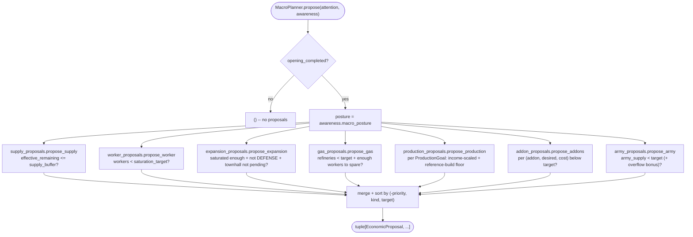

# Macro planner: economic vertical slice

This is the economic counterpart to the scout vertical slice, filling in the
work described as deferred in
[scout-pilot-migration.md](scout-pilot-migration.md): "The future economy
contract: `SpendProposal`, real resource reservations, and an
`EconomyController` remain intentionally unimplemented." It now covers both
halves: `MacroPlanner` argues for economic actions, and `EconomyController`
admits, reserves against, and executes them (see "Integration" below).

## Contracts

`bot/engine/economy/models.py` defines:

- `EconomicActionKind` -- `PRODUCE_WORKER`, `PRODUCE_SUPPLY`, `EXPAND`,
  `BUILD_GAS`, `BUILD_PRODUCTION`, `PRODUCE_UNIT`, `BUILD_ADDON`,
  `RESEARCH_UPGRADE`.
- `ResourceCost` -- a declared `minerals`/`vespene`/`supply` cost. Building one
  never deducts or reserves anything; `affordable_with(...)` only compares
  against a bank the caller supplies.
- `EconomicProposal` -- a planner's argument for one economic action. It is
  deliberately not a `MissionProposal`: it carries no `UnitRequirement` and no
  map `target` (only an optional string `target`/`target_count` describing
  *what*, e.g. a `UnitTypeId` name and a desired count), because declaring an
  economic intent does not move or command a unit by itself. It does carry
  `priority`, `reason`, and `cost`, matching the `MissionProposal` convention
  of an explicit, non-empty reason.

## Planner package (`bot/behavior/macro/planner/`)

`MacroPlanner.propose(attention, awareness)` is a pure function of its inputs
-- no cadence state, no sequence counters -- so it is trivially deterministic:
the same snapshot always yields the same tuple of proposals. It gates entirely
on `economy.opening_completed` (`MacroPlannerConfig.require_opening_completed`,
default `True`) and then delegates to seven independent, single-purpose
modules (`supply`, `worker`, `expansion`, `gas`, `production`, `addons`,
`army`), each returning `None`/`()` when it has nothing useful to say. The
class itself only orders the calls, merges the results, and sorts them by
`(-priority, kind, target)` for readable traces -- `EconomyController` owns
the real admission order. `MacroGoalSet.upgrades` (`UpgradeGoal`) and
`EconomicActionKind.RESEARCH_UPGRADE` already exist as declared goals/vocabulary,
but no module yet converts them into proposals -- see "Deliberately not built"
below.

### Decision rules by module

Every rule below reads `EconomyFacts` (from `WorldFacts.economy`) and the
opening's `MacroGoalSet`; only `RelativeStrength`/`ThreatAssessment` are read
outside `EconomyFacts`, and only where noted.

- **`supply_proposals`**: proposes `PRODUCE_SUPPLY` when supply is not already
  at `max_supply_cap` and `supply_cap + supply_pending - supply_used <=
  supply_buffer` (6 by default) -- counting supply already under construction,
  not just the current cap, so it does not double-queue depots.
- **`worker_proposals`**: proposes `PRODUCE_WORKER` up to
  `min(max_workers, townhalls * workers_per_townhall)` ("saturation target"),
  floored so a snapshot without a tracked townhall does not divide to zero.
- **`expansion_proposals`**: proposes `EXPAND` once workers cross a
  posture-dependent fraction of the saturation target (90% BALANCED, 72%
  GREED, 100% RECOVERY/DEFENSE -- effectively never under those last two),
  and only when no townhall is currently pending and posture is not
  `DEFENSE`.
- **`gas_proposals`**: proposes `BUILD_GAS` up to `refineries_per_townhall *
  ready_townhalls` (capped at `max_refineries`), holding off until there are
  enough workers to spare (`max(12, (desired - 1) * 3)`) so early gas does not
  starve mineral income.
- **`production_proposals`**: for each `ProductionGoal`, targets
  `minimum` structures, scaled up when sustained mineral/vespene collection
  rate crosses a configured threshold (`target_for_income`), but only holds
  that higher target once existing producers are already busy enough
  (`minimum_utilization`); otherwise falls back to `minimum`. A
  `ReferenceBuild` timing floor (see below) can raise the target further.
- **`addon_proposals`**: proposes `BUILD_ADDON` per configured
  `(addon_type, desired_count, cost)` tuple below its target -- flat counts,
  no income scaling.
- **`army_proposals`**: fills `MacroGoalSet.army` composition weights up to
  `army_supply_target`, topping up whichever unit is furthest behind its own
  weight share of the total army (not the grand total), so an over-built
  member never blocks catching up an under-built one.

### Resource-overflow pressure (`ResourceOverflowConfig`)

A pile of banked resources above `mineral_threshold`/`vespene_threshold`
(800/400 by default) is itself evidence that current production/composition
targets are too low -- a build's timings or income-scaling can both
under-shoot when the bot converts resources into buildings/units slower than
it earns them. `production_proposals` and `army_proposals` both add a bonus
(`production_bonus`, `army_supply_bonus`) derived from how far over threshold
the bank sits, on top of their normal target, bypassing the usual
"producers must already be busy" gate.

### Posture-adjusted priorities (`MacroPlannerConfig.priority_for`)

Every category (`supply`, `worker`, `expansion`, `gas`, `army`, `production`,
`addon`, `upgrade`) has a base priority; `awareness.macro_posture` shifts it
by a fixed per-category offset before clamping to `[0, 100]`:

| Posture | worker | expansion | army | production | net effect |
| --- | --- | --- | --- | --- | --- |
| `DEFENSE` | -31 | -38 | +25 | +16 | starve growth, feed the fight |
| `GREED` | +19 | +27 | -20 | -5 | outgrow while it is safe |
| `RECOVERY` | +27 | -18 | -17 | +22 | rebuild the base, not the army |
| `BALANCED` | 0 | 0 | 0 | 0 | strategy's own baseline |

`MacroPosture` itself is derived by `bot/world/awareness/posture.py`
(`derive_macro_posture`) from nearby enemy combat presence, worker/townhall
counts, and `RelativeStrength`, with hysteresis (`defense_release_after`,
`greed_safe_after`, `posture_min_hold`) so it does not flap every frame --
`DEFENSE`/`RECOVERY` apply immediately (danger cannot wait), while leaving
them or entering `GREED` requires holding the new candidate for
`posture_min_hold` first.

## Deliberately not built in this slice

- `RESEARCH_UPGRADE` proposals: `MacroGoalSet.upgrades` and `UpgradeGoal`
  already carry declared upgrade targets and costs (see
  `strategy_goal_profiles.py`), and `upgrade_priority` already exists on
  `MacroPlannerConfig`, but no `propose_upgrade` module reads them yet --
  upgrades in the Bio 3-1-1 goal set are currently produced only by the
  static `terran_builds.yml` opening, not by ongoing macro convergence.
- Expansion location selection beyond what Ares's own `ExpansionController`
  already resolves (see below) -- this planner itself still declares no
  target; it only argues *that* an expansion is warranted.
- Production-queue/idle-structure awareness beyond `ProducerFacts.busy`/`ready`
  (used only for the income-scaling gate's `minimum_utilization` check above)
  -- proposals are based on counts and resources, not per-structure
  idle/order-queue state.

## Integration: `EconomyController`

`bot/engine/economy/controller.py` admits `EconomicProposal`s the way
`MissionController` admits `MissionProposal`s, sized down for the fact that
economic actions are single-frame and self-gating rather than multi-frame
unit commitments -- no unit lease or executor lifecycle is needed.

- `bot/app/runtime.py` calls `MacroPlanner().propose(attention,
  awareness)` from the same frame step that collects the mission planners'
  proposals, gated on `build_order_runner.build_completed` being true.
- Which `MacroGoalSet` that `MacroPlanner` converges toward is not fixed at
  `BotRuntime` construction: `chosen_opening` is unknown until the Ares build
  runner resolves it, so `BotRuntime._resolve_macro_profile` looks it up via
  `bot.behavior.macro.opening_macro_profiles.macro_config_for_opening` on the
  first frame it becomes non-empty and locks it in for the rest of the game
  (an opening never changes mid-game). `MACRO_PROFILES` maps opening name ->
  `MacroPlannerConfig`; an opening with no matching entry, or the opening not
  yet being known, falls back to the default (Bio) profile rather than
  raising. This is the only place the build order and dynamic macro actually
  talk to each other -- see [opening.md](opening.md) for the `BansheeCloak`
  opening this exists for.
- `EconomyController.tick(...)` processes proposals by priority (with
  `created_at`/`deduplication_key`/`proposal_id` as deterministic tiebreakers),
  reserving minerals/vespene/supply against a running virtual `ResourceBank`
  seeded from the current tick's real bank, so two proposals admitted in the
  same frame cannot both spend the same resources; an unaffordable proposal
  instead *holds* its cost against the virtual bank (`hold_towards`) so a
  lower-priority proposal cannot jump the queue by being cheaper. Proposal
  outcomes use `economic_proposal_deferred` and `economic_proposal_rejected`
  (duplicate id/key in the same tick, a live action already covers that key,
  or insufficient virtual bank); actions move from
  `economic_action_admitted`/`economic_action_pending` through dispatched,
  confirmed, failed, or timed out (`dispatch_timeout_seconds` /
  `confirmation_timeout_seconds` on the proposal). Repeated identical
  proposal outcomes are suppressed until their lifecycle state changes.
- Execution is implemented by `AresEconomyCommands`
  (`bot/adapters/ares/economy_commands.py`), which registers Ares's own macro
  behaviors: `BuildWorkers` for `PRODUCE_WORKER`, `AutoSupply` for
  `PRODUCE_SUPPLY` (at `WorldFacts.map.own_start`), and `ExpansionController`
  for `EXPAND` (`to_count` = current ready townhalls, via
  `ready_townhall_count`, plus one). These Ares behaviors own worker
  selection, structure placement, and expansion-site selection themselves;
  `MacroPlanner` only argues that the action is warranted and affordable.
