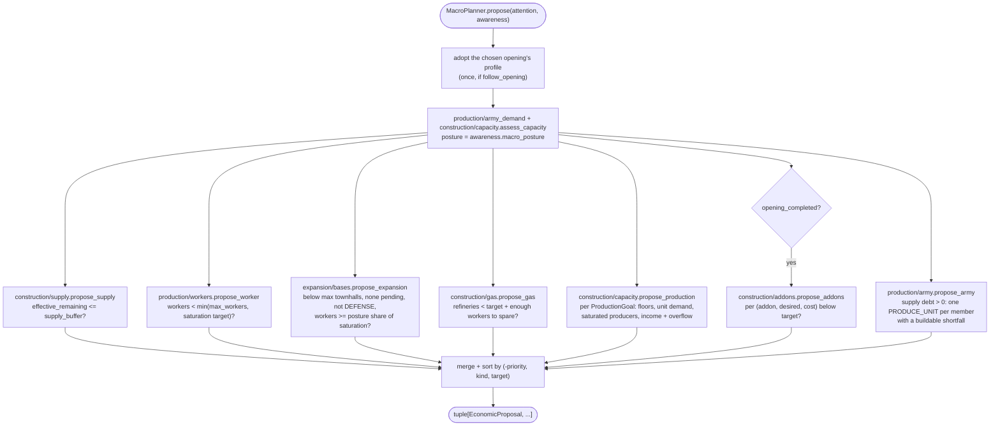
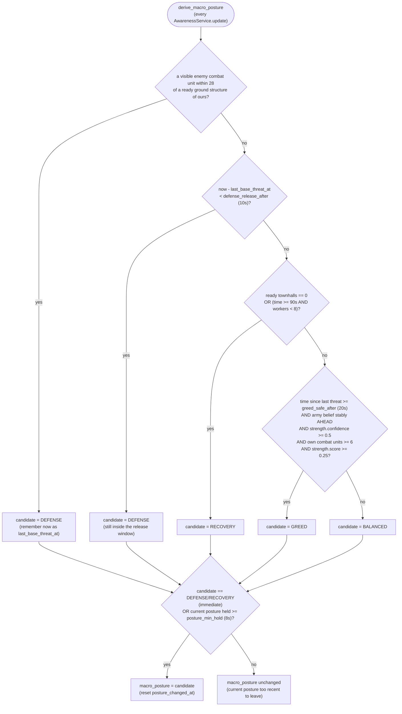
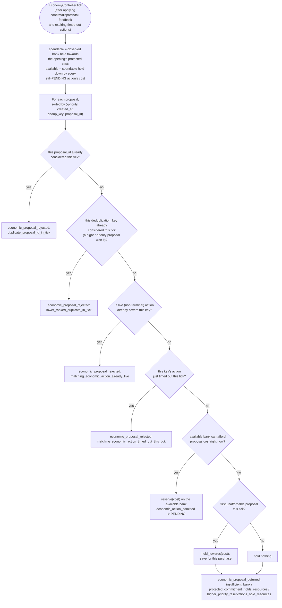

# Macro planner: economic vertical slice

This is the economic counterpart to the scout vertical slice, filling in the
work described as deferred in
[scout-pilot-migration.md](scout-pilot-migration.md). It covers both halves:
`MacroPlanner` argues for economic actions, and `EconomyController` admits,
reserves against, and executes them (see "Integration" below).

## Contracts

`bot/engine/economy/models.py` defines:

- `EconomicActionKind` -- `PRODUCE_WORKER`, `PRODUCE_SUPPLY`, `EXPAND`,
  `BUILD_GAS`, `BUILD_PRODUCTION`, `PRODUCE_UNIT`, `BUILD_ADDON`,
  `RESEARCH_UPGRADE`.
- `ResourceCost` -- a declared `minerals`/`vespene`/`supply` cost. Building one
  never deducts or reserves anything; `affordable_with(...)` only compares
  against a bank the caller supplies.
- `ResourceBank` -- the virtual bank one controller tick arbitrates against:
  `reserve` (a fully funded purchase), `hold_towards` (saturating: protect what
  exists while saving for more) and `consumed_from` (what a derived bank no
  longer has).
- `EconomicProposal` -- a planner's argument for one economic action. It is
  deliberately not a `MissionProposal`: it carries no `UnitRequirement` and no
  map `target` (only an optional string `target`/`target_count` describing
  *what*, e.g. a `UnitTypeId` name), because declaring an economic intent does
  not move or command a unit by itself. It does carry `priority`, `reason`, and
  `cost`, matching the `MissionProposal` convention of an explicit, non-empty
  reason, plus `dispatch_timeout_seconds` (5) and
  `confirmation_timeout_seconds` (60).

One proposal is one purchase. `proposal_helpers.build_proposal` turns a goal
("five Barracks") into a step: `cost` is the price of a single item and
`target_count` is the observed total plus one, never the goal, so the
controller reserves what the action will really spend and can confirm it the
moment Attention shows that count. Its `proposal_id` and deduplication key are
both `macro_planner:<category>:<target>`, stable across ticks.

## Package layout (`bot/macro/`)

Macro is its own layer, beside `bot/behavior/` rather than inside it: a
behavior governs units already on the map, macro governs what to spend on.
The package is split by what a proposal buys:

| Folder | Action kinds | Modules |
| --- | --- | --- |
| `strategy/` | -- | `goals.py`, `profiles.py`, `openings.py`, `config.py`, `reference_build.py` |
| `production/` | `PRODUCE_UNIT`, `PRODUCE_WORKER` | `army_demand.py` (assessment), `army.py`, `workers.py` |
| `construction/` | `BUILD_PRODUCTION`, `BUILD_ADDON`, `PRODUCE_SUPPLY`, `BUILD_GAS` | `capacity.py` (assessment + proposer), `addons.py`, `supply.py`, `gas.py` |
| `expansion/` | `EXPAND` | `bases.py` |

`planner.py` (`MacroPlanner`) is the one module that knows how those domains
depend on each other (capacity reads army demand) and in which order they are
asked; `contracts.py` holds `SpendPlanner`, the contract it keeps;
`diagnostics.py` (`MacroDiagnostics`) emits `macro.status` and
`macro.idle_producer_unexplained` once the economy controller has run. There
is no `tech/` yet: `RESEARCH_UPGRADE` has vocabulary but no proposer.

`MacroPlanner.propose(attention, awareness)` holds no cadence state and no
sequence counters: the same snapshot always yields the same tuple of
proposals. Its only state is `last_status` (a `MacroStatus` for diagnostics)
and, when built with `follow_opening=True`, the one-time switch to the chosen
opening's profile (see "Integration" below). It runs during the opening too --
the economy controller withholds the cost of the opening's next steps
(`protected`), so macro only spends a surplus; add-ons alone wait for
`economy.opening_completed`. It delegates to seven single-purpose proposers,
each returning `None`/`()` when it has nothing useful to say, merges the
results, and sorts them by `(-priority, kind, target)` for readable traces --
`EconomyController` owns the real admission order. `MacroGoalSet.upgrades`
(`UpgradeGoal`) and `EconomicActionKind.RESEARCH_UPGRADE` already exist as
declared goals/vocabulary, but no module yet converts them into proposals --
see "Deliberately not built" below.

### Decision rules by module

Every rule below reads `EconomyFacts` (from `WorldFacts.economy`), the
opening's `MacroGoalSet` and `awareness.macro_posture`; `ResourceOverflowConfig`
also reads the bank.

Each `MacroGoalSet` names the `CompositionDoctrine` it buys within
(`bot/macro/composition/`: core / support / specialized unit types; `BIO` for
both current goal sets, `MECH` defined for BattleMech). Construction fails if
an army goal falls outside it. The doctrine only bounds production. Missions
never see it: they score whatever units exist, so a doctrine change reaches the
army only through what gets built (see [capabilities.md](capabilities.md)).

- **`construction/supply.py`**: proposes `PRODUCE_SUPPLY` (a Supply Depot) when
  `supply_cap` is below `max_supply_cap` (200) and
  `supply_cap + supply_pending - supply_used <= supply_buffer` (6) -- counting
  supply already under construction, not just the current cap, so it does not
  double-queue depots.
  `target_count` is the depot count plus one, so the action is confirmed as
  soon as the next depot is under way.
- **`production/workers.py`**: proposes `PRODUCE_WORKER` up to
  `min(max_workers, saturation target)`. The saturation target is Ares'
  `ideal_harvesters` once known, falling back to `ready townhalls *
  workers_per_townhall` for the first frames.
- **`expansion/bases.py`**: proposes `EXPAND` while townhalls are below
  `max_townhalls`, none is pending, posture is not `DEFENSE`, and workers have
  reached a posture-dependent share of the same saturation target: 90%
  `BALANCED`, 72% `GREED`, 100% `RECOVERY`.
- **`construction/gas.py`**: proposes `BUILD_GAS` up to `refineries_per_townhall *
  ready townhalls` (capped at `max_refineries`), holding off until there are
  enough workers to spare (`max(12, (desired - 1) * 3)`) so early gas does not
  starve mineral income.
- **`construction/capacity.py`**: `assess_capacity` decides, per
  `ProductionGoal`, how many structures are justified, and records why
  (`CapacityAssessment.reason`):
  1. Below the goal's `minimum`, the minimum it declares for the current
     number of townhalls (`townhall_minimums`, counting one under
     construction), or the reference-build benchmark (see below): build up to
     that floor (`production_below_opening_floor`,
     `production_below_townhall_floor`,
     `production_below_reference_build_benchmark`).
  2. No owed, buildable unit this structure trains without an add-on: stay at
     the floor (`no_unit_demand_for_this_producer`, or
     `owed_units_need_an_add_on_not_a_building` when the owed unit needs a
     Tech Lab).
  3. Existing producers not saturated -- any of them idle right now, or their
     20-second utilization below `minimum_utilization` (75%): stay at the floor
     (`existing_capacity_underutilized`).
  4. Otherwise target `max(floor + overflow bonus, target_for_income)`, capped
     at `maximum`. `target_for_income` adds one structure once the sustained
     mineral or vespene collection rate crosses the goal's first threshold, and
     one more per configured increment above it.
- **`construction/addons.py`**: proposes `BUILD_ADDON` per configured
  `(addon_type, desired_count, cost)` tuple below its target -- flat counts,
  no income scaling, only once the opening has completed, and only while a
  finished parent without an add-on exists to hold it.
- **`production/army_demand.py` + `production/army.py`**: `army_demand` scales
  the composition until it would reach `army_supply_target` (plus the overflow
  bonus): each member wants `max(minimum, ceil(weight * cycles))`, where
  `cycles = target / sum(weight * supply cost)`. Weights say what the debt is
  paid in, never whether it exists, so meeting one member's minimum cannot stop
  production while the army as a whole is short. While there is supply debt,
  `propose_army` emits one `PRODUCE_UNIT` for every member still missing units
  whose tech is ready; a member without its structure or add-on is reported as
  `tech_blocked` instead of argued for. Priority is the army category's plus
  the member's `priority_offset` (Medivac +2); the controller then arbitrates
  among them by priority and bank.

### Reference build floor (`ReferenceBuild`)

`strategy/reference_build.py` holds a time-ordered benchmark of how many
production structures a standard build has by a given game time. The Bio
profile uses `bio_three_one_one_reference()` -- one Barracks at 0:41, two at
1:51, three at 2:17, a Factory at 4:34, a Starport at 6:12, blended from a
recorded 3-rax opening and terrancraft's 3-1-1 framework. It only ever raises
`assess_capacity`'s floor, and holds its last value past the final point. The
`BansheeCloak` and `BattleMech` profiles have none (`reference_build=None`);
`BattleMech` keys its structure timing on townhalls instead.

### Resource-overflow pressure (`ResourceOverflowConfig`)

A bank above `mineral_threshold`/`vespene_threshold` (800/400) is evidence that
the bot converts income into value too slowly -- not, by itself, proof that it
lacks production. Each resource counts steps over its threshold (one as soon as
the bank is above it, one more per `mineral_step`/`vespene_step`, 400/200), and
the larger count is the bonus:

- `army_supply_bonus` (steps x 8 supply) raises the army target in
  `army_demand` unconditionally, because a bigger army is what spends the pile;
- `production_bonus` (steps) raises a structure's target only in step 4 of
  `assess_capacity` above, once the existing producers of that type are
  saturated. Adding buildings next to idle buildings would convert nothing.

### Posture-adjusted priorities (`MacroPlannerConfig.priority_for`)

Every category has a base priority; `awareness.macro_posture` shifts it by a
fixed per-category offset (plus an army member's `priority_offset`) before
clamping to `[0, 100]`. `BALANCED` applies no offset:

| Category | Base | `DEFENSE` | `GREED` | `RECOVERY` |
| --- | ---: | ---: | ---: | ---: |
| supply | 96 | +4 | 0 | 0 |
| worker | 66 | -31 | +19 | +27 |
| expansion | 58 | -38 | +27 | -18 |
| gas | 61 | -11 | +9 | +4 |
| army | 70 | +25 | -20 | -17 |
| production | 64 | +16 | -5 | +22 |
| addon | 67 | +10 | -7 | +13 |
| upgrade | 63 | -18 | +2 | -23 |

In short: `DEFENSE` starves growth and feeds the fight, `GREED` outgrows while
it is safe, `RECOVERY` rebuilds the base rather than the army.

`MacroPosture` itself is derived by `bot/world/awareness/posture.py`
(`derive_macro_posture`) from enemy combat units near our structures,
worker/townhall counts, `RelativeStrength` and the stable army belief, with
hysteresis (`defense_release_after`, `greed_safe_after`, `posture_min_hold`) so
it does not flap every frame.

Danger (`DEFENSE`/`RECOVERY`) always wins immediately. Any other change --
leaving danger, or moving between `BALANCED` and `GREED` -- waits until the
current posture has been held for `posture_min_hold`. Together with the 10 s
release window after the last nearby threat, this is what stops the posture
(and therefore every priority in the table above) from flapping every time a
single unit wanders past a base.

## Deliberately not built in this slice

- `RESEARCH_UPGRADE` proposals: `MacroGoalSet.upgrades` and `UpgradeGoal`
  already carry declared upgrade targets and costs (see
  `strategy/profiles.py`), and `upgrade_priority` already exists on
  `MacroPlannerConfig`, but no `propose_upgrade` module reads them yet --
  upgrades are currently researched only by the static `terran_builds.yml`
  openings, not by ongoing macro convergence.
- Expansion location selection beyond what Ares's own `ExpansionController`
  already resolves (see below) -- this planner itself still declares no
  target; it only argues *that* an expansion is warranted.
- Per-structure queue planning: capacity reads `ProducerFacts` per structure
  type (`ready`, `idle`, `busy`, `utilization_20s`), not which Barracks should
  train what next; that stays inside Ares' `SpawnController`.

## Integration: `EconomyController`

`bot/engine/economy/controller.py` admits `EconomicProposal`s the way
`MissionController` admits `MissionProposal`s, sized down for the fact that
economic actions are short and self-gating rather than multi-frame unit
commitments -- no unit lease or executor lifecycle is needed.

- `bot/app/runtime.py` wires the two domains side by side each frame: the
  mission planners into `MissionController.tick`, then
  `EconomyController.step(attention=..., proposals=MacroPlanner.propose(...),
  commands=AresEconomyCommands(bot))`, then `MacroDiagnostics.report`. The
  runtime holds no economic state of its own.
- `EconomyController.step` is the economy counterpart of
  `MissionController.tick`: it confirms live actions from Attention
  (`observe_economic_confirmations`), merges last frame's dispatch feedback,
  arbitrates with `tick` against the observed bank (`observe_bank`) minus
  what the opening protects (`observe_protected_cost`), and dispatches every
  live action again through the `EconomyCommands` port.
- Which `MacroGoalSet` that `MacroPlanner` converges toward is not fixed at
  `BotRuntime` construction: the opening is only known once the runtime has
  picked it (see [opening.md](opening.md)), so the runtime builds the planner
  with `follow_opening=True`. The first tick `economy.opening_name` is
  non-empty, the planner adopts
  `bot.macro.strategy.openings.macro_config_for_opening` and locks it in for
  the rest of the game (an opening never changes mid-game). `MACRO_PROFILES`
  maps opening name -> `MacroPlannerConfig`; an opening with no matching entry
  falls back to the default (Bio) profile rather than raising. A config passed
  as `BotRuntime(macro_config=...)` is pinned and never follows. This is the
  only place the build order and dynamic macro actually talk to each other,
  besides the protected cost.

Only the most important unaffordable proposal saves: its cost is held against
the available bank, so a cheaper, lower-priority proposal later in the same
pass cannot spend what it is saving toward. Every further unaffordable proposal
holds nothing -- saving for all of them at once (an expensive gas unit with zero
gas income, say) would lock the whole bank against purchases nowhere near
possible and starve the cheap useful work below. The deferral reason names what
actually withholds the money: the bank itself, the opening's protected cost, or
higher-priority reservations.

- Lifecycle: an admitted action is `PENDING` and holds its reservation until the
  adapter reports it dispatched (`IN_FLIGHT`; Ares is now spending the real
  resources, so the reservation is released). It is `COMPLETED` when Attention
  shows `target_count` reached -- observed confirmation wins over adapter
  feedback for the same action -- or when the adapter confirms it outright,
  `FAILED` when the adapter raised, and `TIMED_OUT` after
  `dispatch_timeout_seconds` from admission while pending or
  `confirmation_timeout_seconds` from dispatch while in flight.
- Repeated identical proposal outcomes are suppressed until their lifecycle
  state changes, so a proposal stuck `economic_proposal_deferred` for the same
  reason every frame does not spam the log.
- Execution is implemented by `AresEconomyCommands`
  (`bot/adapters/ares/economy_commands.py`), the Ares side of the
  `bot.ports.EconomyCommands` port. It invokes Ares's own macro behaviors --
  `SpawnController` for `PRODUCE_WORKER`/`PRODUCE_UNIT`, `BuildStructure` for
  `PRODUCE_SUPPLY`/`BUILD_PRODUCTION`, `GasBuildingController` for
  `BUILD_GAS`, `ExpansionController` for `EXPAND`, `UpgradeController` for
  `RESEARCH_UPGRADE` -- and orders add-ons on an idle bare parent directly.
  An Ares macro behavior makes one unit of progress per call, so `dispatch`
  returns `DISPATCHED` when that step was accepted, `WAITING` when nothing was
  possible this frame (producer busy, no placement yet), and `FAILED` only on
  an exception. A train order (`PRODUCE_WORKER`/`PRODUCE_UNIT`) returns
  `CONFIRMED` instead of `DISPATCHED`: `SpawnController` only reports progress
  once it has called `train()`, so the purchase already happened. Left in
  flight, it waited for the count to reach `target_count`, which never
  happened if a unit of that type died in between -- and the live action then
  blocked that whole unit type for the 60-second confirmation timeout. Those Ares behaviors own worker selection, structure placement,
  and expansion-site selection themselves. The SCV one picks is marked
  `UnitRole.BUILDING` by Ares and so reads as unavailable to missions, but it
  is never a mission lease; `MacroPlanner` only argues that the action is
  warranted.

## Diagnostics

`MacroDiagnostics.report` (component `macro.planner`) runs after
`EconomyController.step`, because it needs both halves: what `MacroPlanner`
wanted (`MacroStatus`: demand, capacity verdicts, proposals) and what the
controller did with the bank (`EconomyTickResult`). It decides nothing.

- `macro.status`, on change plus a ten-second heartbeat: bank, protected,
  reserved and free resources; army desired/ready/pending supply and debt;
  `unit_demand` and `tech_blocked`; each producer's readiness, idle count and
  20-second utilization; each capacity verdict with its reason; and the
  proposals.
- `macro.idle_producer_unexplained`: a producer has been idle for 15 s while a
  unit it can build without an add-on is owed and the spendable bank (after the
  protected cost) could pay for it.
