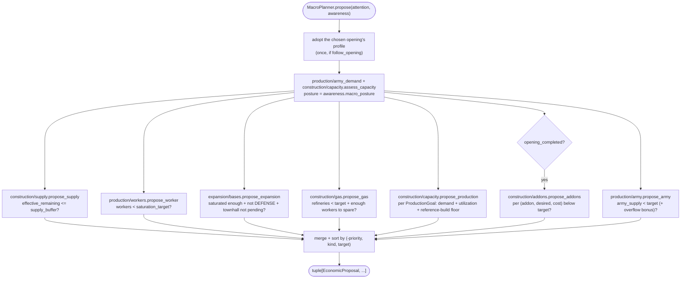
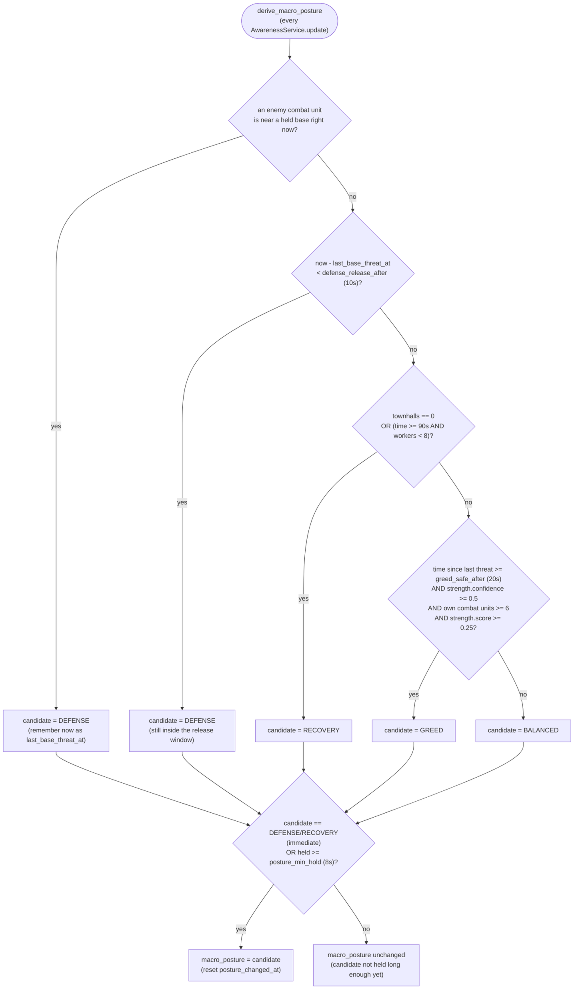
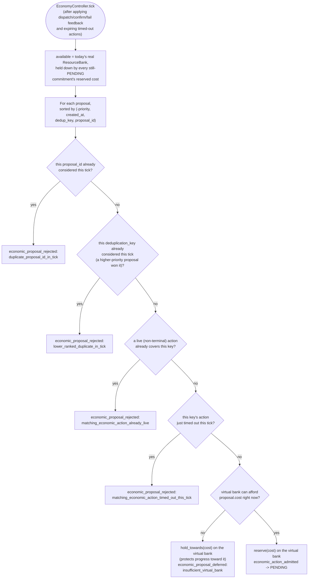

# Macro planner: economic vertical slice

This is the economic counterpart to the scout vertical slice, filling in the
work described as deferred in
[scout-pilot-migration.md](scout-pilot-migration.md): "The future economy
contract: `SpendProposal`, real resource reservations, and an
`EconomyController` remain intentionally unimplemented." It now covers both
halves: `MacroPlanner` argues for economic actions, and `EconomyController`
admits, reserves against, and executes them (see "Integration" below).

## Contracts

`bot/engine/economy/models.py` defines:

- `EconomicActionKind` -- `PRODUCE_WORKER`, `PRODUCE_SUPPLY`, `EXPAND`,
  `BUILD_GAS`, `BUILD_PRODUCTION`, `PRODUCE_UNIT`, `BUILD_ADDON`,
  `RESEARCH_UPGRADE`.
- `ResourceCost` -- a declared `minerals`/`vespene`/`supply` cost. Building one
  never deducts or reserves anything; `affordable_with(...)` only compares
  against a bank the caller supplies.
- `EconomicProposal` -- a planner's argument for one economic action. It is
  deliberately not a `MissionProposal`: it carries no `UnitRequirement` and no
  map `target` (only an optional string `target`/`target_count` describing
  *what*, e.g. a `UnitTypeId` name and a desired count), because declaring an
  economic intent does not move or command a unit by itself. It does carry
  `priority`, `reason`, and `cost`, matching the `MissionProposal` convention
  of an explicit, non-empty reason.

## Package layout (`bot/macro/`)

Macro is its own layer, beside `bot/behavior/` rather than inside it: a
behavior governs units already on the map, macro governs what to spend on.
The package is split by what a proposal buys:

| Folder | Action kinds | Modules |
| --- | --- | --- |
| `strategy/` | -- | `goals.py`, `profiles.py`, `openings.py`, `config.py`, `reference_build.py` |
| `production/` | `PRODUCE_UNIT`, `PRODUCE_WORKER` | `army_demand.py` (assessment), `army.py`, `workers.py` |
| `construction/` | `BUILD_PRODUCTION`, `BUILD_ADDON`, `PRODUCE_SUPPLY`, `BUILD_GAS` | `capacity.py` (assessment + proposer), `addons.py`, `supply.py`, `gas.py` |
| `expansion/` | `EXPAND` | `bases.py` |

`planner.py` (`MacroPlanner`) is the one module that knows how those domains
depend on each other (capacity reads army demand) and in which order they are
asked; `contracts.py` holds `SpendPlanner`, the contract it keeps;
`diagnostics.py` (`MacroDiagnostics`) emits `macro.status` and
`macro.idle_producer_unexplained` once the economy controller has run. There
is no `tech/` yet: `RESEARCH_UPGRADE` has vocabulary but no proposer.

`MacroPlanner.propose(attention, awareness)` holds no cadence state and no
sequence counters: the same snapshot always yields the same tuple of
proposals. Its only state is `last_status` (for diagnostics) and, when built
with `follow_opening=True`, the one-time switch to the chosen opening's
profile (see "Integration" below). It runs during the opening too -- the
economy controller withholds the cost of the opening's next steps
(`protected`), so macro only spends a surplus; add-ons alone wait for
`economy.opening_completed`. It delegates to seven single-purpose proposers,
each returning `None`/`()` when it has nothing useful to say, merges the
results, and sorts them by `(-priority, kind, target)` for readable traces --
`EconomyController` owns the real admission order. `MacroGoalSet.upgrades`
(`UpgradeGoal`) and `EconomicActionKind.RESEARCH_UPGRADE` already exist as
declared goals/vocabulary, but no module yet converts them into proposals --
see "Deliberately not built" below.

### Decision rules by module

Every rule below reads `EconomyFacts` (from `WorldFacts.economy`) and the
opening's `MacroGoalSet`; only `RelativeStrength`/`ThreatAssessment` are read
outside `EconomyFacts`, and only where noted.

- **`construction/supply.py`**: proposes `PRODUCE_SUPPLY` when supply is not already
  at `max_supply_cap` and `supply_cap + supply_pending - supply_used <=
  supply_buffer` (6 by default) -- counting supply already under construction,
  not just the current cap, so it does not double-queue depots.
- **`production/workers.py`**: proposes `PRODUCE_WORKER` up to
  `min(max_workers, townhalls * workers_per_townhall)` ("saturation target"),
  floored so a snapshot without a tracked townhall does not divide to zero.
- **`expansion/bases.py`**: proposes `EXPAND` once workers cross a
  posture-dependent fraction of the saturation target (90% BALANCED, 72%
  GREED, 100% RECOVERY/DEFENSE -- effectively never under those last two),
  and only when no townhall is currently pending and posture is not
  `DEFENSE`.
- **`construction/gas.py`**: proposes `BUILD_GAS` up to `refineries_per_townhall *
  ready_townhalls` (capped at `max_refineries`), holding off until there are
  enough workers to spare (`max(12, (desired - 1) * 3)`) so early gas does not
  starve mineral income.
- **`construction/capacity.py`**: for each `ProductionGoal`, targets
  `minimum` structures, scaled up when sustained mineral/vespene collection
  rate crosses a configured threshold (`target_for_income`), but only holds
  that higher target once existing producers are already busy enough
  (`minimum_utilization`); otherwise falls back to `minimum`. A
  `ReferenceBuild` timing floor (see below) can raise the target further.
- **`construction/addons.py`**: proposes `BUILD_ADDON` per configured
  `(addon_type, desired_count, cost)` tuple below its target -- flat counts,
  no income scaling.
- **`production/army.py`**: fills `MacroGoalSet.army` composition weights up to
  `army_supply_target`, topping up whichever unit is furthest behind its own
  weight share of the total army (not the grand total), so an over-built
  member never blocks catching up an under-built one.

### Resource-overflow pressure (`ResourceOverflowConfig`)

A pile of banked resources above `mineral_threshold`/`vespene_threshold`
(800/400 by default) is itself evidence that current production/composition
targets are too low -- a build's timings or income-scaling can both
under-shoot when the bot converts resources into buildings/units slower than
it earns them. `construction/capacity.py` and `production/army_demand.py` both add a bonus
(`production_bonus`, `army_supply_bonus`) derived from how far over threshold
the bank sits, on top of their normal target, bypassing the usual
"producers must already be busy" gate.

### Posture-adjusted priorities (`MacroPlannerConfig.priority_for`)

Every category (`supply`, `worker`, `expansion`, `gas`, `army`, `production`,
`addon`, `upgrade`) has a base priority; `awareness.macro_posture` shifts it
by a fixed per-category offset before clamping to `[0, 100]`:

| Posture | worker | expansion | army | production | net effect |
| --- | --- | --- | --- | --- | --- |
| `DEFENSE` | -31 | -38 | +25 | +16 | starve growth, feed the fight |
| `GREED` | +19 | +27 | -20 | -5 | outgrow while it is safe |
| `RECOVERY` | +27 | -18 | -17 | +22 | rebuild the base, not the army |
| `BALANCED` | 0 | 0 | 0 | 0 | strategy's own baseline |

`MacroPosture` itself is derived by `bot/world/awareness/posture.py`
(`derive_macro_posture`) from nearby enemy combat presence, worker/townhall
counts, and `RelativeStrength`, with hysteresis (`defense_release_after`,
`greed_safe_after`, `posture_min_hold`) so it does not flap every frame --
`DEFENSE`/`RECOVERY` apply immediately (danger cannot wait), while leaving
them or entering `GREED` requires holding the new candidate for
`posture_min_hold` first.

Danger (`DEFENSE`/`RECOVERY`) always wins immediately; recovering from it, or
upgrading to `GREED`, both require the safer candidate to keep winning for
`posture_min_hold` straight frames first -- this is what stops the posture
(and therefore every priority in the table above) from flapping every time a
single scouting unit wanders past a base.

## Deliberately not built in this slice

- `RESEARCH_UPGRADE` proposals: `MacroGoalSet.upgrades` and `UpgradeGoal`
  already carry declared upgrade targets and costs (see
  `strategy/profiles.py`), and `upgrade_priority` already exists on
  `MacroPlannerConfig`, but no `propose_upgrade` module reads them yet --
  upgrades in the Bio 3-1-1 goal set are currently produced only by the
  static `terran_builds.yml` opening, not by ongoing macro convergence.
- Expansion location selection beyond what Ares's own `ExpansionController`
  already resolves (see below) -- this planner itself still declares no
  target; it only argues *that* an expansion is warranted.
- Production-queue/idle-structure awareness beyond `ProducerFacts.busy`/`ready`
  (used only for the income-scaling gate's `minimum_utilization` check above)
  -- proposals are based on counts and resources, not per-structure
  idle/order-queue state.

## Integration: `EconomyController`

`bot/engine/economy/controller.py` admits `EconomicProposal`s the way
`MissionController` admits `MissionProposal`s, sized down for the fact that
economic actions are single-frame and self-gating rather than multi-frame
unit commitments -- no unit lease or executor lifecycle is needed.

- `bot/app/runtime.py` wires the two domains side by side each frame: the
  mission planners into `MissionController.tick`, then
  `EconomyController.step(attention=..., proposals=MacroPlanner.propose(...),
  commands=AresEconomyCommands(bot))`, then `MacroDiagnostics.report`. The
  runtime holds no economic state of its own.
- `EconomyController.step` is the economy counterpart of
  `MissionController.tick`: it confirms live actions from Attention
  (`observe_economic_confirmations`), merges last frame's dispatch feedback,
  arbitrates with `tick` against the observed bank (`observe_bank`) minus
  what the opening protects (`observe_protected_cost`), and dispatches every
  live action again through the `EconomyCommands` port.
- Which `MacroGoalSet` that `MacroPlanner` converges toward is not fixed at
  `BotRuntime` construction: `chosen_opening` is unknown until the Ares build
  runner resolves it, so the runtime builds the planner with
  `follow_opening=True`. The first tick `economy.opening_name` is non-empty,
  the planner adopts `bot.macro.strategy.openings.macro_config_for_opening`
  and locks it in for the rest of the game (an opening never changes
  mid-game). `MACRO_PROFILES` maps opening name -> `MacroPlannerConfig`; an
  opening with no matching entry, or the opening not yet being known, falls
  back to the default (Bio) profile rather than raising. A config passed as
  `BotRuntime(macro_config=...)` is pinned and never follows. This is the
  only place the build order and dynamic macro actually talk to each other
  -- see [opening.md](opening.md) for the `BansheeCloak` opening this exists
  for.

Deferring still *holds* the proposal's cost against the virtual bank even
though nothing was admitted -- this stops a cheap, lower-priority proposal
later in the same pass from spending minerals a more important, still-unmet
proposal is saving toward. A `PENDING` action is later dispatched/confirmed
through `AresEconomyCommands` feedback (see `EconomicActionStatus`); it can
also simply time out (`dispatch_timeout_seconds` before dispatch,
`confirmation_timeout_seconds` after) if Ares never reports it.

- `EconomyController.tick(...)` runs the admission decision above once per
  frame, in priority order, against one shared virtual `ResourceBank` for the
  whole tick (see the flowchart above). Repeated identical proposal outcomes
  are suppressed until their lifecycle state changes, so a proposal stuck
  `economic_proposal_deferred` for the same reason every frame does not spam
  the log.
- Execution is implemented by `AresEconomyCommands`
  (`bot/adapters/ares/economy_commands.py`), the Ares side of the
  `bot.ports.EconomyCommands` port. It invokes Ares's own macro behaviors --
  `SpawnController` for `PRODUCE_WORKER`/`PRODUCE_UNIT`, `BuildStructure` for
  `PRODUCE_SUPPLY`/`BUILD_PRODUCTION`, `GasBuildingController` for
  `BUILD_GAS`, `ExpansionController` for `EXPAND`, `UpgradeController` for
  `RESEARCH_UPGRADE` -- and orders add-ons on an idle bare parent directly.
  Those Ares behaviors own worker selection, structure placement, and
  expansion-site selection themselves. The SCV one picks is marked
  `UnitRole.BUILDING` by Ares and so reads as unavailable to missions, but it
  is never a mission lease; `MacroPlanner` only argues that the action is
  warranted.
