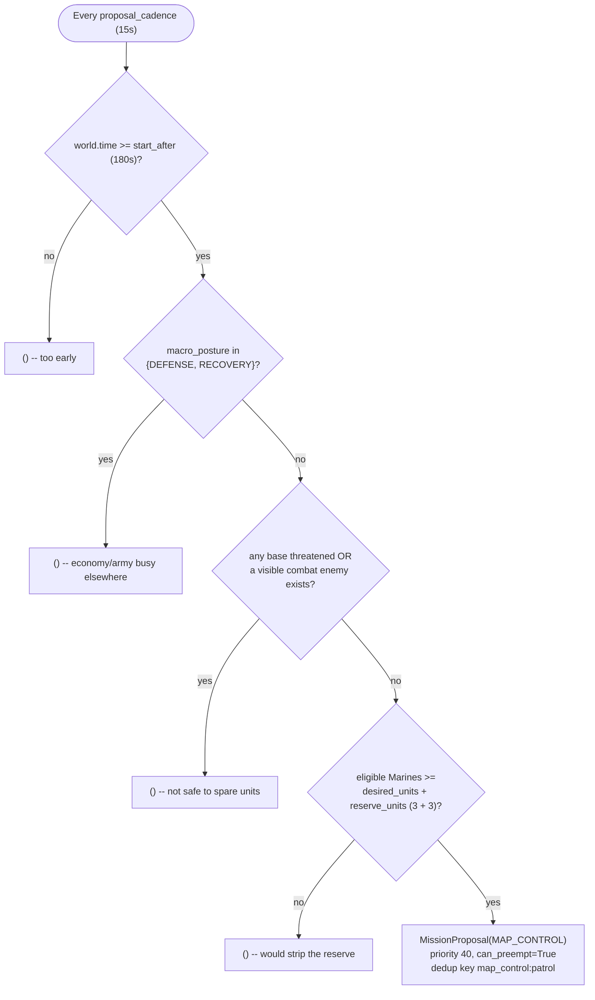

# Safe map-control mission

`MapControlPlanner` creates one low-priority, persistent patrol after 180 game
seconds (`start_after`). Its default squad is three healthy Marines
(`desired_units`), with a minimum of two (`minimum_units`), and it only
proposes when at least `desired_units + reserve_units` (6 by default) eligible
Marines exist in total -- so the patrol never visibly thins out the standing
disposition it draws from. It does not start during `DEFENSE`/`RECOVERY`
macro posture, while any base is threatened, or while a visible combat enemy
is on the map.

The proposal uses `MissionKind.MAP_CONTROL`, priority 40, dedup key
`map_control:patrol`, and `can_preempt=True` -- standing `POSITION`/`RESERVE`
missions (see [army-disposition.md](army-disposition.md)) now hold most
otherwise-idle units, so Map Control must be able to preempt them just to
acquire its patrol squad at all. Its own one-second commitment window then
lets `DEFENSE` take the squad back almost immediately if a base comes under
threat.

`MapControlExecutor` cycles the squad through four points covering the friendly
side of the map and the center. Every unit receives `safe_path_to`, implemented
by the Ares adapter with `MoveToSafeTarget`, `get_ground_grid`, and a strict
influence threshold. The adapter assigns Ares' native `UnitRole.MAP_CONTROL`.
No attack or attack-move command is issued by this mission.

The whole squad retreats to the closest safe base when:

- a visible ground threat comes within 20 range of any member;
- any member drops to 60% health or less;
- macro posture becomes `DEFENSE`/`RECOVERY`; or
- any held base becomes threatened.

Once the retreat reaches a base, the mission completes and releases its leases.
This is deliberately survival-biased map presence, not an army attack or combat
micro controller. The influence grid also routes around known enemy pressure and
dangerous effects between waypoints.
