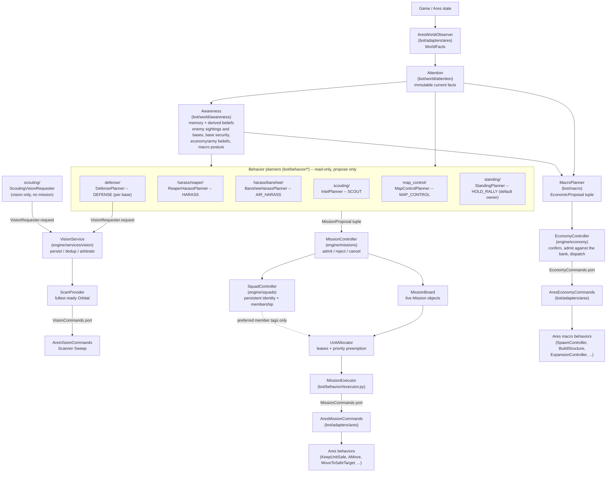

# Pilot architecture

The official architecture is a one-way causal flow:

```text
Game / Ares
    -> Attention (selected current observations)
    -> Awareness (memory and derived beliefs)
    -> Planners (independent arguments)
    -> MissionProposal / EconomicProposal
    -> MissionController / EconomyController (admission and arbitration)
    -> MissionBoard + UnitAllocator (commitments and leases)
    -> MissionExecutor
    -> command ports (MissionCommands, EconomyCommands, VisionCommands)
    -> Ares behaviors
```



Two domains share the same Attention/Awareness read side and nothing else:

```text
             attention / awareness
                      |
            +---------+---------+
            |                   |
        behavior              macro
     (bot/behavior)        (bot/macro)
            |                   |
     MissionProposal     EconomicProposal
            |                   |
    MissionController    EconomyController
    (engine/missions)    (engine/economy)
            |                   |
          units      minerals / gas / supply / production
```

**Behavior** governs units already on the map: missions, squads and unit
leases. **Macro** governs what to spend on -- production, construction,
tech, expansion and timing -- paid out of the bank with no unit lease.
Neither package imports the other, and neither engine imports either domain;
`tests/test_macro_architecture.py` fails if that erodes. Behaviors also share
capabilities among themselves through `BehaviorServices` (today only active
vision); macro does not use them. See [macro-planner.md](macro-planner.md) for
the macro side.

## Ownership

- `bot/world/attention` publishes immutable current facts. It contains no
  beliefs or mission bookkeeping. `AresWorldObserver` (`bot/adapters/ares`)
  is the only code that reads Ares to build them.
- `bot/world/awareness` owns memory and derived beliefs: enemy sightings and
  location freshness, enemy base memory, per-base security, the economy and
  army beliefs, and the macro posture.
- Behavior planners propose useful work. They never allocate or command units.
- `MissionController` (`bot/engine/missions`) is the only code allowed to
  admit proposals, change mission lifecycle, transfer leases, or release
  units. `UnitAllocator` holds the leases; `SquadController`
  (`bot/engine/squads`) only remembers who belongs together.
- Executors implement one admitted mission and use only explicit command
  ports, plus the shared services handed to them as `context.services`.
- `bot/engine/services` holds capabilities several behaviors share without
  knowing how they are provided -- today active vision, see
  [vision.md](vision.md).
- `bot/macro` proposes purchases and never claims a unit; `EconomyController`
  (`bot/engine/economy`) alone admits, reserves and dispatches them through
  the `EconomyCommands` port.
- `bot/adapters/ares` translates those ports into Ares roles and behaviors.
- `bot/app` wires the frame together without containing strategic rules
  (`runtime.py`) and binds each mission kind to its executor
  (`mission_registry.py`).

## World package layout

Observation facts live under `bot/world/attention/facts/`, split by subject so
each module has room to grow without turning into a generic model catalog:
`unit_facts.py`, `base_facts.py`, `map_facts.py`, `economy_facts.py`, and
`world_facts.py`. `attention/service.py` (`AttentionService.build`) wraps the
`WorldFacts` that `AresWorldObserver` collected, and `attention/snapshot.py`
holds `AttentionSnapshot`. Consumers import the stable public API from
`bot.world.attention`.

Awareness follows the same naming rule under `bot/world/awareness/`:
`snapshot.py` holds the combined belief snapshot (`AwarenessSnapshot`),
`service.py` derives it (`AwarenessService.update`), and the subpackages use
explicit state/derivation names instead of repeated `models.py` files:

- `enemy/` -- `knowledge.py` (sighting and location types) + `memory.py`
  (`EnemyKnowledge`, sightings kept while Ares reports the tag), and
  `bases.py` (`EnemyBaseMemory`: confirmed/empty/unknown per expansion slot,
  plus `scouting_coverage`).
- `bases/` -- `security.py` + `security_assessor.py`, the per-base threat
  reading described in [base-model.md](base-model.md).
- `belief/` -- `economy.py` and `army.py` compare us with the enemy on one
  axis each, and `relative.py` turns that noisy comparison into a stable
  belief (below).
- `posture.py` -- `derive_macro_posture`, described in
  [macro-planner.md](macro-planner.md).

Consumers import from `bot.world.awareness` or the relevant subpackage.

### Economy and army beliefs

`AwarenessSnapshot.economy` and `.army` answer "are we ahead?" without trusting
a single frame. Each axis compares our own number (workers; combat supply)
with an enemy *estimate* that includes remembered units, and derives a
confidence from evidence freshness and `scouting_coverage` -- the share of
expansion slots looked at recently -- so an unscouted map never reads as an
enemy with nothing. `relative.py` then debounces the raw reading into
`stable_state` (`AHEAD`/`EVEN`/`BEHIND`/`UNKNOWN`): a new state must persist
(15 s economy, 8 s army), `AHEAD` also needs confidence >= 0.60, an `UNKNOWN`
reading never replaces the stable belief, and a large or directly observed
deficit applies `BEHIND` at once.

A stable change is announced in game chat (`[Awareness] ARMY: EVEN -> BEHIND
...`, logged as `awareness.belief_changed`). The army belief also feeds
`RelativeStrength` (a supply comparison, with a unit-count fallback), the
`GREED` gate of the macro posture, and the standing army's `CombatPosture`.

## Scouting and active vision

The scouting slice sends a Reaper through the enemy natural and around the enemy
main using a map-derived perimeter route and Ares' climber grid. It stays safe via
`KeepUnitSafe`, records structures and the known enemy base count, and completes
only after closing the lap. Unknown information creates the initial scout after the
economy reaches 16 workers; stale information can be revisited in the periodic
phase. These values live in `IntelConfig`; the decision is drawn in
[scout-pilot-migration.md](scout-pilot-migration.md).

Active vision is a shared service rather than a scouting implementation detail.
`ScoutingVisionRequester` asks for normal-urgency vision when the enemy main has
gone 120 seconds without it; `DefensePlanner` asks for high-urgency vision where a
recent nearby attacker disappeared. `VisionService` persists, deduplicates and
arbitrates those needs, and its current `ScanProvider` casts Scanner Sweep from the
fullest ready Orbital holding at least 100 energy, preserving 50. Consumers know
neither Orbitals nor the provider. Mission executors receive the same capability as
`context.services.vision`. See [vision.md](vision.md).

## Behavior layout

`bot/behavior/` is organized vertically: one folder per behavior, holding
everything specific to it, so understanding or changing one behavior means
opening one directory. Every behavior follows the same shape, fixed by
`bot/behavior/contracts.py`:

```text
ASSESS   assessment.py   what is the situation, through this behavior's lens?
PLAN     planner.py      what do we want, at what priority, with which units?
OWN      (engine)        MissionController admits, UnitAllocator leases
EXECUTE  executor.py     how do we make it happen this frame?
```

`model.py` holds the assessment/plan/state types those three share. A small
behavior may collapse the files; it may not blur the responsibilities. An
assessment describes and never commits; a planner proposes and never
commands; an executor commands only the units its mission owns.

All six mission behaviors use this layout: `standing/` (the default owner of
every otherwise-idle combat unit, see
[standing-behavior.md](standing-behavior.md)), `harass/banshee/`,
`harass/reaper/`, `defense/`, `map_control/` and `scouting/`. A test in
`tests/test_behavior_architecture.py` fails if one of them grows a fifth
file or loses one of the four. `scouting/` also holds
`ScoutingVisionRequester`, which follows the same assess -> plan shape but
ends in a vision request instead of a mission.

## Macro layout

`bot/macro/` is not a behavior and does not live under `bot/behavior/`. It
is split by what a proposal buys, so the intelligence for one kind of spend
stays in one folder:

```text
bot/macro/
  contracts.py         SpendPlanner -- the macro counterpart of BehaviorPlanner
  planner.py           MacroPlanner: composes the domains into one tick's proposals
  diagnostics.py       macro.status / macro.idle_producer_unexplained
  proposal_helpers.py  one-step EconomicProposal builder, saturation target
  strategy/            goals, per-opening profiles, costs + posture priorities,
                       reference build
  production/          PRODUCE_UNIT, PRODUCE_WORKER  (army_demand.py: assessment)
  construction/        BUILD_PRODUCTION, BUILD_ADDON, PRODUCE_SUPPLY, BUILD_GAS
                       (capacity.py: assessment)
  expansion/           EXPAND
```

It keeps a behavior's discipline minus ownership: ASSESS (`army_demand`,
`assess_capacity`) -> PLAN (one proposer per domain, composed by
`MacroPlanner`) -> ADMIT (`EconomyController`, against the bank) -> EXECUTE
(`AresEconomyCommands`, through the `EconomyCommands` port). See
[macro-planner.md](macro-planner.md).

## Behavior planners

Six mission planner instances are wired into `BotRuntime` today, each with
its concrete executor in the same folder:

| Behavior | Planner | Mission kind | Priority | Mode | Can preempt |
| --- | --- | --- | --- | --- | --- |
| `scouting/` | `IntelPlanner` | `SCOUT` | 65 | FINITE | no |
| `harass/reaper/` | `ReaperHarassPlanner` | `HARASS` | 60 | FINITE | yes |
| `harass/banshee/` | `BansheeHarassPlanner` | `AIR_HARASS` | 62 | STANDING | yes |
| `defense/` | `DefensePlanner` | `DEFENSE` | 85 / 95 (threatened / critical) | FINITE | yes |
| `map_control/` | `MapControlPlanner` | `MAP_CONTROL` | 40 | STANDING | yes |
| `standing/` | `StandingPlanner` | `HOLD_RALLY` | 20 | STANDING | yes |

The two raids are independent behaviors rather than two `HarassOption`s
inside one planner: each has its own cadence, gates, assessment and config.
Banshee activation additionally requires compatible build intent. `SCOUT`
remains unit-based and is the only proposal that cannot preempt.

`BotRuntime` concatenates every planner's proposals into one tuple each frame;
`MissionController` sorts live missions by `-priority` before allocating, so
list order does not decide arbitration -- see
[harass-and-defense-planners.md](harass-and-defense-planners.md) for the
opportunistic missions' conditions, the command ports, and the
unit-utility/preemption-cost hooks,
[base-model.md](base-model.md) for per-base defense, and
[standing-behavior.md](standing-behavior.md) for the default-owner invariant.
Persistent identity is described in [squads.md](squads.md).
`MacroPlanner` produces
`EconomicProposal`s instead of `MissionProposal`s and is admitted separately by
`bot/engine/economy`; see [macro-planner.md](macro-planner.md).

## Two lifecycle modes

`MissionMode.FINITE` (`SCOUT`, `HARASS`, `DEFENSE`) is admitted once, runs to
completion/failure/cancellation,
and rejects a second proposal for the same `deduplication_key` while live.
`MissionMode.STANDING`
(`HOLD_RALLY`, `MAP_CONTROL`, and Banshee `AIR_HARASS`) is re-declared every cadence tick: a live standing
mission has its `Mission.proposal` replaced in place (same `mission_id`, same
lease history) instead of being rejected as a duplicate, and is torn down only
when its planner proposes something this tick but no longer that key
(`MissionController._reconcile_standing_missions`); a planner that proposes
nothing at all leaves its standing missions alone. Standing missions never time
out, and their `minimum=0` requirement means losing every unit leaves them idle
rather than failed. See [contracts.md](contracts.md) for the full frame
lifecycle.
