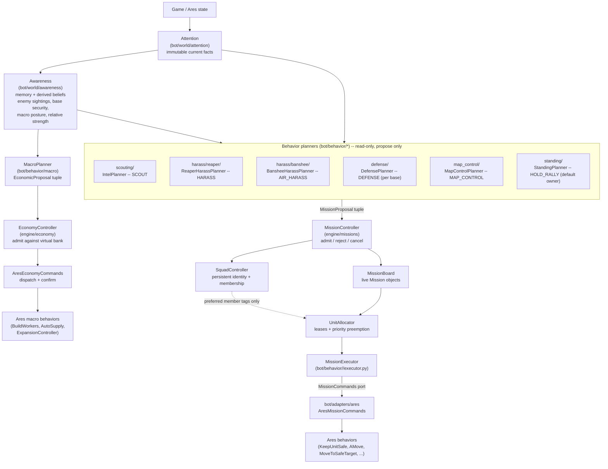

# Pilot architecture

The official architecture is a one-way causal flow:

```text
Game / Ares
    -> Attention (selected current observations)
    -> Awareness (memory and derived beliefs)
    -> Planners (independent arguments)
    -> MissionProposal / EconomicProposal
    -> Ego / MissionController / EconomyController (admission and arbitration)
    -> MissionBoard + UnitAllocator (commitments and leases)
    -> MissionExecutor
    -> infrastructure command port
    -> Ares Behaviors
```



Two independent arbitration tracks share the same Attention/Awareness read
side: the **mission** track (units, leases, positional/combat commitments)
and the **economic** track (single-frame spend decisions, no unit lease).
`MacroPlanner` only participates in the second one -- see
[macro-planner.md](macro-planner.md).

## Ownership

- `attention` publishes immutable current facts. It contains no beliefs or mission
  bookkeeping.
- `awareness` owns persistent enemy sightings and typed freshness beliefs.
- `planners` propose useful work. They never allocate or command units.
- `ego` is the only domain allowed to admit proposals, change mission lifecycle,
  transfer leases, or release units.
- `executors` implement one admitted mission and use only explicit command ports.
- `infrastructure/ares` translates those ports into Ares roles and behaviors.
- `application` wires the frame together without containing strategic rules.

## World package layout

Observation facts live under `bot/world/attention/facts/`, split by subject so
each module has room to grow without turning into a generic model catalog:
`unit_facts.py`, `base_facts.py`, `map_facts.py`, `economy_facts.py`, and
`world_facts.py`. `attention/service.py` (`AttentionService.build`) remains the
sole Ares-to-facts adapter and `attention/snapshot.py` holds `AttentionSnapshot`.
Consumers import the stable public API from `bot.world.attention`.

Awareness follows the same naming rule under `bot/world/awareness/`:
`snapshot.py` holds the combined belief snapshot (`AwarenessSnapshot`),
`service.py` derives it (`AwarenessService.update`), and the `bases`/`enemy`
subpackages use explicit state/derivation names (`security.py` +
`security_assessor.py`, `knowledge.py` + `memory.py`) instead of repeated
`models.py`/`knowledge.py` files. Consumers import from `bot.world.awareness`
or the relevant `bases`/`enemy` subpackage.

The scouting slice sends a Reaper through the enemy natural and around the enemy
main using a map-derived perimeter route and Ares' climber grid. It stays safe via
`KeepUnitSafe`, records structures and the known enemy base count, and completes
only after closing the lap. Unknown information creates the initial scout after the
economy reaches 16 workers; stale information can be revisited in the periodic
phase. These values live in `IntelConfig`.

## Behavior layout

`bot/behavior/` is organized vertically: one folder per behavior, holding
everything specific to it, so understanding or changing one behavior means
opening one directory. Every behavior follows the same shape, fixed by
`bot/behavior/contracts.py`:

```text
ASSESS   assessment.py   what is the situation, through this behavior's lens?
PLAN     planner.py      what do we want, at what priority, with which units?
OWN      (engine)        MissionController admits, UnitAllocator leases
EXECUTE  executor.py     how do we make it happen this frame?
```

`model.py` holds the assessment/plan/state types those three share. A small
behavior may collapse the files; it may not blur the responsibilities. An
assessment describes and never commits; a planner proposes and never
commands; an executor commands only the units its mission owns.

All six mission behaviors use this layout: `standing/` (the default owner of
every otherwise-idle combat unit, see
[standing-behavior.md](standing-behavior.md)), `harass/banshee/`,
`harass/reaper/`, `defense/`, `map_control/` and `scouting/`. A test in
`tests/test_behavior_architecture.py` fails if one of them grows a fifth
file or loses one of the four.

`macro/` is the deliberate exception. It produces `EconomicProposal`s on the
other arbitration track: it claims no unit, holds no mission, and has no
executor, so the four-file shape would describe nothing real. Its own split
is by spend domain -- see [macro-planner.md](macro-planner.md).

## Behavior planners

Six mission planner instances are wired into `BotRuntime` today, each with
its concrete executor in the same folder:

| Behavior | Planner | Mission kind | Priority | Mode | Can preempt |
| --- | --- | --- | --- | --- | --- |
| `scouting/` | `IntelPlanner` | `SCOUT` | 65 | FINITE | no |
| `harass/reaper/` | `ReaperHarassPlanner` | `HARASS` | 60 | FINITE | yes |
| `harass/banshee/` | `BansheeHarassPlanner` | `AIR_HARASS` | 62 | STANDING | yes |
| `defense/` | `DefensePlanner` | `DEFENSE` | 85 / 95 (threatened / critical) | FINITE | yes |
| `map_control/` | `MapControlPlanner` | `MAP_CONTROL` | 40 | STANDING | yes |
| `standing/` | `StandingPlanner` | `HOLD_RALLY` | 20 | STANDING | yes |

The two raids are now independent behaviors rather than two `HarassOption`s
inside one planner: each has its own cadence, gates, assessment and config.
Banshee activation additionally requires compatible build intent. `SCOUT`
remains unit-based and is the only proposal that cannot preempt.

`BotRuntime` concatenates every planner's proposals into one tuple each frame;
`MissionController` sorts live missions by `-priority` before allocating, so
list order does not decide arbitration -- see
[harass-and-defense-planners.md](harass-and-defense-planners.md) for the
opportunistic missions' conditions, the shared `attack_move` command port, and
the unit-utility/preemption-cost hooks,
[base-model.md](base-model.md) for per-base defense, and
[standing-behavior.md](standing-behavior.md) for the default-owner invariant.
Persistent identity is described in [squads.md](squads.md).
`MacroPlanner` produces
`EconomicProposal`s instead of `MissionProposal`s and is admitted separately by
`bot/engine/economy`; see [macro-planner.md](macro-planner.md).

## Two lifecycle modes

`MissionMode.FINITE` (`SCOUT`, `HARASS`, `DEFENSE`) is admitted once, runs to
completion/failure/cancellation,
and rejects a second proposal for the same `deduplication_key` while live.
`MissionMode.STANDING`
(`HOLD_RALLY`, `MAP_CONTROL`, and Banshee `AIR_HARASS`) is re-declared every cadence tick: a live standing
mission has its `Mission.proposal` replaced in place (same `mission_id`, same
lease history) instead of being rejected as a duplicate, and is torn down only
when its planner stops declaring that key at all
(`MissionController._reconcile_standing_missions`). See
[contracts.md](contracts.md) for the full frame lifecycle.
