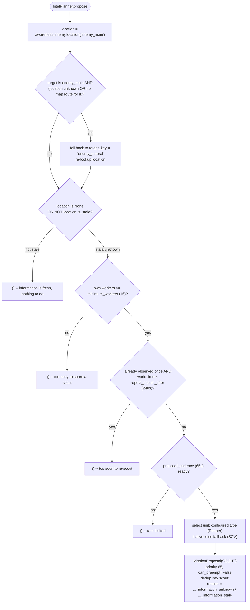

# Scout pilot migration

## Sources deliberately mined

The research source was branch `ares` at commit `2eab783`. The destination and
official architecture is branch `recomeço`.

The pilot reimplemented these useful ideas rather than copying their code:

- planner proposal and admitted commitment are different objects;
- unit ownership has both `unit_tag -> mission_id` and
  `mission_id -> unit_tags` views;
- selection is deterministic and prefers health and proximity;
- a short commitment window plus a priority margin prevents allocation thrashing;
- enemy observations carry time, age, confidence, and a typed stale threshold;
- worker scouts require a healthy, ready, non-carrying, non-constructing worker;
- an objective completes only after a real observation newer than mission start;
- timeouts, cooldowns, lifecycle results, and all decisions have explicit reasons;
- mission state is exposed through immutable `MissionSnapshot` objects.

## Deliberately not migrated

- The old monolithic `Ego`: it mixed planning, allocation, scheduling, execution,
  memory, and logging.
- The global key/value `MemoryStore`: the pilot uses typed enemy location knowledge.
- `PrioritizationIntel`: scout priority 65 is explicit and keeps the initial
  information mission ahead of opportunistic Reaper harass.
- The giant `DefensePlanner`, synthetic threats, bunker logic, SCV pulls, and repair
  orchestration: none are required to prove the scout flow.
- `MacroOrchestratorPlanner`, desired composition, and spending heuristics: economy
  proposals need a separate future vertical slice.
- `ResourceReserve`: it was declarative but had no effective enforcement in the old
  runtime.
- Generic task factories, pick-policy protocols, event buses, service locators, and
  lease heartbeats: each adds machinery without helping this single mission.
- Scans, rush-specific cadence, and probabilistic inference remain outside this
  slice.

## `IntelPlanner` decision

`location.is_stale` (`bot/world/awareness/service.py`) is `True` when the
location was never observed (`age is None`) or its age has crossed
`location_stale_after` (90s) -- "unknown" and "stale" are the same branch in
code, distinguished only in the proposal's `reason` string for readability.

## End-to-end behavior

1. Attention selects the enemy main and natural, then derives an enemy-main
   perimeter route from map-analysis data. The route starts at the natural,
   enters the main from a cliff-side point away from the ramp, circles its
   perimeter, and closes the lap.
2. Awareness remembers real observations, enemy structures, and townhalls; the
   runtime logs them through `knowledge.enemy_intel`.
3. `IntelPlanner` emits a reasoned `MissionProposal` when it is unknown or stale.
4. `MissionController` logs the proposal, rejects duplicates/cooldown conflicts, or
   admits it as a distinct `Mission`.
5. `UnitAllocator` leases one eligible Reaper (with SCV fallback when none is
   alive); maps without a specialized main route use the natural objective. The
   allocator supports priority-based preemption without allowing missions to
   steal tags directly.
6. `ScoutExecutor` carries out the admitted mission through `MissionCommands`.
7. The Ares adapter assigns `UnitRole.SCOUTING` and registers a maneuver with
   `KeepUnitSafe` followed by `PathUnitToTarget`, using the climber grid for a
   Reaper so cliff jumps are pathable.
8. `ScoutExecutor` advances only when each route point is reached or visible; merely
   seeing the main does not complete a routed scout.
9. The mission completes with `enemy_main_route_completed` after the closed lap,
   releases the lease, and restores the unit to `UnitRole.IDLE`.

The opening's independent `worker_scout` step was removed so this flow has one
authority and one causal record.

## Deferred decisions

- Whether a scout should return home before completion or release immediately to
  Ares mining.
- How emergency priority 100 should bypass or shorten commitment protection.
- The future economy contract: `SpendProposal`, real resource reservations, and an
  `EconomyController` remain intentionally unimplemented.
