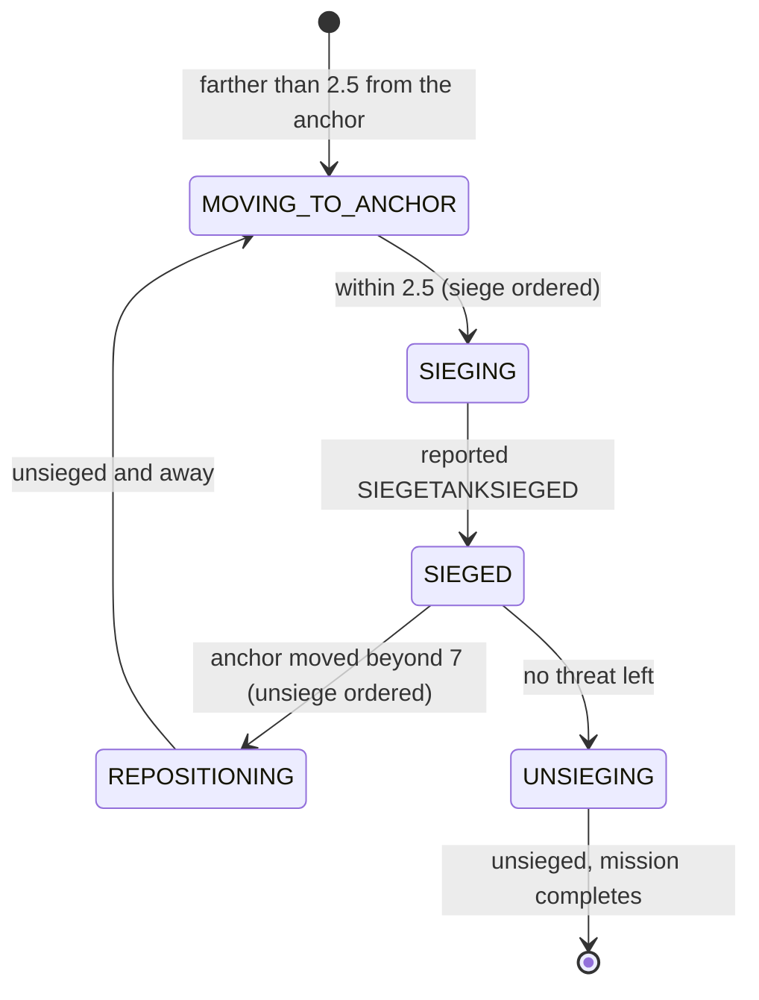

# Defense

`bot/behavior/defense/` proposes one defense mission per threatened base,
picks which defenders are worth pulling from what is attacking, asks for
vision where an attacker just disappeared, and runs a small role pilot inside
the mission: Tanks siege on an anchor behind the fight, everything else
screens.

Source: `bot/behavior/defense/` (`model.py`, `assessment.py`, `planner.py`,
`executor.py`); the threat reading is in
[world/base-security.md](../world/base-security.md).

## Assess

`DefenseAssessor` reads `awareness.bases.threatened` through the defense lens
and adds what the base reading does not carry -- what the attackers are:

| `DefenseAssessment` | Meaning |
| --- | --- |
| `threatened` | one `ThreatenedBase(base, air_threats, ground_threats)` per base that needs defense |
| `held_bases` | number of held bases |
| `pressure` | `threat.near_own_base_enemy_combat_units` |

`air_threats` / `ground_threats` count visible combat threats within
`engagement_radius` (25) of the base, flying and not. `ThreatenedBase` also
exposes `is_critical`, `gap = threat_score - protection_score`, and `target =
nearest threat position` (or the base position).

## Plan

```text
propose, every frame:
  request vision for a recently lost attacker        (below; independent of the cadence)
  cadence (5 s) not ready          -> ()
  assess
  no threatened base               -> ()   cadence not consumed: a new attack is answered at once
  mark cadence
  one plan per threatened base; log behavior.assessed and a behavior.proposed per plan
  -> one proposal per plan
```

Per threatened base:

| Plan field | Value |
| --- | --- |
| `desired_units` | `min(6, max(1, ceil(gap)))` -- grows with how outnumbered the base is |
| `priority` | 95 when `CRITICAL` (no protection at all), 85 when `THREATENED` |
| `reason` | `base_undefended_against_observed_threat` / `base_outnumbered_by_observed_threat` |
| `type_desirability` | the ground table if anything attacking is on the ground; the air-only table if every attacker flies |

Defender preference (`DefenseConfig`):

| Attack | Siege Tank | Marauder | Marine | Reaper | Banshee |
| --- | ---: | ---: | ---: | ---: | ---: |
| anything on the ground (`ground_threat_desirability`) | 1.0 | 0.7 | 0.6 | 0.4 | 0.4 |
| air only (`air_only_threat_desirability`) | 0.0 | 0.2 | 1.0 | 0.2 | 0.0 |

The allocator only ranks by these numbers and never requests a 0.0, so the
matchup knowledge stays here.

The proposal:

| Field | Value |
| --- | --- |
| kind, mode | `DEFENSE`, `FINITE` |
| `deduplication_key` | `defense:<base_id>` -- independent missions for a two-front attack |
| `target_key`, `target` | the base id; the nearest threat's position (the base when unknown) |
| requirement | `UnitRequirement.combat(unit_types=DefenseConfig.unit_types, desired, minimum=1, minimum_health=0.3, type_desirability)` |
| `can_preempt`, `commitment_seconds` | yes, 3 s |
| `timeout_seconds`, `cooldown_seconds` | 120 s, 10 s |

`DefenseConfig.unit_types` defaults to Marine, Marauder, Reaper, Siege Tank
(both modes) and Banshee.

Protection never suppresses a proposal -- see
[world/base-security.md](../world/base-security.md#why-protection-never-suppresses-a-proposal).
While a defense for a base is live, the planner keeps proposing it every 5 s;
those proposals are rejected as `matching_mission_already_live` and change
nothing.

Once admitted, the mission may be bound to a compatible squad, whose members
then rank first ([engine/squads.md](../engine/squads.md#temporary-missions-defense)).

### Vision for a lost attacker

Every frame, before the cadence gate, `DefensePlanner` looks at remembered
enemy sightings that are no longer visible, not workers, armed, last seen at
most `remembered_threat_max_age` (12 s) ago, within 25 of one of our bases.
For the most recently seen one it asks `BehaviorServices.vision` for `HIGH`
urgency vision at its last position, TTL `vision_request_ttl` (6 s), reason
`recent_threat_lost_near_own_base`. Whether that becomes a Scanner Sweep is
the service's call ([engine/vision.md](../engine/vision.md)).

## Execute

`DefendBaseExecutor` runs until no threat remains near where the mission was
admitted.

```text
step:
  resolve roles for newly assigned units; forget departed ones
  threats = visible combat threats within 25 of the mission target
  no threats                     -> release sequence (below)
  threats but no units           -> FAILED assigned_unit_missing
  anchors = toward(defended base, ground-threat centroid)
  each unit: SIEGE_ANCHOR -> hold the siege anchor; SCREEN -> attack-move the nearest threat
  -> ACTIVE engaging_enemy_near_own_base
```

### Roles (pilot)

A unit does not only belong to a defense mission; its type decides what it
does inside it. Roles are resolved inside this executor only --
`MissionProposal`, `MissionController` and `UnitAllocator` carry no roles.

| `DefenseRole` | Units | Does |
| --- | --- | --- |
| `SIEGE_ANCHOR` | `SIEGETANK`, `SIEGETANKSIEGED` | moves to the siege anchor, sieges there, holds; never attack-moved at the enemy |
| `SCREEN` | every other defender | `attack_move` to the threat nearest the mission target (arrival 2) |

Role resolution is logged once per batch as `behavior.state_changed` with
state `SIEGE_ANCHOR` or `SCREEN`, reason `role_resolved_from_unit_type`.

### Anchors

`DefenseAnchors` is plain geometry. From the defended base
(`awareness.bases.get(target_key)`, or our start if that base is gone) toward
the centroid of the ground threats (every threat if none is on the ground):

```text
scale  = min(1, distance(base, threat centroid) / 12)
siege  = base moved toward the threat by 6 * scale
screen = base moved toward the threat by 12 * scale
```

An enemy already inside the screen line squeezes both anchors back, so the
Tank always stands behind where the bio fights. The screen anchor is logged
but not used yet.

### Siege loop



The leash is 2.5 while mobile and 7 once sieged or sieging, so a drifting
threat does not unsiege a Tank that just set up. Siege and unsiege go through
`use_ability`, safe to repeat every frame (Ares' `UseAbility` no-ops while the
ability is unavailable). Every phase change is logged with the anchors and
the Tank's distance to its anchor.

### Release

`MissionController` releases every unit the moment the executor reports
`COMPLETED`, and a Tank left sieged would stay sieged under its next owner.
So when no threat remains:

- no Tank sieged or mid-siege -> `COMPLETED threat_cleared_near_own_base`;
- otherwise unsiege them and wait (`unsieging_tanks_before_release`), and
  after `unsiege_timeout` (6 s) complete anyway with
  `threat_cleared_unsiege_timed_out`;
- a threat returning cancels the release.

## Config (`DefenseConfig`)

| Group | Field | Default |
| --- | --- | --- |
| Proposal | `proposal_cadence` | 5 s |
| | `threatened_priority`, `critical_priority` | 85, 95 |
| | `mission_timeout`, `failure_cooldown` | 120 s, 10 s |
| | `commitment_seconds` | 3 s |
| Units | `unit_types` | Marine, Marauder, Reaper, Siege Tank (both), Banshee |
| | `minimum_units`, `max_desired_units` | 1, 6 |
| | `minimum_unit_health` | 0.3 |
| | `ground_threat_desirability`, `air_only_threat_desirability` | the tables above |
| Vision | `remembered_threat_max_age`, `vision_request_ttl` | 12 s, 6 s |
| Tactics | `engagement_radius`, `arrival_radius` | 25, 2 |
| | `siege_anchor_offset`, `screen_anchor_offset` | 6, 12 |
| | `siege_arrival_radius`, `siege_reposition_distance` | 2.5, 7 |
| | `unsiege_timeout` | 6 s |

## Known gaps

- **Mech units cannot defend.** `unit_types` has no Hellion, Hellbat,
  Cyclone, Thor or Viking, and every game plays `BattleMech`: after the
  opening, most of the army is not eligible for defense missions.
- Sizing is a unit count (`ceil(gap)`), not supply or fighting value.
- The engagement area is centred on where the nearest threat stood at
  admission, not on the base; an attack that moves along the base can leave
  that circle and complete the mission early.
- A FINITE mission keeps the requirement it was admitted with: an attack that
  turns from ground to air does not shed the Tanks already leased.
- No worker pulls, SCV repair, or reinforcement requests.
- Tanks are not unsieged when the mission is cancelled by timeout or loses
  them to preemption; no choke or high-ground placement; no unsieging when the
  enemy is inside minimum range; the screen anchor does not steer the screen.
- The proposal cadence is one scalar for all bases.
