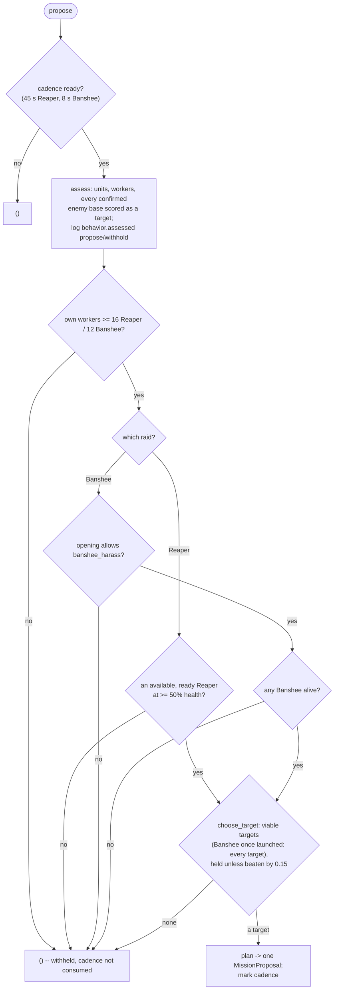
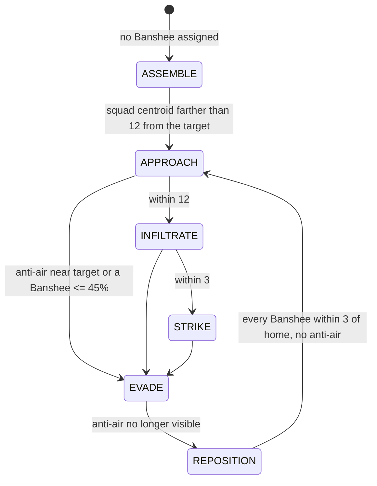

# Harass: the Reaper and Banshee raids

Two independent raids on the enemy economy, each its own vertical behavior
with its own assessor, planner, executor and config. They share nothing but
the folder above them; `MissionController` arbitrates whatever they each
propose, so both can be live at once.

Source: `bot/behavior/harass/reaper/`, `bot/behavior/harass/banshee/`
(`model.py`, `assessment.py`, `planner.py`, `executor.py` each),
`bot/behavior/strategy_intent.py`, `bot/engine/missions/planning.py`.

| | Reaper raid | Banshee raid |
| --- | --- | --- |
| Kind, priority, mode | `HARASS`, 60, FINITE | `AIR_HARASS`, 62, STANDING |
| Deduplication key | `harass:<target_key>` | `air_harass:banshee_harass` (the squad) |
| Units | exactly 1 Reaper | every Banshee alive (squad `banshee_harass`) |
| Cadence | 45 s | 8 s |
| Launch gates | 16 workers, an available healthy Reaper, a viable target | 12 workers, build intent, a Banshee alive, a viable target |
| Target | fixed for the raid's life | retargets in place |
| Ends | returns home at low health, or times out after 60 s | never; retreats and resumes |

Neither raid ever asks for units to be built; producing Reapers and Banshees
is the opening's and the build's decision ([macro/builds.md](../macro/builds.md)).

## Launch decision



## Target selection

Neither raid has a fixed target. Each assessment reads every enemy base
Awareness has confirmed (`awareness.enemy.bases.confirmed`) together with the
force clusters that may be near it (`awareness.enemy.forces.near`), and scores
each base through its own heuristics. Awareness describes a base once; each
raid interprets it for its unit, so the same base can rank first for one raid
and last for the other. Every weight lives in `BansheeTargetHeuristics` /
`ReaperTargetHeuristics` (`config.targeting`).

Two helpers, used below:

```text
believed(reading, confidence, assumed) = c * reading + (1 - c) * max(reading, assumed)
    the share of a reading its confidence does not cover is assumed to hold at least `assumed`;
    defense already seen never shrinks with age

proximity(distance, contact, reach)    = clamp((reach - distance) / (reach - contact), 0, 1)
    1 within contact, 0 at reach; distance is EnemyForceCluster.distance_to, which already
    subtracts the cluster's spread and position uncertainty
```

### Banshee

```text
opportunity      = 0.6 * economic_value + 0.4 * min(1, workers / 16)
air_defense_risk = believed(air_defense, air_defense_confidence, assumed 0.25)
ground_hint      = ground_defense                 cannot shoot up: only a hint that the base is held
army_risk        = min(1, sum over clusters within 45 of
                          anti_air_strength * proximity(d, 10, 45) * (0.35 + 0.65 * cluster confidence)
                        / 6)
score  = 1.0 * opportunity - 1.0 * air_defense_risk - 0.1 * ground_hint
       - 0.8 * army_risk   - 0.15 * (1 - base confidence)
viable = air_defense_risk <= 0.4 and army_risk <= 0.5
```

A cluster seen long ago still counts for 35% of its anti-air: a Banshee is
expensive and slow to replace.

### Reaper

```text
opportunity         = 0.3 * economic_value + 0.7 * min(1, workers / 16)
ground_defense_risk = clamp((believed(ground_defense, ground_defense_confidence, assumed 0.35) - 0.25) / 0.75, 0, 1)
army_risk           = clamp((sum over clusters within 25 of
                                anti_ground_strength * proximity(d, 6, 25) * cluster confidence
                             - 2) / 6, 0, 1)
score  = opportunity - ground_defense_risk - army_risk - 0.05 * (1 - base confidence)
viable = ground_defense_risk <= 0.6 and army_risk <= 0.6
```

A Reaper leans on the worker line, tolerates about one Queen's worth of
ground defense (0.25 of the 8 that reads as fully defended) and about 2 supply
of army, and counts a cluster only at its confidence: it outruns a force it
did not expect. Looking at a base is part of what it is for, so uncertainty
weighs little.

### Fallback, holding and logging

- While no base is confirmed, each `fallback_target_keys` location (default
  `enemy_natural`) that has been observed stands in, scored as a base worth
  `fallback_opportunity` (0.5) with unknown defense, at the location's
  confidence.
- The planner, not the assessment, holds the target. Both call
  `choose_target` with `retarget_margin` 0.15: the previous target is kept
  while it is still a candidate and nothing beats it by more than 0.15, and
  dropped at once when it is no longer one. Candidates are the viable
  targets -- except for a Banshee raid that has launched at least once, which
  takes every target when none is viable, so the standing squad keeps being
  declared.
- Both planners log `behavior.target_selection` -- `change`, `selected`,
  `previous` and one summary line per candidate (`expansion:3 score=0.82
  value=0.91 aa=0.12 army_risk=0.08 confidence=0.94`) -- whenever the target
  changes and at most every 30 s otherwise. Selection only runs once every
  other gate has passed.

## Reaper raid

### Assess

| `ReaperHarassAssessment` | Meaning |
| --- | --- |
| `reapers_available` | Reapers that are available for missions, ready and at >= 50% health |
| `workers` | own workers |
| `targets` | every candidate, best score first |
| `readiness` | `min(1, available) * min(1, workers / 16) * (1 if any target is viable)` -- descriptive only |

Availability is the point: a Reaper away on a scout has the `SCOUTING` role
and reads unavailable, so the raid never proposes something that would only
be blocked (it could not preempt a 65 scout at 60 anyway).

### Plan

`best_ranked_reaper_target`, one Reaper (`UnitRequirement.combat`, 1/1,
health 0.5), evidence fields from the base's last check, `can_preempt`, 5 s
commitment, 60 s timeout, 30 s cooldown. A live raid keeps the base it was
launched at; the next raid is chosen from the new ranking, still measured
against the previous raid's base.

### Execute

```text
no unit                       -> FAILED assigned_unit_missing
health <= 40% (latched)       -> safe_path_to our start (search radius 6);
                                 COMPLETED critical_reaper_returned_to_safety within 10 of it
a visible enemy worker within 16 of the target
                              -> attack_unit the lowest-health one (ties: nearest, then tag)
                                 (Ares ReaperGrenade + StutterUnitForward, role HARASSING)
otherwise                     -> attack_move onto the target (arrival 3)
```

A healthy raid does not complete: it ends when the 60 s mission timeout
cancels it, which releases the Reaper back to the standing army.

## Banshee raid

### Assess

| `BansheeHarassAssessment` | Meaning |
| --- | --- |
| `banshees_alive`, `banshees_ready`, `banshees_pending` | every Banshee we own; ready ones; in production |
| `cloak_ready`, `cloak_progress` | Cloaking Field done; research progress 0..1 |
| `workers` | own workers |
| `build_supports_harass` | `StrategicIntent.allows("banshee_harass")`: true for `BansheeCloak` and `BattleMech` |
| `targets` | every candidate, best score first |
| `known_anti_air_units` | remembered enemy units that can attack air |
| `enemy_army_position` | the main force's centre -- descriptive, not a gate |
| `readiness` | `min(1, (alive + 0.5 * pending) / 2) * cloak_progress * (1 if any target)` -- descriptive |
| `risk` | the worse of the two risks at the best viable target, or the best target |

### Plan

`desired_banshees = max(1, banshees_alive)`, so every Banshee produced
afterwards joins the squad within one 8 s cadence. Reason
`best_ranked_banshee_target`, or `raid_live_without_a_viable_target` when a
launched raid holds a non-viable target. Proposal: `STANDING`, squad
`banshee_harass`, minimum 0 (holding zero Banshees is idle, not failed),
health 0.5, `can_preempt`, 5 s commitment, 30 s cooldown. Retargeting keeps
the squad-scoped key, so `MissionController` replaces the live proposal in
place (same mission, leases and squad home) and the executor's `refresh`
flies to the new target on its next step.

### Execute

`BansheeHarassExecutor` runs an explicit tactical state machine; every phase
change is logged as `behavior.state_changed`.



- **APPROACH / INFILTRATE / STRIKE** issue the same pair every step, per
  Banshee: `use_ability(BEHAVIOR_CLOAKON_BANSHEE)` and `attack_move` onto the
  target (arrival 3). Closing the last tiles onto a worker line changes what
  is at stake, not what the squad is told to do. Re-casting cloak is always
  safe: `UseAbility` no-ops when the ability is not available (before the
  research, or already cloaked).
- **Retreat latch.** A visible enemy able to attack air within
  `disengage_radius` (12) of the target, or any Banshee at 45% health or less,
  latches retreat. Home is the `SAFE` base nearest the squad centroid, or our
  start. EVADE while that anti-air is visible, REPOSITION once it is not, both
  flying `safe_path_to` home.
- **Recovery** needs only the threat gone and every Banshee within 3 of home
  -- not health back, since Banshees do not regenerate and nothing repairs
  them. Then the raid resumes.
- **Preemption cost.** `preemption_cost()` is 5 in INFILTRATE and STRIKE, 0
  otherwise. Small enough that `DEFENSE` (85) still takes striking Banshees
  (85 >= 62 + 10 + 5), large enough that nothing near the raid's priority
  pulls it apart at its most valuable moment.
- Being standing and squad-backed, the raid never completes or times out, and
  defense preemption leaves the executor in ASSEMBLE waiting for the same
  members.

## Config

### `ReaperHarassConfig`

| Field | Default |
| --- | --- |
| `unit_types` | Reaper |
| `minimum_workers` | 16 |
| `proposal_cadence`, `priority` | 45 s, 60 |
| `mission_timeout`, `failure_cooldown` | 60 s, 30 s |
| `minimum_unit_health`, `commitment_seconds` | 0.5, 5 s |
| `fallback_target_keys` | `("enemy_natural",)` |
| `worker_search_radius`, `arrival_radius` | 16, 3 |
| `retreat_health`, `retreat_arrival_radius` | 0.40, 10 |
| `targeting` | `ReaperTargetHeuristics`: the formula constants above |

### `BansheeHarassConfig`

| Field | Default |
| --- | --- |
| `unit_types` | Banshee |
| `minimum_workers` | 12 |
| `proposal_cadence`, `priority` | 8 s, 62 |
| `mission_timeout`, `failure_cooldown` | 70 s (not applied to standing), 30 s |
| `minimum_unit_health`, `commitment_seconds` | 0.5, 5 s |
| `strategic_intent`, `cloak_upgrade` | `banshee_harass`, `BANSHEECLOAK` |
| `preferred_squad_size` | 2 (readiness only) |
| `fallback_target_keys` | `("enemy_natural",)` |
| `disengage_radius`, `arrival_radius`, `infiltration_radius` | 12, 3, 12 |
| `retreat_health` | 0.45 |
| `strike_preemption_cost` | 5 |
| `targeting` | `BansheeTargetHeuristics`: the formula constants above |

## Known gaps

- No detector awareness: a detector that cannot attack air does not trigger
  EVADE.
- No static-defense reaction in flight: target scoring reads static anti-air
  through `air_defense`, but the in-flight check looks only at visible enemy
  units, so a Missile Turret or Spore Crawler at the target never triggers
  EVADE.
- Cloak is cast blindly every step; no energy scheduling.
- No air pathing: `safe_path_to` routes Banshees on the ground grid.
- A live Reaper raid cannot retarget (a FINITE mission accepts no in-place
  update); a raid does not chain targets (natural, then main).
- Target selection reads the current state only: no predicted army movement,
  no travel distance.
