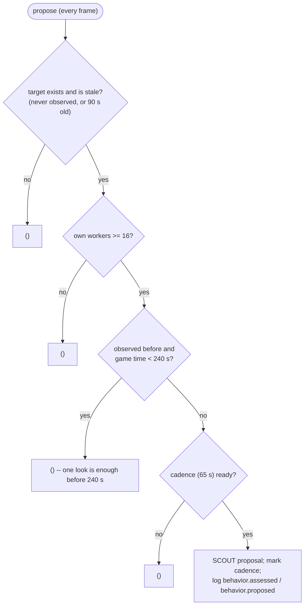

# Scouting

`bot/behavior/scouting/` spends one unit on information when information is
missing: a Reaper walks a lap of the enemy main. Next to the mission, a
separate requester asks the vision service for a scan when the enemy main has
gone unseen for too long.

Source: `bot/behavior/scouting/` (`model.py`, `assessment.py`, `planner.py`,
`executor.py`); the route is built in `bot/adapters/ares/world_observer.py`
([world/attention.md](../world/attention.md#the-enemy-main-scouting-route)).
History of the slice: [history/scout-pilot-migration.md](../history/scout-pilot-migration.md).

## `IntelPlanner`

### Assess

`IntelAssessor` resolves which location to visit and what to send:

```text
key      = IntelConfig.target_key ("enemy_main")
location = awareness.enemy.location(key)
if key is enemy_main and (location unknown or the map has no enemy_main route):
    key = "enemy_natural"; location = awareness.enemy.location(key)
target   = ScoutTarget(key, position, last_observed_at, age, stale_after, is_stale, has_route)
           or None when that location does not exist

scout types = {Reaper} while any Reaper is alive, otherwise {SCV}
```

The planner and the executor both see one already-decided target.

### Plan

Assessed every frame; the cadence is checked only once a plan exists, so a
withheld scout does not consume it.



| Proposal field | Value |
| --- | --- |
| kind, priority, mode | `SCOUT`, 65, FINITE |
| `deduplication_key` | `scout:<key>` |
| `target_key`, `target` | the resolved key and its position |
| `reason` | `<key>_information_unknown` (never observed) or `<key>_information_stale` |
| requirement | `UnitRequirement.combat(unit_types=scout types, desired=1, minimum=1, minimum_health=0.7)` -- which also excludes an SCV carrying minerals or constructing |
| evidence | `last_observed_at`, `age`, `stale_after` of the location |
| `can_preempt` | **no** -- information is worth a spare unit, not an interrupted raid |
| `commitment_seconds`, `timeout_seconds`, `cooldown_seconds` | 5 s, 105 s, 18 s |

If the location gets observed after admission but before a unit starts the
mission, `MissionController` cancels it with
`objective_satisfied_before_mission_started`.

## `ScoutExecutor`

```text
no unit                                             -> FAILED assigned_unit_missing
the unit is a Reaper and the map has a route for the target key:
    walk the waypoints in order; a waypoint counts as reached within 4,
    or within 10 while it is visible
    path_to the next waypoint (arrival 4)           -> ACTIVE scouting_main_route_waypoint_<i>_of_<n>
    after the last one                              -> COMPLETED enemy_main_route_completed
otherwise (an SCV, or no route):
    the location observed after the mission started -> COMPLETED target_observed_after_mission_started
    path_to the location (arrival 4)                -> ACTIVE moving_to_stale_location
```

Merely seeing the main does not complete a routed scout: the lap must close.
`path_to` registers Ares `KeepUnitSafe` plus `PathUnitToTarget` with danger
sensing, on the climber grid for a Reaper (so cliff jumps are pathable),
assigns the `SCOUTING` role and, for a worker, removes it from its mineral
line. Completion releases the unit (`IDLE`, or `GATHERING` for an SCV).

The opening build orders deliberately contain no scouting step, so this flow
is the one authority for scouting and has one causal record.

## `ScoutingVisionRequester`

Not a mission: it follows the assess -> plan shape but ends in a vision
request. `FrameProcessor` ticks it every frame, before the mission planners.

```text
assess:  target            = the enemy_main MapObservation position
         visible_now       = that observation's visibility
         seconds_without   = game time since enemy_main was last observed (since game start if never)
plan:    target exists, not visible, seconds_without >= 120 s
request: at most every 5 s -> vision.request(position, NORMAL, requester "scouting",
                                             reason "enemy_main_vision_stale", ttl 12 s)
```

It logs `behavior.assessed` (decision `request_vision`) and
`behavior.proposed` with the request id and status under
`behavior.scouting.vision`. Whether a scan fires is the vision service's
decision ([engine/vision.md](../engine/vision.md)).

## Config

### `IntelConfig`

| Field | Default |
| --- | --- |
| `target_key` | `enemy_main` |
| `location_stale_after` | 90 s (also passed to `AwarenessService`) |
| `minimum_workers` | 16 |
| `repeat_scouts_after` | 240 s |
| `proposal_cadence`, `priority` | 65 s, 65 |
| `mission_timeout`, `failure_cooldown` | 105 s, 18 s |
| `unit_types`, `fallback_unit_types` | Reaper; SCV |
| `minimum_unit_health` | 0.70 |
| `arrival_radius`, `observation_radius` | 4, 10 |

### `ScoutingVisionConfig`

| Field | Default |
| --- | --- |
| `target_key` | `enemy_main` |
| `max_without_vision` | 120 s |
| `request_cadence` | 5 s |
| `request_ttl` | 12 s |
| `urgency` | `NORMAL` |

## Known gaps

- **Blocked by the standing army.** Scouting never preempts, and the standing
  army leases every combat unit, Reapers included. While any Reaper is alive
  the scout asks only for a Reaper, so it usually stays blocked until the
  105 s timeout, then waits the 18 s cooldown and tries again. It only gets a
  Reaper that happens to be unleased (a fresh one before the standing army's
  next update, or one just released).
- The scout does not return home before completing.
- There is no emergency priority path around commitment windows.
