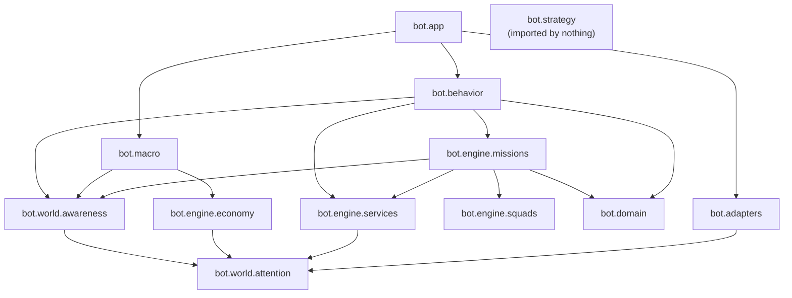

# Contracts

The rules that keep the layers in [overview.md](overview.md) apart, who owns
each decision, and the tests that fail when a rule erodes. Mission-level
detail (admission, allocation, loss and cleanup) is in
[engine/missions.md](engine/missions.md); the per-frame order is in
[frame-lifecycle.md](frame-lifecycle.md).

## Package dependencies

Allowed imports, top to bottom. Anything not listed is not allowed.

```text
bot.domain            nothing from bot
bot.ports             nothing from bot (type-only imports of engine models)
bot.world.attention   nothing from bot
bot.world.awareness   world.attention, ports.logging
bot.strategy          the standard library only
bot.engine.services   world.attention, ports
bot.engine.missions   domain, world, engine.services, engine.squads, ports
bot.engine.squads     engine.missions (models, allocator), world.attention, ports
bot.engine.economy    world.attention, ports
bot.behavior          engine.missions, engine.services, world, domain, ports
bot.macro             engine.economy, world, ports
bot.adapters.ares     ares, sc2, world.attention facts, engine models the ports carry
bot.app               everything: the composition root
```



## Rules

Each rule names what enforces it. "Review" means no test does yet.

| # | Rule | Enforced by |
| --- | --- | --- |
| 1 | **Attention is one frame of facts.** It holds only state observable now, as immutable dataclasses, never an Ares object. `AresWorldObserver` is the only code that reads Ares to build facts. | review |
| 2 | **Enemy memory follows Ares.** Each enemy unit carries Ares' own visible/memory flag (`UnitSnapshot.visible_now`); a scouted structure in fog arrives as a game snapshot and is flagged the same way. `EnemyKnowledge` keeps a sighting only while Ares still reports the tag. Force clusters inherit that lifetime. Only `EnemyRoster` keeps units longer -- until the game reports them dead -- and only for counting. | `test_enemy_knowledge.py`, `test_awareness_belief.py` |
| 3 | **Awareness describes.** No controller state, lease, cooldown or mission status enters it, and it decides nothing. Stable belief changes leave as `AwarenessSnapshot.belief_changes`, which `FrameProcessor` logs. Its only direct log output is the cost heartbeat (`spatial.perf`, `territory.perf`) through the injected logger port. | review |
| 4 | **An assessment is a reading.** A behavior's `assessment.py` reads Attention and Awareness only -- never `bot.engine` or `bot.app` -- and its result carries no `mission_id`, `assigned_units`, `status` or `owner`. | `test_behavior_architecture.py` (`AssessmentIndependenceTests`) |
| 5 | **A planner proposes.** It returns immutable proposals and never claims a unit or starts a mission. It may ask a shared service for an outcome (rule 12). | `test_behavior_architecture.py` (`BehaviorShapeTests`) |
| 6 | **`MissionController` alone admits.** It admits and rejects proposals and changes mission status. It never names a `MissionKind` or a behavior: it looks each kind up in the executor table `bot/app/mission_registry.py` hands it, and every kind is registered. | `test_behavior_architecture.py` (`MissionControllerGenericityTests`) |
| 7 | **`UnitAllocator` alone leases.** It is the only writer of the unit-to-mission leases. `SquadController` records membership and preferred tags; it is not a second owner and never commands. | `test_allocator.py`, `test_squad_controller.py` |
| 8 | **Executors command only what they lease.** Commands go through `MissionCommands`; `AresMissionCommands` raises `UnauthorizedUnitCommand` for a unit the calling mission does not lease. Executors may use `context.services`. Every `MissionResult` has a non-empty reason. | `test_ares_commands.py`; `MissionResult` raises |
| 9 | **Only the Ares adapters touch Ares.** They assign Ares roles and register Ares behaviors; each command sets its own role whatever mission calls it (table below). | review |
| 10 | **Behavior and macro stay apart.** `bot.behavior` never imports `bot.macro` or `bot.engine.economy`. `bot.macro` never imports `ares`, `bot.adapters`, `bot.app`, `bot.behavior`, `bot.engine.missions` or `bot.engine.squads`. Neither engine imports `bot.macro`; `bot.engine.economy` never imports missions or squads. The generic spend folders (`production/`, `construction/`, `expansion/`) name no army unit; each registered build owns `builds/<name>/plan.py`. | `test_macro_architecture.py` |
| 11 | **`EconomyController` alone spends.** It admits, reserves and dispatches through `EconomyCommands`. The SCV that lays a structure is picked by the Ares behavior; Ares marks it `UnitRole.BUILDING`, which Attention reports as unavailable for missions. That is builder selection, never a lease. | `test_economy_controller.py` |
| 12 | **Shared capabilities are services.** They live in `bot/engine/services` and reach behaviors as `BehaviorServices` (planners at construction, executors as `context.services`). A behavior asks for an outcome -- vision at a position, with urgency and TTL -- and never names the provider. `bot.engine` never imports `bot.behavior`. | `test_behavior_architecture.py`, `test_vision_consumers.py` |
| 13 | **The domain is a leaf; doctrine is macro's.** `bot/domain` imports nothing from `bot` and contains no `CombatRole`, `CompositionDoctrine` or `UnitRequirement`. `CompositionDoctrine` appears only under `bot/macro`; the mission engine never mentions doctrine. | `test_behavior_architecture.py` (`CompositionIndependenceTests`) |
| 14 | **Generic behaviors state a job.** `standing/` and `map_control/` name no `UnitTypeId` and no doctrine; map control asks `UnitRequirement.for_role(...)`, standing asks `UnitRequirement.any_combat_unit(...)`. Specialized raids ask for their own unit with `UnitRequirement.combat(...)`. | `test_behavior_architecture.py` (`CompositionIndependenceTests`) |
| 15 | **Every behavior is a vertical folder** holding exactly `__init__.py`, `model.py`, `assessment.py`, `planner.py`, `executor.py`. | `test_behavior_architecture.py` (`BehaviorShapeTests`) |
| 16 | **Territory is shadow.** No module under `bot/behavior`, `bot/macro` or `bot/engine` mentions `.territory` or a `*Territory*` name. `bot/app` (telemetry, debug) may read it. | `test_territory.py` (`ShadowModeTests`) |
| 17 | **Strategy is pure and unconsumed.** `bot/strategy` imports only `__future__`, `collections.abc`, `dataclasses`, `enum`, `math`; calls no `open`/`print`/`input`/`exec`/`eval`; and nothing outside it imports it. | `test_strategy_architecture.py` |
| 18 | **Observers change nothing.** Telemetry and the debug view/SVG exporter read snapshots, derive no world state, and never stop a match: the exporter catches every exception and logs it. | review; `test_spatial_snapshot.py` |
| 19 | **The ladder writes nothing.** `MyBot` defaults to `NullBotLogger`; `run.py` opens a JSONL log and the SVG exporter only for local games, and never enables the debug view or snapshots when `--LadderServer` is present. | `test_run.py`, `test_contracts.py` |
| 20 | **The frame order is fixed.** Vision needs are collected before they are resolved, leases are synced before macro reads the frame, diagnostics run after both domains. | `test_frame_processor.py` |

### Command port: what each command leaves behind (rule 9)

| `MissionCommands` method | Ares behavior registered | Role assigned |
| --- | --- | --- |
| `path_to` | `CombatManeuver(KeepUnitSafe, PathUnitToTarget)`, danger distance 24; climber grid for Reapers, ground grid otherwise | `SCOUTING`; a worker is also removed from its mineral line |
| `safe_path_to` | `MoveToSafeTarget`, danger distance 24, search radius 14 by default; climber grid for Reapers | `MAP_CONTROL`, or `IDLE` with `keep_available=True` |
| `attack_move` | `AMove` | `ATTACKING` |
| `attack_unit` | `CombatManeuver(ReaperGrenade (Reapers only), StutterUnitForward)` | `HARASSING` |
| `use_ability` | `UseAbility` | unchanged |
| `release` | -- | `GATHERING` for workers, `IDLE` otherwise |

Attention reports every own unit whose Ares role is neither `GATHERING` nor
`IDLE` as `available_for_mission=False`. That is why a parked standing unit
keeps `IDLE`: it must stay visible to planners that gate on availability.

Ares clears registered behaviors after each step, so `Mining`, `DepotToggle`
and every mission command are registered again every frame.

## Mission kinds and priorities

`MissionKind` is the shared vocabulary: `SCOUT`, `HARASS`, `AIR_HARASS`,
`DEFENSE`, `MAP_CONTROL`, `HOLD_RALLY`, `POSITION`. `POSITION` has no planner
today; it is registered to the standing executor for compatible callers.

Priorities set the arbitration order under `UnitAllocator`'s preemption margin
of 10:

| Kind | Planner | Priority | Mode | `can_preempt` |
| --- | --- | ---: | --- | --- |
| `HOLD_RALLY` | `StandingPlanner` | 20 | STANDING | yes |
| `MAP_CONTROL` | `MapControlPlanner` | 40 | STANDING | yes |
| `HARASS` | `ReaperHarassPlanner` | 60 | FINITE | yes |
| `AIR_HARASS` | `BansheeHarassPlanner` | 62 | STANDING | yes |
| `SCOUT` | `IntelPlanner` | 65 | FINITE | **no** |
| `DEFENSE`, threatened base | `DefensePlanner` | 85 | FINITE | yes |
| `DEFENSE`, critical base | `DefensePlanner` | 95 | FINITE | yes |

- `HOLD_RALLY` sits well below everything, so any mission can take a unit
  from the standing army.
- Every kind except `SCOUT` can preempt, because the standing army holds most
  idle combat units: without preemption no opportunistic mission could get a
  unit at all. Priority order still decides between two missions that want
  the same unit.
- `SCOUT` never preempts: information is worth a spare unit, not an
  interrupted raid. The known cost is that a scout proposed while every Reaper
  sits in the standing army stays blocked.
- `HARASS` (60) and `AIR_HARASS` (62) cannot take units from each other or
  from `SCOUT` (65): the gaps are under the margin.

The full parameter set of every planner is in
[behavior/README.md](behavior/README.md#roster).
