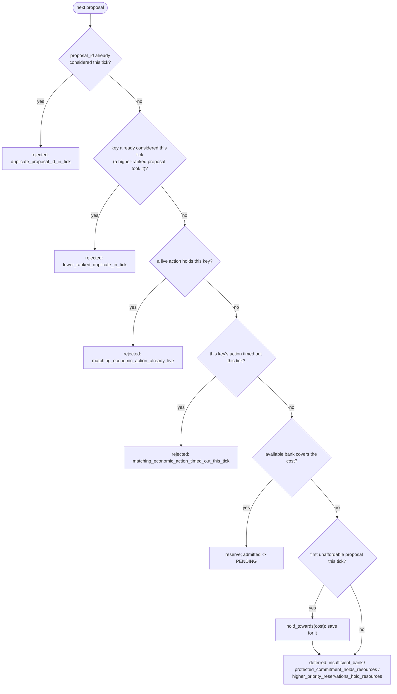
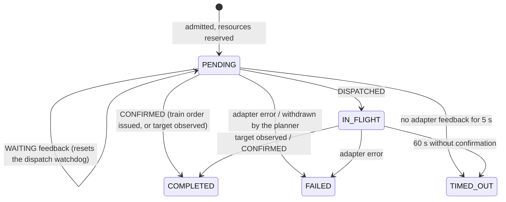

# Economy controller

The economic counterpart of the mission engine: it admits purchases that
`MacroPlanner` argues for, reserves resources for them against a virtual bank,
dispatches them to Ares, and confirms them from what the game shows. It knows
nothing about units, missions, production policy or Ares.

Source: `bot/engine/economy/` (`models.py`, `controller.py`,
`observer.py`), `bot/ports/economy_commands.py`,
`bot/adapters/ares/economy_commands.py`. What gets proposed:
[macro/macro-planner.md](../macro/macro-planner.md).

## Models

| Type | Meaning |
| --- | --- |
| `EconomicActionKind` | `PRODUCE_WORKER`, `PRODUCE_SUPPLY`, `EXPAND`, `BUILD_GAS`, `BUILD_PRODUCTION`, `PRODUCE_UNIT`, `BUILD_ADDON`, `RESEARCH_UPGRADE` |
| `ResourceCost(minerals, vespene, supply)` | a declared cost; declaring one reserves nothing |
| `ResourceBank(minerals, vespene, supply_available)` | the virtual bank one tick arbitrates against |
| `EconomicProposal` | one purchase argued for (below) |
| `EconomicAction` | an admitted proposal: `action_id` (`economic-action-0001`...), `proposal`, `admitted_at` |
| `EconomicActionStatus` | `PENDING`, `IN_FLIGHT`, `COMPLETED`, `FAILED`, `TIMED_OUT` |
| `EconomicFeedback(action_id, kind, reason)` | `WAITING`, `DISPATCHED`, `CONFIRMED`, `FAILED` |
| `EconomyTickResult` | `admitted_actions`, `available_bank`, `reserved_cost`, `protected_cost` |

`ResourceBank` operations:

- `can_afford(cost)` -- every component covered.
- `reserve(cost)` -- the bank left after a fully funded purchase (raises if
  unaffordable).
- `hold_towards(cost)` -- saturating: protect what exists while saving toward
  more, never negative.
- `consumed_from(original)` -- what a derived bank no longer has.

### `EconomicProposal`

| Field | Default | Meaning |
| --- | --- | --- |
| `proposal_id`, `planner`, `kind`, `priority`, `reason`, `cost`, `created_at` | required | |
| `deduplication_key` | `<planner>:<kind>[:<target>]` | one live action per key |
| `target` | `None` | what is bought, as a name (`"SIEGETANK"`) |
| `target_count` | `None` | the total the world should reach once this action lands |
| `dispatch_timeout_seconds` | 5 | |
| `confirmation_timeout_seconds` | 60 | |

It deliberately carries no unit requirement and no map position. One
proposal is **one** purchase: `cost` is one item's price and `target_count`
is the observed total plus one, never the build's goal, so the reservation
matches what the action really spends and the action can be confirmed the
moment Attention shows the count. Macro builds these with
`proposal_helpers.build_proposal`, whose id and key are both
`macro_planner:<category>:<target>`, stable across ticks.

## `EconomyController.step`

Called once per frame by `FrameProcessor` with this tick's full proposal list.

```text
1  feedback = observe_economic_confirmations(live actions, economy)    observed in Attention
            + last frame's adapter feedback                             observed wins per action
2  result   = tick(now, observe_bank(world), proposals, feedback, observe_protected_cost(economy))
3  for every PENDING action (newly admitted ones included):
       dispatch_attempts += 1; feedback = commands.dispatch(action)
   keep that feedback for the next frame
```

- `observe_bank`: minerals and gas clamped at 0 (Ares decrements them in
  place while simulating spend), `supply_available = max(0, cap - used)`.
- `observe_protected_cost`: `EconomyFacts.protected_minerals/vespene`, the
  opening's next steps ([attention.md](../world/attention.md#economyfacts)).
- Observed confirmation: an action (pending or in flight) with a
  `target_count` is confirmed with `target_observed_in_attention` once the
  observed total reaches it.

| Kind | Observed total |
| --- | --- |
| `PRODUCE_WORKER` | `workers.total` |
| `EXPAND` | `townhalls.total` |
| `PRODUCE_UNIT` | `unit_count(target).total` |
| `PRODUCE_SUPPLY`, `BUILD_GAS`, `BUILD_PRODUCTION`, `BUILD_ADDON` | `structure_count(target).total` |
| `RESEARCH_UPGRADE` | none (never observed) |

## `tick`

```text
1  time must be finite, non-negative and never go backwards
2  apply feedback, once per (action, kind):
       unknown action / already terminal       -> economic_feedback_rejected
       WAITING     reason updated; dispatch watchdog reset; economic_action_pending if the reason changed
       DISPATCHED  PENDING -> IN_FLIGHT (reservation released: Ares is spending real resources)
       CONFIRMED   -> COMPLETED
       FAILED      -> FAILED
3  withdraw: a PENDING action whose key no proposal carries this tick
       -> FAILED proposal_withdrawn_before_dispatch     (in-flight work is left to observation)
4  expire:
       PENDING    now - (last adapter feedback, or admission) >= dispatch_timeout      -> TIMED_OUT dispatch_timeout
       IN_FLIGHT  now - dispatched_at >= confirmation_timeout                          -> TIMED_OUT confirmation_timeout
5  spendable = bank held towards the protected cost
   available = spendable held towards every PENDING action's cost
6  proposals sorted by (-priority, created_at, key, id); for each (see flowchart)
7  return admitted actions, available bank, reserved = spendable - available, protected = bank - spendable
```



**Only the most important unaffordable proposal saves.** Its cost is held
against the available bank, so a cheaper, lower-priority proposal later in the
same pass cannot spend what it is saving toward. Every further unaffordable
proposal holds nothing: saving for all of them at once (an expensive gas unit
with no gas income, say) would lock the whole bank against purchases nowhere
near possible. The deferral reason names what withholds the money: the bank
itself, the opening's protected cost, or higher-priority reservations.

**Log volume.** `economic_proposal_created` is written once per proposal id.
A proposal's outcome is written only when it differs from that proposal's
previous outcome, so a purchase deferred for the same reason every frame logs
once.

## Lifecycle of one action



A pending action whose adapter keeps answering `WAITING` (a busy producer, no
placement yet) is not timed out: the watchdog measures silence, not waiting.
It stays reserved for as long as the planner keeps proposing it, and is
withdrawn the first tick it does not.

## The Ares adapter

`AresEconomyCommands.dispatch(action)` invokes one Ares macro behavior per
call. An Ares macro behavior makes one unit of progress per call, which is why
the controller dispatches every pending action again each frame.

| Kind | Ares call | Accepted means |
| --- | --- | --- |
| `PRODUCE_WORKER` | `SpawnController({worker: proportion 1}, freeflow_mode=True, maximum=1)` | `CONFIRMED` `ares_train_order_issued` |
| `PRODUCE_UNIT` | `SpawnController({target: proportion 1}, freeflow_mode=True, maximum=1)` | `CONFIRMED` `ares_train_order_issued` |
| `PRODUCE_SUPPLY` | `BuildStructure(start_location, target, to_count=target_count, supply_depot=True)` | `DISPATCHED` |
| `BUILD_PRODUCTION` | `BuildStructure(start_location, target, to_count=target_count, production=True)` | `DISPATCHED` |
| `EXPAND` | `ExpansionController(to_count, can_afford_check=True, check_location_is_safe=True, max_pending=1)` | `DISPATCHED` |
| `BUILD_GAS` | `GasBuildingController(to_count, max_pending=1)` | `DISPATCHED` |
| `BUILD_ADDON` | the first ready, idle parent without an add-on builds it directly | `DISPATCHED` |
| `RESEARCH_UPGRADE` | `UpgradeController([upgrade], start_location, auto_tech_up_enabled=True)` | `DISPATCHED` (no proposer exists yet) |

- Nothing possible this frame -> `WAITING` with the most useful reason the
  adapter can observe (the list is in [logging.md](../logging.md#engineeconomycontroller)).
- An exception -> `FAILED` `ares_dispatch_error:<Type>:<message>`.
- Train orders confirm outright because `SpawnController` only reports
  progress after calling `train()`: the purchase already happened. Left in
  flight, the action would wait for the count to reach `target_count`, which
  never happens if a unit of that type dies first, and would block that unit
  type for the 60-second confirmation timeout.
- Worker selection, structure placement and expansion-site selection belong
  to those Ares behaviors. The SCV one picks is marked `UnitRole.BUILDING` and
  reads as unavailable to missions; it is never a lease.

## Known gaps

- `RESEARCH_UPGRADE` has an adapter path but no proposer and no observed
  confirmation.
- The adapter's add-on parent table is restated (macro keeps its own copy),
  because macro may not import the adapter or Ares.
- There is no per-structure queue planning: which Barracks trains what is
  Ares' `SpawnController`'s choice.
