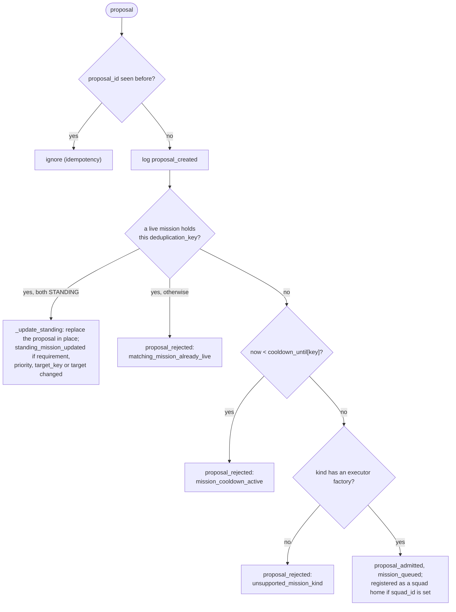
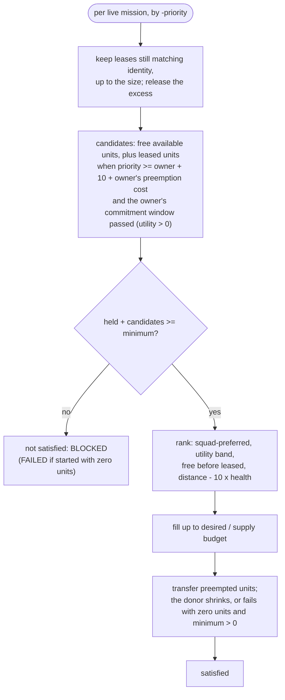

# Missions

The mission engine turns behavior proposals into commitments: it admits them,
leases units to them, runs their executors, and cleans up when they end. It is
deliberately generic -- it never names a mission kind or a behavior (rule 6
in [contracts.md](../contracts.md)).

Source: `bot/engine/missions/` (`models.py`, `controller.py`,
`allocator.py`, `board.py`, `execution.py`, `planning.py`),
`bot/ports/mission_commands.py`, `bot/adapters/ares/mission_commands.py`.

## Vocabulary

### `MissionProposal`

A planner's argument for work; not yet a commitment. Immutable.

| Field | Default | Meaning |
| --- | --- | --- |
| `proposal_id` | required | unique per proposal; a repeated id is ignored |
| `deduplication_key` | required | "the same work": one live mission per key |
| `planner` | required | planner id; also scopes standing reconciliation |
| `kind` | required | `MissionKind`, looked up in the executor registry |
| `priority` | required | 0..100 |
| `target_key`, `target` | required | a name and a map point |
| `reason` | required | why this is worth doing |
| `requirement` | required | `UnitRequirement` (below) |
| `created_at` | required | game time |
| `evidence_last_observed_at`, `evidence_age`, `evidence_stale_after` | `None` | what the proposal was based on, for the log |
| `timeout_seconds` | 70 | FINITE missions are cancelled after this long from admission |
| `cooldown_seconds` | 65 | after a mission with this key finishes, new proposals for it are rejected this long |
| `can_preempt` | `False` | may take units leased by lower-priority missions |
| `commitment_seconds` | 5 | once this mission leases a unit, nobody may preempt it for this long |
| `mode` | `FINITE` | `FINITE` or `STANDING` |
| `squad_id` | `None` | makes this mission a squad's home ([squads.md](squads.md)) |

Identifiers and reason must be non-blank, priority within 0..100, timeout
positive, cooldown and commitment not negative.

### `UnitRequirement`

Which units qualify, what each is worth to the requesting behavior, and how
many. The behavior names the concrete unit types its planner and executor
know how to use; the allocator enforces that and never infers what a type is
good for.

| Field | Default | Meaning |
| --- | --- | --- |
| `unit_types` | required | the requested types; never empty |
| `desired` | required | at most this many units (> 0) |
| `minimum` | required | fewer than this and the mission cannot run (0..desired) |
| `flying` | `None` | require flying or ground |
| `minimum_health` | 0.0 | health fraction |
| `require_ready` | `True` | |
| `exclude_resource_carriers`, `exclude_constructors` | `False` | never pull a worker mid-return or mid-build |
| `require_available` | `True` | `UnitSnapshot.available_for_mission` (ignored for preemption) |
| `desirability` | 1.0 | baseline utility of a matching unit |
| `type_desirability` | `()` | per-type utility overrides, `(type, value)` pairs; may only price requested types |
| `supply_budget` | `None` | stop acquiring once held supply reaches this |

- `utility_for(unit)`: the type override, otherwise `desirability`. Zero means
  never requested.
- `matches_identity(unit)`: the flying constraint and membership in
  `unit_types`. Used to keep an existing lease.
- `matches(unit)`: identity, health, readiness, worker exclusions,
  availability.

Planners build it with `UnitRequirement.combat(unit_types=, desired=,
minimum=, minimum_health=, desirability=, type_desirability=,
supply_budget=)`, which also excludes resource carriers and constructors.
Each behavior owns its roster:

| Behavior | `unit_types` | Preference |
| --- | --- | --- |
| standing (fallback owner) | `STANDING_ROSTER`: Marine, Marauder, Reaper, Hellion, Hellbat, Cyclone, Siege Tank, Thor, Viking and Banshee, every mode of each | none |
| map control | `PATROL_UNIT_TYPES`: Cyclone, Hellion, Marine, Marauder | Cyclone 1.0, Hellion 0.9, Marine and Marauder 0.6 |
| defense | Marine, Marauder, Reaper, Siege Tank (both modes), Banshee | by what is attacking ([behavior/defense.md](../behavior/defense.md)) |
| Reaper raid, Banshee raid | Reaper; Banshee | none |
| scouting | Reaper, or an SCV when no Reaper is alive | none |

A new unit type reaches a behavior only by being added to its roster.

### Kinds, modes and status

- `MissionKind`: `SCOUT`, `HARASS`, `AIR_HARASS`, `DEFENSE`, `MAP_CONTROL`,
  `HOLD_RALLY`, `POSITION`. Priorities per kind: [contracts.md](../contracts.md#mission-kinds-and-priorities).
- `MissionMode.FINITE`: admitted once, runs to completion, failure or
  cancellation; a second proposal for the same key while it is live is
  rejected.
- `MissionMode.STANDING`: a responsibility re-declared every cadence. A new
  proposal for a live standing key replaces the mission's proposal in place
  (same `mission_id`, leases and executor). Standing missions never time out.
- `MissionStatus`: `PROPOSED -> QUEUED -> ACTIVE / BLOCKED -> COMPLETED /
  FAILED / CANCELLED`.

`Mission` holds the proposal, `admitted_at`, `status`, `assigned_unit_tags`,
`started_at`, `finished_at`, `last_reason`. Ids run `mission-0001`,
`mission-0002`, ... `MissionBoard` is the catalog of every mission, live and
finished; `MissionSnapshot` is its immutable view for telemetry.

## `MissionController.tick`

```text
1  allocator.sync(own units); squads.sync(own units)
2  for each live mission that started, had units and now holds none, with minimum > 0:
       FAILED all_assigned_units_lost                  (checked before replacement allocation)
3  for each proposal, by admission_key (-priority, deduplication_key, proposal_id): _consider (below)
4  _reconcile_standing_missions
5  for each live mission, by arbitration_key (-priority, admitted_at, deduplication_key, mission_id):
       cancellation check (below)
       squads.bind_compatible_squad (DEFENSE only)
       requirement = squads.effective_requirement (a home squad shrinks while members are away;
                     None when nothing is left to ask for -> keep current leases, satisfied)
       allocation  = allocator.allocate(...)
       apply transfers and releases; log units_*
       squads.allocation_changed
       not satisfied: FAILED all_assigned_units_lost if started with zero units, else BLOCKED
       satisfied: advance the executor
```

Neither order depends on the order proposals arrive in, so the same proposals
in any order admit the same missions, under the same ids, and allocate the
same units (`test_decision_invariants.py`, `ArbitrationOrderTests`):

- **Admission.** Higher priority first, so of two FINITE duplicates in one
  tick the higher-ranked one is admitted; equal priorities by deduplication
  key, then proposal id.
- **Arbitration.** Higher priority first. Among equals the earlier-admitted
  mission allocates first -- it already holds its units, so a newcomer of the
  same rank never reshuffles them -- then the deduplication key (one live
  mission per key makes the order total), then the mission id.

### Admitting one proposal (`_consider`)



A rejected proposal simply does not become a mission; the planner proposes
again on its own cadence if the reason still holds. The cooldown starts only
when a mission **finishes**, never on a rejection.

### Standing reconciliation

`tick` takes `declared_planners`: every planner that declared work this tick,
including work the Mission Policy rejected. The app passes it; the engine
never learns why a proposal is missing. For each planner that is declared or
sent at least one STANDING proposal, any live standing mission of that
planner whose key is not among its proposals is cancelled with
`standing_proposal_omitted`. That is how a standing responsibility the policy
now rejects -- a patrol worth nothing -- is withdrawn instead of holding its
units at its old priority. A planner that declared nothing this tick -- its
cadence was not ready, or it withheld -- leaves its standing missions alone:
silence is not omission.

### Cancellation

Checked for each live mission before allocation:

| Reason | When |
| --- | --- |
| `objective_satisfied_before_mission_started` | the mission has not started, and `awareness.enemy.location(target_key)` was observed after admission. Applies to any mission whose `target_key` is a location key (`enemy_main`, `enemy_natural`) -- the scout, or a raid launched at a fallback location. |
| `mission_timeout` | `now - admitted_at >= timeout_seconds`, counting blocked time. Never for STANDING. |

### Advancing the executor

- First satisfied allocation: the registered factory builds the executor
  (`factory(mission, now)`); `started_at` is set; `mission_started`. A factory
  exception fails the mission with `executor_error:<Type>:<message>`.
- Every step: `executor.refresh(mission)` if the executor has it (so a
  standing mission picks up a changed target), then
  `executor.step(MissionContext(attention, awareness, assigned_units,
  commands, services))`. An exception fails the mission the same way.
- Each result is compared with the mission's last `(outcome, reason)`; a
  change -- including the first report -- is logged as `mission.progressed`
  (`outcome`, `previous_outcome`, `previous_reason`), a repeat is not.
- `COMPLETED` or `FAILED` results finish the mission; `ACTIVE` keeps it.
- A blocked mission keeps its surviving leases and does not step; once
  replenished it resumes the same executor with its original start time.

### Finishing

`_finish` releases every lease through the command port (workers back to
`GATHERING`, others to `IDLE`), logs `units_released`, clears tags, sets
status, `finished_at` and `last_reason`, discards the executor, tells the
squads, and starts the key's cooldown (`now + cooldown_seconds`).

Failure and cancellation reasons in one place:

| Outcome | Reason |
| --- | --- |
| FAILED | `all_assigned_units_lost` (started, then lost every unit; minimum > 0) |
| FAILED | `all_assigned_units_preempted` (a donor left with zero units; minimum > 0) |
| FAILED | `executor_error:<Type>:<message>` |
| FAILED / COMPLETED | the executor's own reason |
| CANCELLED | `mission_timeout`, `objective_satisfied_before_mission_started`, `standing_proposal_omitted` |

A requirement with `minimum=0` -- every squad-backed standing mission -- is
exempt from both loss failures: holding zero units is idle, not failed.

## `UnitAllocator`

Exclusive unit leases with deterministic, hysteretic preemption. Candidates
are every unit the bot owns; the requirement decides who is eligible, utility
who is taken first, and `desired` plus `supply_budget` how many.

A `UnitLease` records `mission_id`, `priority`, `protected_until` (lease time
plus the mission's `commitment_seconds`) and `preemption_cost`. `sync` drops
leases of units that no longer exist.

### `allocate(...)`

```text
1  keep:     current leases whose unit still matches the requirement's identity, filled up to the size
             in order of the behavior's preference, then distance; the rest are released
2  free:     unleased units with matches(unit) and utility > 0
3  preemptible (only if can_preempt):
             units leased by another mission where
                 priority >= lease.priority + margin (10) + lease.preemption_cost
             and now >= lease.protected_until
             and matches(unit, ignoring availability) and utility > 0
4  if kept + free + preemptible < minimum:  not satisfied; keep what is held
5  rank candidates:  squad-preferred first
                     -> higher utility, in bands of 0.05
                     -> free before leased
                     -> distance to the mission target minus 10 x health fraction
                     -> tag
6  fill:     take ranked candidates one at a time while count < desired
             and (no budget or held supply < budget); the last unit may overshoot the budget
7  write leases for newly acquired units (with this mission's priority, commitment window and
   preemption cost); refresh the preemption cost on units already held
8  satisfied = held >= minimum
```

Notes:

- Preemption is not gated on the recipient being below its minimum: a
  mission at its minimum still preempts toward `desired` when the margin and
  commitment window allow.
- The 0.05 utility band is the precision of a behavior's per-type
  preference: two units it values almost equally (a Marine and a Marauder for
  the patrol) are chosen by distance, not by the third decimal.
- A held unit is never displaced for a better one: a mission only takes more
  units while it has room.
- Every ordering ends in the unit tag, so the same units in any input order
  give the same allocation.



### Worked example

Priorities here are illustrative Mission Policy outputs, not constants. The
standing army (fallback, 20) holds ten units. A viable map-control patrol,
ranked say 45, is declared with a supply budget: after the standing
mission's 2 s commitment window it preempts its share (45 >= 20 + 10). A
base is attacked: the defense's urgency floor ranks it near the top (say
97), so it preempts from the patrol after the patrol's 1 s window
(97 >= 45 + 10), and from a Banshee raid mid-strike ranked 70
(97 >= 70 + 10 + 5). Two raids ranked within 10 of each other cannot take
units from one another, and scouting cannot take anything. A candidate the
policy rejected never appears here at all. When defense completes, its units
are released and the standing and map-control missions, which prefer their
squad members, take them back on the next allocation.

## Executor contract (`execution.py`)

```python
class MissionExecutor(ABC):
    async def step(self, context: MissionContext) -> MissionResult: ...
    def refresh(self, mission: Mission) -> None: ...        # default: no-op
    def preemption_cost(self) -> float: ...                 # default: 0.0
```

- `MissionContext`: `attention`, `awareness`, `assigned_units` (this
  mission's leased units only), `commands` (`MissionCommands`), `services`
  (`BehaviorServices` or `None`).
- `MissionResult(outcome, reason)`: `ACTIVE`, `COMPLETED` or `FAILED`, with a
  non-empty reason.
- `refresh` lets a standing mission's executor follow its replaced proposal.
- `preemption_cost` is the running executor's tactical answer to "what does
  taking my units cost right now"; it is clamped to >= 0 and added to the
  preemption margin on its leases. A cost that raises or is NaN reads as 0,
  but never silently: `mission.preemption_cost_failed` (`error`,
  `fallback_cost`, `suppressed_since_last`) is logged on the first failure,
  then at most every 30 s per mission. The Banshee raid returns 5 while
  infiltrating or striking.
- `MissionExecutorFactory = Callable[[Mission, float], MissionExecutor]`,
  registered per kind in `bot/app/mission_registry.py` ([app.md](../app.md#executor-registry)).

### Commands

`MissionCommands` (`bot/ports/mission_commands.py`): `path_to`,
`safe_path_to` (`search_radius`, `keep_available`), `attack_move`,
`attack_unit`, `use_ability`, `release`. `AresMissionCommands` checks the
lease on every call and raises `UnauthorizedUnitCommand` otherwise; what each
command registers in Ares is in [contracts.md](../contracts.md#command-port-what-each-command-leaves-behind-rule-9).
When units are transferred, the controller resets their role through the
port using the new owner, before the recipient's executor runs.

## Planning helpers (`planning.py`)

- **`ProposalCadence`** rate-limits a planner and hands out sequence numbers
  for stable proposal ids: `ready(now, cadence)` is true once `cadence`
  seconds passed since the last `mark(now)`; `next_sequence()` increments.
  Planners that withhold do not `mark`, so the next frame re-evaluates.
- **`choose_target(candidates, current_key, margin)`** returns a
  `TargetChoice(target, change, previous_key)`. It keeps the held target while
  it is still a candidate and nothing beats it by more than `margin`; drops it
  without any margin when it is no longer a candidate; ties go to the earlier
  candidate. `TargetChange`: `NONE`, `SELECTED`, `KEPT`, `RETARGETED`,
  `REPLACED`, `LOST`. Used by both raids.

## Known gaps

- Sizing is per unit, not per squad: the budget is filled greedily by the best
  individual scores, so a patrol can end up one unit type. `_fill` is the seam
  for a marginal utility given the units already taken.
- Preemption compares priorities, not what the donor loses.
- A FINITE mission cannot accept an in-place update (a live Reaper raid keeps
  its target).
- Emergency priority 100 has no special path around commitment windows.
