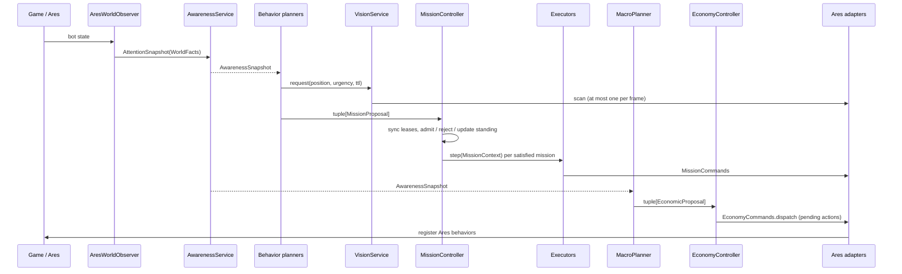

# Frame lifecycle

What happens between Ares handing the bot a frame and the bot handing
commands back, in the order it happens. The order is behavior, not
presentation; `tests/test_frame_processor.py` fails if it changes.

Source: `bot/main.py`, `bot/app/runtime.py`, `bot/app/frame.py`,
`bot/world/awareness/service.py`, `bot/engine/missions/controller.py`,
`bot/engine/economy/controller.py`, `bot/app/telemetry/frame.py`.

## Game hooks

`MyBot` (an `AresBot`) forwards the three python-sc2 hooks to `BotRuntime`
after calling Ares' own:

| Hook | What the runtime does |
| --- | --- |
| `on_start` | `OpeningSelector.choose_and_announce` re-rolls the opening from the configured cycle and posts it in chat ([macro/builds.md](macro/builds.md)); logs `game.started` with the map name. |
| `on_step` | `FrameProcessor.process(bot, iteration)` -- everything below. |
| `on_end` | Logs `game.ended` with the result and closes the logger. |

Every long-lived object was built once, before the game, by `compose_bot`
([app.md](app.md)).

## One frame

```text
 1  world     = AresWorldObserver.world_facts(bot)            facts of this frame
 2  attention = AttentionService.build(world)
 3  awareness = AwarenessService.update(attention)             memory + beliefs (detail below)
 4  log awareness.belief_changes                               awareness.belief_changed
 --- behavior domain -----------------------------------------------------------
 5  VisionService.begin_frame(attention, AresVisionCommands)    expire, re-check visibility, read Orbital energy
 6  ScoutingVisionRequester.tick                                may request vision
 7  proposals = every mission planner's propose(), in order:   Defense may request vision here
        IntelPlanner, ReaperHarassPlanner, BansheeHarassPlanner,
        DefensePlanner, MapControlPlanner, StandingPlanner
 8  VisionService.resolve()                                    at most one Scanner Sweep attempt
 9  register_baseline_behaviors(bot)                           Ares Mining + DepotToggle
10  MissionController.tick(proposals, AresMissionCommands)      admit, allocate, execute (detail below)
 --- macro domain ---------------------------------------------------------------
11  economic = MacroPlanner.propose(attention, awareness)
12  result   = EconomyController.step(economic, AresEconomyCommands)   confirm, admit, dispatch
13  MacroDiagnostics.report(attention, last_status, result)    macro.status, idle producers
 --- observers ------------------------------------------------------------------
14  SpatialDebugView.render(bot, awareness)                    only with --spatial-view
15  SpatialSnapshotExporter.capture(attention, awareness)      only with --spatial-snapshot, on its cadence
16  FrameTelemetry.report(bot, attention, awareness)           end-of-frame log lines
```

The planner tuple order does not decide arbitration -- `MissionController`
sorts live missions by priority -- but it is the order proposals are logged.

Ares runs the behaviors registered during steps 9, 10 and 12 after
`on_step` returns, and clears them; everything is registered again next frame.



## Step 3: inside `AwarenessService.update`

Each reading is built from the ones above it. Details in
[world/awareness.md](world/awareness.md).

```text
 a  EnemyKnowledge.update         sightings (kept while Ares reports the tag)
 b  EnemyRoster.update            every mobile enemy seen, until reported dead
 c  LossTracker.update            both sides' losses, decaying
 d  enemy locations               enemy_main / enemy_natural freshness (90 s)
 e  unit counts                   own and visible enemy combat units
 f  EnemyBaseMemory.update        CONFIRMED / EMPTY / UNKNOWN per expansion slot (120 s)
 g  coverage                      scouting_coverage, enemy_territory_coverage
 h  EnemyBaseAssessor.update      value, workers, air/ground defense per slot
 i  EnemyForceTracker.update      force clusters and the main force
 j  BaseSecurityAssessor.update   threat vs protection per own base
 k  assess_economy, assess_army   beliefs: estimate + P(ahead) + hysteresis
 l  RelativeStrength, ThreatAssessment
 m  derive_macro_posture          DEFENSE / BALANCED / GREED / RECOVERY
 n  belief_changes                one message per stable-state change
 o  SpatialFieldModel.update      friendly, threat, choke, route values (cached components)
 p  TerritoryAssessor.update      control, frontline, ground access (1 s cadence)
```

## Step 10: inside `MissionController.tick`

Details in [engine/missions.md](engine/missions.md).

```text
 a  UnitAllocator.sync(own units)          drop leases of units that no longer exist
 b  SquadController.sync(own units)        drop dead members
 c  fail started missions that lost their whole team (minimum > 0 only)
 d  for each proposal: _consider           admit, reject, or update a live standing mission
 e  _reconcile_standing_missions           cancel standing keys a planner stopped declaring
 f  for each live mission, by (-priority, admitted_at):
        cancel on timeout (FINITE) or objective observed before start
        bind a DEFENSE mission to a compatible squad
        effective requirement (home squads shrink while members are away)
        UnitAllocator.allocate               leases, preemption, upgrades
        apply transfers, releases, upgrades; log them
        squad membership update, capability composition log
        requirement unsatisfied -> BLOCKED (or FAILED if started with zero units)
        otherwise: build executor on first start, refresh(mission), step(context)
        COMPLETED / FAILED result -> finish: release leases, start cooldown
```

## Step 12: inside `EconomyController.step`

Details in [engine/economy.md](engine/economy.md).

```text
 a  feedback = confirmations observed in Attention + last frame's adapter feedback
 b  tick:  apply feedback -> withdraw pending actions no longer proposed
           -> expire timed-out actions -> bank minus protected cost minus pending reservations
           -> admit proposals by priority while affordable; the first unaffordable one saves
 c  dispatch every PENDING action through AresEconomyCommands; keep its feedback for next frame
```

## Step 16: telemetry order

| Reporter | Event(s) | Emitted |
| --- | --- | --- |
| `BuildOrderTelemetry` | `macro.build_order_progress` | on step/command/completion change |
| `EnemyTelemetry` | `knowledge.enemy_intel` | on change of known structures or confirmed locations |
| | `knowledge.enemy_model` | on change of confirmed bases or main force, and every 10 s |
| `BeliefTelemetry` | `awareness.world_belief` | on raw/stable state change, and every 10 s |
| `TerritoryTelemetry` | `knowledge.territory` | on region control / security step / base region / frontline change, and every 10 s |
| `WorldSnapshotTelemetry` | `knowledge.updated`, `observation.updated` | together, on headline change and every 10 s |
| `StandingTelemetry` | `standing.updated`, `standing.unassigned_units_persisting` | on change and every 10 s; the warning after 15 s ownerless |

## Cadences

How often each periodic decision or reading runs. "Consumed only when
proposing" means a withheld decision is re-evaluated on the next frame
instead of waiting a full cadence.

| What | Interval | Notes |
| --- | --- | --- |
| `IntelPlanner` proposal | 65 s | assessed every frame; cadence consumed only when proposing |
| `ReaperHarassPlanner` proposal | 45 s | assessed when the cadence is ready; consumed only when proposing |
| `BansheeHarassPlanner` proposal | 8 s | as above; frequent so new Banshees join the squad quickly |
| `DefensePlanner` proposal | 5 s | consumed only when a base is threatened |
| `DefensePlanner` vision request | every frame | for recently lost attackers |
| `MapControlPlanner` proposal | 15 s | consumed only with enough combat supply |
| `StandingPlanner` proposal | 5 s | always consumed |
| `ScoutingVisionRequester` request | 5 s | only while the enemy main has gone 120 s unseen |
| Spatial field threat | 2 s | or at once when a force cluster moves a quantization step |
| Territory | 1 s | topology only on a new map version |
| Target-selection log (raids) | 30 s | or on any target change |
| SVG snapshot | 30 s game time | `--spatial-snapshot-interval` |
| Telemetry heartbeats, `macro.status`, `spatial.perf`, `territory.perf` | 10 s | plus on change |
| Vision dedup/deferral log throttle | 15 s | per request |
| Strategy (when wired) | 1 s | `StrategyConfig.update_interval_seconds` |

## Time windows

Every constant that turns elapsed time into forgetting or waiting.

| Window | Value | Where |
| --- | --- | --- |
| Enemy location stale | 90 s, linear | `IntelConfig.location_stale_after` -> `AwarenessService` |
| Enemy base slot stale | 120 s, linear | `EnemyBaseMemory` |
| Enemy force confidence | 30 s, linear | `EnemyForceHeuristics.stale_after` |
| Force position drift | 3 tiles/s, capped at 30 | `EnemyForceHeuristics` |
| Cluster identity memory | 15 s | `EnemyForceHeuristics` |
| Defender freshness | units 30 s, structures 180 s | `EnemyBaseHeuristics` |
| Territory observation | 30 s, linear | `TerritoryConfig.observation_stale_after` |
| Belief: take on a better reading / forget it | τ 5 s / τ 90 s | `EstimateConfig` |
| Belief: sighting evidence / attrition | τ 20 s / τ 300 s | `EstimateConfig` |
| Loss trade recovery | τ 120 s | `LossTracker` |
| Stable belief must hold | economy 15 s, army 8 s | `RelativeBeliefConfig.persist_seconds` |
| Macro posture: DEFENSE release / GREED safe / minimum hold | 10 s / 20 s / 8 s | `AwarenessService` |
| RECOVERY by low workers | after 90 s game time, under 8 workers | `derive_macro_posture` |
| Producer utilization window | 20 s | `AresWorldObserver` |
| Economic action dispatch / confirmation timeout | 5 s / 60 s | `EconomicProposal` |
| Scan cooldown | 15 s within 13 tiles | `VisionServiceConfig` |
| Standing ownerless warning | 15 s | `StandingTelemetry` |
| Idle producer warning | 15 s | `MacroDiagnostics` |
| Traffic route retry after a pathfinding error | 2 s | `AresWorldObserver` |
