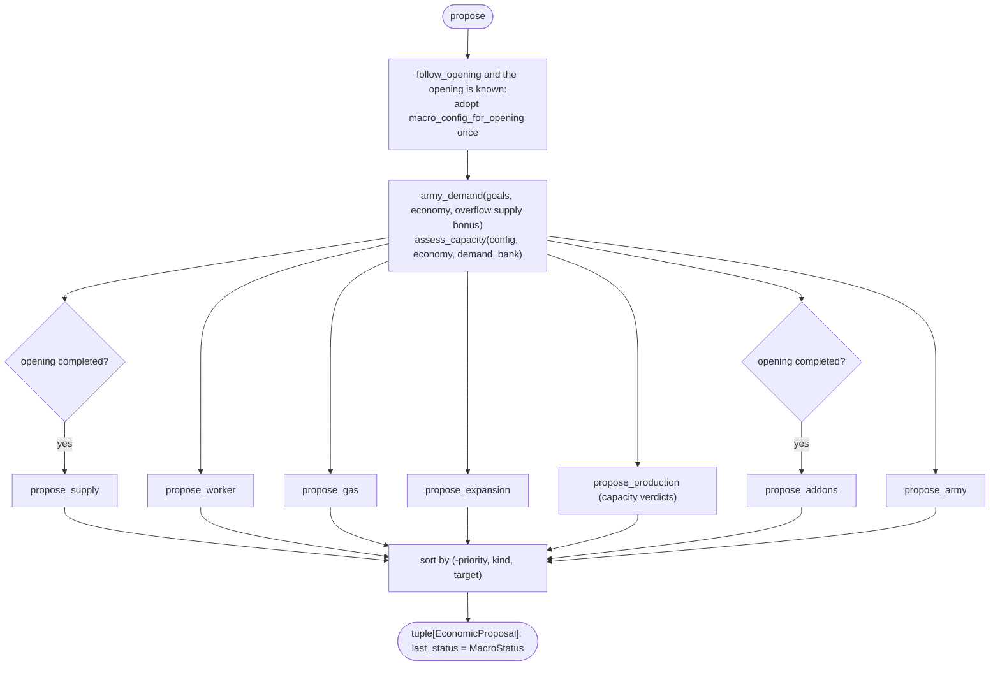

# Macro planner

`bot/macro` decides what to spend on: workers, supply, refineries, bases,
production structures, add-ons and army units. It argues for one purchase at a
time; [`EconomyController`](../engine/economy.md) decides whether the bank can
pay. Macro never names a unit tag, mission or squad.

Source: `bot/macro/` (`planner.py`, `contracts.py`, `diagnostics.py`,
`proposal_helpers.py`, `strategy/`, `builds/`, `composition/`,
`production/`, `construction/`, `expansion/`).

## Package layout

Split by what a proposal buys, so the intelligence for one kind of spend
stays in one folder:

| Folder | Action kinds | Modules |
| --- | --- | --- |
| `builds/<build>/` | -- | `plan.py`: that build's `MacroGoalSet` ([builds.md](builds.md)) |
| `strategy/` | -- | `goals.py` (goal vocabulary), `config.py` (`MacroPlannerConfig`, overflow, priorities), `openings.py` (opening -> profile), `reference_build.py`; `profiles.py` is a compatibility import only |
| `composition/` | -- | `doctrine.py`: `CompositionDoctrine`, `BIO`, `MECH` |
| `production/` | `PRODUCE_UNIT`, `PRODUCE_WORKER` | `army_demand.py` (assessment), `army.py`, `workers.py` |
| `construction/` | `BUILD_PRODUCTION`, `BUILD_ADDON`, `PRODUCE_SUPPLY`, `BUILD_GAS` | `capacity.py` (assessment + proposer), `addons.py`, `supply.py`, `gas.py` |
| `expansion/` | `EXPAND` | `bases.py` |

`planner.py` is the one module that knows how those domains depend on each
other (capacity reads army demand) and in which order they are asked.
`contracts.py` holds `SpendPlanner`, the protocol it keeps. There is no
`tech/`: `RESEARCH_UPGRADE`, `UpgradeGoal` and `upgrade_priority` exist as
vocabulary, but nothing proposes research.

## The goal vocabulary (`strategy/goals.py`)

A build describes what it wants to own as a `MacroGoalSet`:

| Field | Meaning |
| --- | --- |
| `name`, `opening_name` | the build folder and the YAML opening it follows |
| `max_workers`, `max_townhalls` | hard limits |
| `workers_per_townhall` | fallback saturation before Ares knows `ideal_harvesters` |
| `refineries_per_townhall`, `max_refineries` | gas targets |
| `army_supply_target` | the army size the composition is scaled to |
| `army` | `ArmyUnitGoal(unit_type, weight, minimum, cost, priority_offset)` per member |
| `production` | `ProductionGoal` per production structure type (below) |
| `doctrine` | the `CompositionDoctrine` every army member must belong to (construction fails otherwise) |
| `addons` | `(add-on type, target total, cost)` |
| `upgrades` | `UpgradeGoal(upgrade_id, cost)` -- declared, unused |

`ProductionGoal`:

| Field | Meaning |
| --- | --- |
| `structure_type`, `minimum`, `maximum`, `cost` | |
| `mineral_rate_for_first_extra`, `mineral_rate_per_extra` | income that justifies one more structure above `minimum`, then one per increment |
| `vespene_rate_for_first_extra`, `vespene_rate_per_extra` | the same for gas; either stream may demand capacity |
| `minimum_utilization` | 0.75: existing producers must be this busy before growth |
| `townhall_minimums` | `(townhalls, minimum)` milestones, counting a townhall under construction |
| `dynamic_growth_minimum_ready_townhalls` | income- and bank-driven growth waits for this many **ready** townhalls; milestones do not |

## `MacroPlanner.propose(attention, awareness)`

Stateless apart from `last_status` and the one-time opening switch: the same
snapshot always yields the same proposals.



- **It runs during the opening.** An unfinished opening is a set of
  commitments, not a freeze: the economy controller withholds the cost of the
  opening's next steps, so macro only spends a genuine surplus. Early on there
  is none and macro does almost nothing.
- **Two things wait for `opening_completed`.** Supply depots, because the
  opening's depot steps say where they go (`supply @ ramp` closes the wall)
  and Ares' `AutoSupplyAtSupply` covers the gaps -- a macro depot went down
  behind the mineral line and took the ramp depot's slot. Add-ons, because
  they contend for a production slot the opening may still need, not just for
  money.
- **Following the opening.** `compose_bot` builds the planner with
  `follow_opening=True`. The first tick `economy.opening_name` is non-empty,
  it adopts `MACRO_PROFILES[opening]` (the default Bio profile for an unknown
  name) and never switches again. A config passed explicitly is pinned.
- The sort only makes traces readable; `EconomyController` owns admission
  order.

Every proposal is one step built by `build_proposal`: cost of one item,
`target_count = min(desired, current + 1)`, id and key
`macro_planner:<category>:<target lowercase>`.

## Decision rules

Every rule reads `EconomyFacts`, the goal set and `awareness.macro_posture`.

### Supply (`construction/supply.py`)

Only after the opening. Proposes one `SUPPLYDEPOT` (100 minerals) when
`supply_cap < 200` and `supply_cap + supply_pending - supply_used <= 6`,
counting supply already under construction (8 per depot) so it does not
double-queue. `target_count` is the depot count plus one, confirmed as soon as
the next depot is under way. Reason `effective_supply_capacity_near_limit`.

### Workers (`production/workers.py`)

```text
saturation = ideal_harvesters if Ares knows it, else ready townhalls * workers_per_townhall
desired    = min(max_workers, saturation)
propose one SCV (50 minerals, 1 supply) while workers.total < desired
```

Reason `worker_count_below_current_saturation_target`.

### Gas (`construction/gas.py`)

```text
desired = min(max_refineries, ready townhalls * refineries_per_townhall)
propose one REFINERY (75 minerals) while refineries < desired
    and workers.total >= max(12, (desired - 1) * 3)       early gas must not starve mineral income
```

### Expansion (`expansion/bases.py`)

```text
no proposal when: townhalls.total >= max_townhalls, a townhall is pending, or posture is DEFENSE
otherwise propose one COMMANDCENTER (400 minerals) once
    workers.total >= ceil(saturation * share)       share: BALANCED 0.90, GREED 0.72, RECOVERY 1.00
```

Reason `current_bases_saturated_for_<posture>_posture`. Where to expand is
Ares' `ExpansionController`'s choice.

### Army (`production/army_demand.py`, `production/army.py`)

The build's `army_supply_target` anchors the demand; composition weights say
what the debt is paid in, never whether it exists:

```text
desired_supply   = army_supply_target + overflow supply bonus
cycles           = desired_supply / sum(weight * unit supply)
member desired   = max(minimum, ceil(weight * cycles))
supply_debt      = max(0, desired_supply - (ready + pending supply of the army members))
buildable        = missing units whose tech Ares reports ready
```

While `supply_debt > 0`, `propose_army` emits one `PRODUCE_UNIT` per member
with a buildable shortfall, priority = army priority + the member's
`priority_offset`, reason
`army_supply_below_target_for_this_composition_member`. A member without its
tech is reported as `tech_blocked` in `macro.status` instead of argued for.
Meeting one member's minimum can never stop production while the army as a
whole is short. Worked numbers per build are in [builds.md](builds.md).

### Production capacity (`construction/capacity.py`)

`assess_capacity` decides per `ProductionGoal` how many structures are
justified and records why. Checked in this order:

```text
floor = min(maximum, max(minimum_for(townhalls incl. pending), reference build benchmark now))
desired = floor unless the last step raises it

1  total < minimum                                   production_below_opening_floor
2  total < townhall milestone                        production_below_townhall_floor
3  total < reference benchmark                       production_below_reference_build_benchmark
4  ready townhalls < dynamic_growth_minimum_ready     dynamic_growth_waits_for_ready_townhall
5  no buildable owed unit this structure trains without an add-on
                                                     owed_units_need_an_add_on_not_a_building
                                                     or no_unit_demand_for_this_producer
6  producers not saturated: none ready, any idle now, or utilization_20s < 0.75
                                                     existing_capacity_underutilized
7  desired = min(maximum, max(floor + overflow production bonus, income target))
                                                     saturated_capacity_still_matches_income
                                                     saturated_capacity_and_bank_overflowing
                                                     sustained_income_exceeds_saturated_capacity

income target = minimum + max over minerals/gas of
                (0 below the first-extra rate; else 1 + floor((rate - first) / per_extra))
```

`propose_production` emits one `BUILD_PRODUCTION` for each verdict whose
`desired` exceeds `ready + pending`, with the verdict's reason. Army debt on
its own is never a reason to build: a unit needing a Tech Lab makes the
add-on the bottleneck, and structures next to idle structures would convert
nothing.

### Add-ons (`construction/addons.py`)

Only after the opening. For each `(add-on, target, cost)` below its target,
proposes one `BUILD_ADDON` -- but only while a finished parent of the right
type holds no add-on (counted from type totals: a Factory that landed on the
Barracks' Reactor holds a `FACTORYREACTOR`). An add-on with nowhere to go is
not argued for, so its cost is never reserved against a purchase that cannot
land. Reason `addon_count_below_strategy_target`.

## Reference build floor

`strategy/reference_build.py` holds a time-ordered benchmark of how many
production structures a standard build has by a given time. Only the Bio
profile uses one (`bio_three_one_one_reference`: Barracks 1 at 0:41, 2 at
1:51, 3 at 2:17, Factory at 4:34, Starport at 6:12, blended from a recorded
3-rax opening and terrancraft's 3-1-1 framework). It only ever raises the
capacity floor and holds its last value past the final point.
`BansheeCloak` and `BattleMech` have none; `BattleMech` keys its timing on
townhalls instead.

## Resource-overflow pressure

A bank above 800 minerals or 400 gas is evidence that income is converted
into value too slowly -- not, by itself, proof that production is missing.
Each resource counts steps over its threshold (one as soon as it is above,
one more per 400 minerals / 200 gas); the larger count is the bonus:

- `army_supply_bonus` = steps x 8 supply, added to the army target
  unconditionally, because a bigger army is what spends the pile;
- `production_bonus` = steps, added to a structure's target only in step 7
  above, once the existing producers are saturated.

## Posture-adjusted priorities

Every category has a base priority; the macro posture shifts it by a fixed
per-category offset (plus an army member's `priority_offset`), clamped to
0..100. `BALANCED` applies none. How the posture is derived:
[world/awareness.md](../world/awareness.md#macro-posture).

| Category | Base | `DEFENSE` | `GREED` | `RECOVERY` |
| --- | ---: | ---: | ---: | ---: |
| supply | 96 | +4 | 0 | 0 |
| worker | 66 | -31 | +19 | +27 |
| expansion | 58 | -38 | +27 | -18 |
| gas | 61 | -11 | +9 | +4 |
| army | 70 | +25 | -20 | -17 |
| production | 64 | +16 | -5 | +22 |
| addon | 67 | +10 | -7 | +13 |
| upgrade | 63 | -18 | +2 | -23 |

`DEFENSE` starves growth and feeds the fight, `GREED` outgrows while it is
safe, `RECOVERY` rebuilds the base rather than the army.

## Diagnostics (`diagnostics.py`)

`MacroDiagnostics.report` runs after `EconomyController.step`, because it
needs both halves: what the planner wanted (`MacroStatus`: demand, capacity
verdicts, proposals) and what the controller did with the bank. It decides
nothing.

- `macro.status`, on change plus a ten-second heartbeat: bank, protected,
  reserved and free resources; army desired/ready/pending supply and debt;
  `unit_demand` and `tech_blocked`; each producer's readiness, idle count and
  utilization; each capacity verdict with its reason; the proposals.
- `macro.idle_producer_unexplained`: a producer idle for 15 s while a unit it
  can build without an add-on is owed and the spendable bank (after the
  protected cost) could pay for it.

## Config (`MacroPlannerConfig`)

| Field | Default |
| --- | --- |
| `goals` | `bio_three_one_one()` |
| `reference_build` | `bio_three_one_one_reference()` |
| `overflow` | thresholds 800 / 400, steps 400 / 200, 8 army supply per step |
| `worker_cost`, `supply_cost`, `expansion_cost`, `gas_cost` | 50m + 1 supply, 100m, 400m, 75m |
| `supply_buffer`, `max_supply_cap` | 6, 200 |
| priorities | the table above |

## Known gaps

- No upgrade research after the opening: goal sets declare upgrades, nothing
  proposes them, and research only happens in the opening YAML.
- Expansion location, structure placement and which producer trains what are
  Ares' decisions.
- Gas counts only `REFINERY`, not rich refineries.
- Workers per townhall is a fallback; saturation otherwise follows Ares'
  `ideal_harvesters`, which does not account for planned bases.
