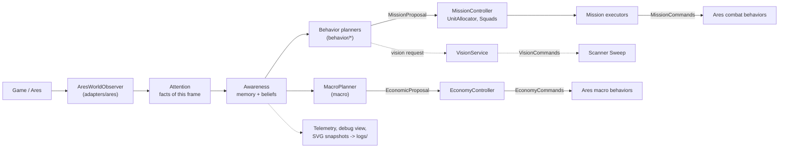

# Overview

A Terran StarCraft II bot built on [ares-sc2](https://github.com/AresSC2/ares-sc2),
which itself builds on python-sc2. Ares provides the generic mechanics --
pathing grids, unit roles, combat and macro behaviors, the build-order runner,
map analysis. The bot provides the decisions: what is true about the game,
what is worth doing, which units do it, and what to buy.

Every game currently opens with the `BattleMech` build (Reaper expand into
Hellions, a cloaked Banshee, then Tanks and Cyclones on three bases). See
[macro/builds.md](macro/builds.md).

## The pipeline

Information flows one way, from the game to commands, through layers that
each own one kind of decision.



In words:

1. **Observe.** `AresWorldObserver` is the only code that reads Ares' mutable
   state. It copies one frame into immutable `WorldFacts`: units, structures,
   economy counts, map topology, visibility.
2. **Attend.** `AttentionSnapshot` wraps those facts. Attention holds nothing
   that is not observable in this frame.
3. **Believe.** `AwarenessService` keeps memory across frames and derives
   beliefs: where enemy bases and armies are and how sure we are, whether we
   are ahead in economy and army, how risky spending is, how threatened each
   base is, a spatial field over the map, and a territory reading.
4. **Propose.** Six behavior planners read Attention and Awareness and
   propose missions. `MacroPlanner` reads the same snapshots and proposes
   purchases. Nobody commands anything yet.
5. **Arbitrate.** `MissionController` admits missions and `UnitAllocator`
   leases units to them by priority and utility. `EconomyController` admits
   purchases against the bank.
6. **Execute.** Each admitted mission's executor issues commands for its
   leased units through a port; the Ares adapters turn those into Ares
   behaviors. Funded purchases go through the economy port the same way.
7. **Explain.** Every decision is logged with a reason. Telemetry, the
   in-game debug view and SVG snapshots read the same snapshots and change
   nothing.

[frame-lifecycle.md](frame-lifecycle.md) walks through one frame in order.

## Two domains, one read side

```text
                 Attention / Awareness
                          |
            +-------------+-------------+
            |                           |
        behavior                      macro
     (bot/behavior)                (bot/macro)
            |                           |
     MissionProposal             EconomicProposal
            |                           |
    MissionController           EconomyController
    (engine/missions)           (engine/economy)
            |                           |
   units already on the map    minerals, gas, supply, production
```

**Behavior** governs units already on the map: missions, squads, leases.
**Macro** governs what to spend on: units to train, structures, add-ons,
bases. They share the read side and nothing else -- neither imports the other,
and neither engine imports either domain. A behavior may read what exists (how
many Banshees are alive); it never asks for one to be built. Macro never names
a unit tag, mission or squad.

## Packages

| Package | Owns | Reads | Produces | Never |
| --- | --- | --- | --- | --- |
| `bot/adapters/ares` | Translation to and from Ares | `bot` (the AresBot), Ares mediator | `WorldFacts`; Ares roles and behaviors | decides anything |
| `bot/adapters/logging` | JSONL and null loggers | -- | files under `logs/` | runs on the ladder (JSONL) |
| `bot/ports` | Protocols: `MissionCommands`, `EconomyCommands`, `VisionCommands`, `BotLogger` | -- | -- | holds logic |
| `bot/world/attention` | Immutable facts of one frame | -- | `AttentionSnapshot` | remembers or infers |
| `bot/world/awareness` | Memory and beliefs | Attention | `AwarenessSnapshot` | knows missions, leases or cooldowns |
| `bot/domain` | Static unit knowledge: capability profiles, suitability math | -- | `Suitability` | imports anything from `bot`, holds policy |
| `bot/behavior` | Six vertical behaviors: assess, plan, execute | Attention, Awareness | `MissionProposal`s, commands for leased units, vision requests | allocates units, proposes spend |
| `bot/engine/missions` | Mission admission, lifecycle, unit leases | proposals, own units | `Mission`s, `MissionContext` | names a behavior or mission kind |
| `bot/engine/squads` | Persistent squad identity | allocations | preferred tags | owns or commands units |
| `bot/engine/services` | Capabilities shared by behaviors (active vision) | requests, Attention | vision request results, scans | knows who asked |
| `bot/macro` | What to buy | Attention, Awareness | `EconomicProposal`s, `MacroStatus` | names a unit tag, mission or squad |
| `bot/engine/economy` | Spend admission against a virtual bank | proposals, Attention | `EconomicAction`s | knows units, missions or production policy |
| `bot/strategy` | Strategic objective scoring (shadow, not wired) | `StrategyInputs` | `StrategySnapshot` | imports anything but the standard library |
| `bot/app` | Wiring, frame order, telemetry, debug views | everything | logs, debug drawings, SVGs | holds game rules |

The rules behind this table, and the tests that keep it true, are in
[contracts.md](contracts.md).

## What runs, and how mature it is

| Piece | Status | Notes |
| --- | --- | --- |
| Attention, enemy memory, enemy bases and forces, beliefs, macro posture, base security, spatial field | live | [world/awareness.md](world/awareness.md), [world/spatial-field.md](world/spatial-field.md) |
| Territory (control, frontline, ground security) | sample projection live; regions shadow | computed every second, logged and drawn; bounded sample control/knowledge is projected onto the generic spatial field for Map Control, while no behavior reads territory types or the region graph ([world/territory.md](world/territory.md)) |
| Strategy | shadow, not wired | pure library with tests; `compose_bot` never builds it and nothing logs it ([strategy.md](strategy.md)) |
| Standing army, map control, defense, Reaper harass, Banshee harass, scouting | live | [behavior/README.md](behavior/README.md) |
| Defense roles (Tanks siege on an anchor, everything else screens) | pilot | inside `DefendBaseExecutor` only ([behavior/defense.md](behavior/defense.md)) |
| `CombatRole.SIEGE_ANCHOR` | defined, unused | no behavior asks for it yet |
| Active vision | live | one provider, Scanner Sweep ([engine/vision.md](engine/vision.md)) |
| Macro and economy | live | upgrades are vocabulary only: research comes from the opening YAML ([macro/macro-planner.md](macro/macro-planner.md)) |
| Openings | live | every cycle is pinned to `BattleMech` ([macro/builds.md](macro/builds.md)) |

## Design principles

These are the choices every layer follows; each component doc shows how.

- **Propose, then commit.** A planner argues for work; a controller decides.
  Exactly one authority per decision: `MissionController` for mission
  lifecycle, `UnitAllocator` for unit leases, `EconomyController` for spend,
  the Ares adapters for game commands.
- **Facts are not beliefs.** Attention is what this frame shows. Awareness
  keeps what was last known apart from how much it still describes the
  present: a value and a confidence, never folded into one number.
- **Unknown is not empty.** Not having seen the enemy is never evidence that
  the enemy is weak. Confidence is 0 where nobody has looked.
- **Continuous scores, physical constraints.** Units and targets are ranked
  by continuous utility; only physical facts ("cannot shoot air") are hard
  constraints. There are no arbitrary cut-offs.
- **Stabilize the estimate first.** Flapping is fixed where the belief is
  formed (persistent, uncertainty-aware estimates). Hysteresis is only the
  last layer.
- **Behaviors are vertical.** One folder per behavior, the same four files in
  each, so understanding one behavior means opening one directory.
- **Every transition has a reason.** Proposals, admissions, leases, phases and
  purchases are logged with a machine-readable reason. Logs are local only;
  the ladder build writes nothing.
- **Reuse Ares for mechanics.** Pathing, micro primitives, spawning, building
  placement and the build runner come from Ares; the bot does not reimplement
  them.

## Glossary

| Term | Meaning |
| --- | --- |
| Attention | Immutable facts of the current frame (`AttentionSnapshot`, `WorldFacts`). |
| Awareness | Memory and derived beliefs (`AwarenessSnapshot`). |
| Confidence | How much a remembered reading still describes the present, 0..1. Never the size of the thing measured. |
| Sighting | One enemy unit or structure as last seen, kept while Ares reports its tag. |
| Force cluster | Remembered enemy combat units grouped by proximity, with strength and confidence. |
| Belief (economy / army) | A running estimate of the enemy's workers or army supply, and the probability that we are ahead. |
| Macro posture | `DEFENSE`, `BALANCED`, `GREED`, `RECOVERY`: how risky spending is right now. |
| Combat posture | `TURTLE`, `BALANCED`, `PRESSURE`: where the standing army should sit. Separate axis from macro posture. |
| Proposal | A planner's argument for work (`MissionProposal`) or for a purchase (`EconomicProposal`). |
| Mission | An admitted `MissionProposal`, with a lifecycle and leased units. |
| Deduplication key | Identifies "the same work" across proposals; one live mission (or economic action) per key. |
| FINITE / STANDING | A one-shot mission, or a responsibility re-declared every cadence and updated in place. |
| Lease | Exclusive ownership of one unit by one mission, held by `UnitAllocator`. |
| Preemption | A higher-priority mission taking a leased unit: needs priority >= owner priority + margin (10) + the owner's preemption cost, after the owner's commitment window. |
| Utility | How much a mission wants one particular unit, 0..1. Zero means never requested. |
| Suitability | Capability-based utility: how well a unit type's profile fits a role. |
| Role | A job described as a capability requirement (`MOBILE_CONTROL`, `SIEGE_ANCHOR`), never a unit list. |
| Squad | Persistent identity of units that belong together (`main_army`, `map_control`, `banshee_harass`). |
| Cadence | The minimum time between two proposals from one planner. |
| Goal set | A build's convergence targets: army composition, production structures, add-ons, upgrades (`MacroGoalSet`). |
| Doctrine | The unit types a goal set may produce (`BIO`, `MECH`). Macro only. |
| Opening | The deterministic Ares build order at game start (`terran_builds.yml`). |
| Protected cost | What the opening's next two steps cost; macro may not spend it. |
| Shadow mode | Computed and logged, read by no decision; guarded by a test. |
