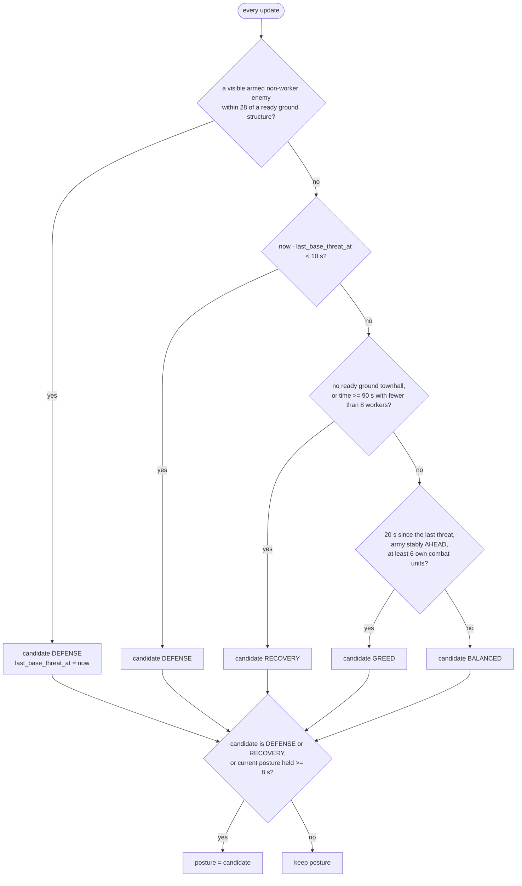

# Awareness

Awareness is what the bot believes: memory kept across frames and readings
derived from it. It describes the world -- what was observed, what is still
believed, and how reliable that belief is -- and decides nothing. No mission
state, lease or cooldown enters it.

Source: `bot/world/awareness/` (`service.py`, `snapshot.py`, `posture.py`,
`enemy/`, `belief/`, `bases/`, `spatial/`, `territory/`).

## The service

`AwarenessService.update(attention) -> AwarenessSnapshot` runs once per
frame. The order of its steps is in
[frame-lifecycle.md](../frame-lifecycle.md#step-3-inside-awarenessserviceupdate).

| Constructor argument | Default | Used for |
| --- | --- | --- |
| `location_stale_after` | 90 s (the game passes `IntelConfig.location_stale_after`) | enemy location freshness |
| `own_base_threat_radius` | 28 | `ThreatAssessment` near-base counts, macro posture |
| `defense_release_after` | 10 s | macro posture |
| `posture_min_hold` | 8 s | macro posture |
| `greed_safe_after` | 20 s | macro posture |
| `enemy_base_stale_after` | 120 s | enemy base slot freshness |
| `enemy_base_heuristics`, `enemy_force_heuristics` | defaults | enemy bases and forces |
| `economy_belief_config`, `army_belief_config` | defaults | beliefs |
| `spatial_model_config`, `territory_config` | defaults | spatial field, territory |
| `logger` | none | `spatial.perf`, `territory.perf` only |

## The snapshot

| `AwarenessSnapshot` field | Type | Read by |
| --- | --- | --- |
| `enemy.sightings` | `tuple[EnemySighting]` | Defense (vision for lost attackers), telemetry |
| `enemy.locations` | `tuple[EnemyLocationKnowledge]` | scouting, scouting vision, raid fallbacks, `MissionController` (early cancellation) |
| `enemy.bases` | `EnemyBaseAwareness` | Reaper and Banshee target scoring, territory, SVG |
| `enemy.forces`, `enemy.main_force` | `EnemyForceAwareness` | raid army risk, spatial threat, territory, SVG |
| `relative_strength` | `RelativeStrength` | telemetry |
| `threat` | `ThreatAssessment` | standing (pressure), defense assessment, Banshee assessment, telemetry |
| `updated_at` | float | telemetry |
| `macro_posture` | `MacroPosture` | macro priorities and expansion, map control retreat, standing posture |
| `bases` | `BaseAwareness` | defense, map control, Banshee retreat, standing anchor, spatial field, territory |
| `economy`, `army` | `EconomyBelief`, `ArmyBelief` | standing posture (army), macro posture (army), telemetry |
| `spatial` | `SpatialField` | map control, territory, debug view |
| `territory` | `TerritorySnapshot` | telemetry and debug only (shadow) |
| `belief_changes` | `tuple[str]` | `FrameProcessor` logs them |

Readings with their own documents: [base-security.md](base-security.md),
[spatial-field.md](spatial-field.md), [territory.md](territory.md).

## Confidence

Every reading keeps two things apart: a **value** (what we believe existed,
from the last information known) and a **confidence** (how much that still
describes the present). Awareness never folds one into the other; a behavior
decides how to combine them.

- Something visible now has confidence 1.
- An old reading loses confidence by the rule of its concept (table below).
- The absence of any known source, where nobody has looked, has confidence 0.
  `enemy_threat == 0` at confidence 0 means "unknown", not "safe".
- Every confidence Awareness produces lies in [0, 1].
- A remembered enemy source only raises confidence where its influence is
  material (kernel weight above 0.01); beyond that the place stays unknown.

| Reading | Control | Confidence |
| --- | --- | --- |
| a place in vision, empty | `UNCONTROLLED` | 1 |
| a place never seen, no known source | `UNCONTROLLED` | 0 |
| a place out of vision, remembered source nearby | from the influences | bounded by the source |
| a forgotten source (confidence 0) | adds no influence | 0 without other evidence |

How each kind of evidence ages -- different on purpose:

| Evidence | Decay |
| --- | --- |
| Enemy locations (`enemy_main`, `enemy_natural`) | linear to 0 over 90 s |
| Enemy base slot status | linear to 0 over 120 s since the slot was last looked at; `CONFIRMED` stays as the last known value |
| Base defenders | units linear over 30 s, structures over 180 s; "no defender seen" is as current as the last look at the slot |
| Enemy force clusters | linear over 30 s (Ares' own memory window), while position uncertainty grows up to 30 tiles; clusters at confidence 0 are never the main force and never returned by `near()` |
| Aggregate economy/army beliefs | exponential time constants; a reading is forgotten on τ 90 s |
| Territory observation | linear over 30 s after the last look |

**Unknown sighting time.** If the first frame that shows an enemy unit
already has it as Ares memory, the bot cannot know when it was actually seen.
`EnemySighting.last_seen_known = False` records that: the unit gets no fresh
confidence, does not inform the economy or army belief, and forms only a
zero-confidence cluster. Once it is seen, its timestamp becomes known.

## Enemy memory

### Sightings (`enemy/memory.py`)

`EnemyKnowledge` turns `enemy_units` and `enemy_structures` into
`EnemySighting`s: `tag`, `unit_type`, `last_position`, `first_seen_at`,
`last_seen_at` (updated only while visible), `visible_now`, weapons,
`is_structure`, `is_worker`, `supply_cost`, `last_seen_known`. A sighting
lives exactly as long as Ares keeps reporting the tag -- destroyed, or
forgotten by Ares about 30 s after leaving vision.

Derived flags: `is_combat_unit` (a mobile armed non-worker) and
`is_static_defense` (an armed structure). `EnemyAwareness.known_base_count`
counts remembered enemy townhalls; `known_structure_count` every remembered
structure.

### Roster (`enemy/roster.py`)

`EnemyRoster` keeps every mobile enemy unit's last sighting until its tag
appears in `WorldFacts.dead_unit_tags` -- an army that walked into the fog
still exists. It returns `alive` (for the beliefs) and `died` this update (for
the loss ledger). A tag is counted dead once even if reported twice. Losses no
one saw (a morph, a merge) are left to the beliefs, which let old entries fade
by attrition.

### Locations

For each `MapFacts.observations` entry the service remembers when it was last
visible and reports `EnemyLocationKnowledge(key, position, last_observed_at,
age, confidence, stale_after, is_stale)`: `confidence = max(0, 1 - age / 90)`,
`is_stale` when never observed or `age >= 90`.

### Enemy base slots (`enemy/bases/memory.py`)

`EnemyBaseMemory` tracks every expansion slot except those within 6 tiles of
one of our bases:

- When the slot is visible, it is `CONFIRMED` if a visible enemy townhall
  stands within 6 tiles, otherwise `EMPTY`, and its check time is updated.
- Out of vision, its status is kept and only ages; never seen is `UNKNOWN`.
- `confidence = max(0, 1 - age / 120)`, `is_stale` when never checked or
  `age >= 120`.

Two coverage summaries:

- `scouting_coverage` -- share of slots checked and not stale; 1.0 when the map
  has no slots (a compatibility fallback).
- `enemy_territory_coverage` -- `sum(confidence of CONFIRMED slots) /
  (confirmed + 2)`. The 2 stands for the places no confirmed base covers: a
  base not found yet and the army away from home. With nothing confirmed there
  is no information at all; an empty slot is not information about the enemy.

### Enemy base assessment (`enemy/bases/assessor.py`)

`EnemyBaseAssessor` turns each slot into an `EnemyBaseAssessment`. Weights in
`EnemyBaseHeuristics`:

```text
economic_value = 0 unless CONFIRMED
               = 0.4 + 0.6 * min(1, workers / 16)

workers        recounted whenever any remembered enemy worker within 10 of the slot is visible:
               the count is every remembered worker within 10 (a sweeping scout accumulates
               the whole line); kept after Ares forgets them; an EMPTY slot forgets its count

defender value (every remembered combat unit or static defense within 12 of the slot)
               combat unit: its supply (0.25 when it has none); static defense: 2.0
               counts in full toward each domain it can attack

air_defense    = min(1, sum(anti-air values) / 8)
ground_defense = min(1, sum(anti-ground values) / 8)
*_confidence   = sum(value * freshness) / sum(value)      freshness: units 30 s, structures 180 s
               = slot confidence when no defender was seen
```

Values never decay with age; only confidences do. `EnemyBaseAwareness`
offers `get(key)` and `confirmed`.

### Enemy force clusters (`enemy/forces/`)

`EnemyForceTracker` regroups remembered enemy **combat units** (never workers
or structures) from scratch every frame; only cluster ids carry over.

```text
grouping          single linkage within 7 tiles (grid-bucketed, so each unit is compared
                  with its own and the 8 neighbouring cells)
combat_strength   sum of supply (0.25 for zero-supply fighters); anti_air / anti_ground: the part
                  of it that can attack each domain
center, radius    centroid of last positions; farthest member
age               per member: now - last_seen_at, or 30 s when the sighting time is unknown
confidence        sum(value * freshness(age, 30 s)) / strength
position_uncertainty = min(30, 3 * strength-weighted mean age)
identity          1) the previous cluster (or one departed within 15 s) sharing the most units
                  2) otherwise an unclaimed one reported within 12 tiles, larger groups first
                  3) otherwise a new id
main_force        max over clusters with confidence > 0 of strength * (0.35 + 0.65 * confidence)
```

`EnemyForceCluster.distance_to(position)` subtracts the radius and the
position uncertainty, so a stale cluster is "possibly near" over a wider
area. `EnemyForceAwareness.near(position, distance)` returns clusters with
confidence above 0 within that distance, nearest first.

Every number above lives in `enemy/heuristics.py` and can be replaced through
`AwarenessService(enemy_base_heuristics=..., enemy_force_heuristics=...)`.

## Economy and army beliefs

`AwarenessSnapshot.economy` and `.army` answer "are we ahead?" without
trusting a single frame. Each axis compares our own number (workers; combat
supply) with a running estimate of the enemy's, in three layers.

### 1. Evidence

- The roster: every enemy unit seen and not seen dying.
- `LossTracker`: the supply and workers each side lost, decaying on τ 120 s
  as both rebuild. Our losses are tags reported dead that were ours last
  frame (a unit loading into a transport does not count). The **trade** (ours
  minus theirs) moves the size we assume for an enemy we cannot see.

From the roster, `roster_evidence` sums each entry's amount (supply, or 1 per
worker) with two decays:

```text
known     = sum(amount * exp(-age / 300))                       attrition: nobody saw it die
freshness = sum(amount * exp(-age / 300) * exp(-age / 20)) / known     0 when nothing is known
```

Only entries with a known sighting time count.

### 2. Estimate (`belief/estimate.py`)

The enemy quantity is `known` plus an unseen remainder. The belief is carried
as a **gap** from a prior, scaled by the prior's size, with how informative
the reading behind it was:

```text
prior        army:    our total supply + supply trade - believed enemy workers
             economy: our workers + worker trade
scale        army:    max(our total supply, 8)       economy: max(prior, 8)
reading      army:    known                          economy: max(known workers, confirmed bases * 16)
information  enemy_territory_coverage * freshness    (economy: when the base projection is the
                                                       reading, freshness is exp(-age of the latest
                                                       check of a confirmed base / 20))
quality      min(information, 0.85)
observed_gap (reading - prior) / scale

each update, elapsed dt:
  held = previous information * exp(-dt / 90)
  if quality >= held:
      f    = 1 - exp(-dt / 5)
      held = held + (quality - held) * f
      gap  = gap  + (observed_gap - gap) * f

mean   = max(reading, prior + scale * held * gap)
spread = (1 - held) * 0.35 * scale + held * 0.15 * max(reading, 8)
confidence = held / 0.85
```

- A reading less informative than what is remembered leaves the gap alone:
  repeated weak glimpses never add up to certainty.
- Because the gap is relative, the belief follows both sides' growth.
- With nothing scouted, the enemy is assumed our size.
- All rates are time constants, so the belief does not depend on game step.

Economy uses tighter spreads (own and evidence 5 %, noise floor 2): a worker
count is the economy itself.

### 3. Decision (`belief/relative.py`)

```text
advantage = P(ours > known + unseen)
            unseen ~ normal cut at zero, with mean (mean - known) and spread `spread`,
                     integrated over 24 quantiles
            our side's spread = hypot(0.15 * ours, 0.15 * known, 4)   (economy: 0.05, 0.05, 2)
```

Doubt is part of the number: an unscouted enemy reads near 0.5.

| `RelativeBeliefConfig` | Value |
| --- | --- |
| enter `AHEAD` / stay `AHEAD` | `advantage >= 0.75` / `>= 0.60` |
| enter `BEHIND` / stay `BEHIND` | `advantage <= 0.25` / `<= 0.40` |
| a new position must hold for | economy 15 s, army 8 s |
| except `BEHIND` at | `advantage <= 0.10`: believed at once |

- Before an axis has any evidence it is `UNKNOWN`. The army is informed once
  any slot was checked or a combat unit is on the roster; the economy also by
  a known worker or a confirmed base. `UNKNOWN` never replaces a believed
  position.
- Staleness widens the spread toward the prior, which pulls `advantage`
  toward 0.5 and the position toward `EVEN`; it never freezes a position.
- `RelativeAssessment` exposes `raw_state` (this tick's reading),
  `stable_state` (the believed one), `confidence`, `advantage`, and a
  `reason` only on the tick the stable state changes.

A stable change becomes one `belief_changes` message, e.g. `[Awareness] ARMY:
EVEN -> AHEAD (p_ahead=0.78, confidence=0.52) | own 40 vs enemy ~28±6
supply`, logged as `awareness.belief_changed`; it is not sent to game chat.

`EconomyBelief` also carries `own_bases`, the enemy's observed/known/estimated
workers with uncertainty, and confirmed bases. `ArmyBelief` carries the
enemy's observed/known/estimated supply with uncertainty and the known
composition by unit type.

## Relative strength and threat

`RelativeStrength.score = (own combat supply - estimated enemy supply) / (sum
of both)`, with the army belief's confidence. When neither side has supply
data (synthetic tests), it falls back to visible unit counts.

`ThreatAssessment` counts, this frame:

| Field | Counts |
| --- | --- |
| `visible_enemy_units` | every visible enemy unit |
| `known_anti_air_units` | remembered sightings that can attack air |
| `visible_anti_air_units` | visible enemy units that can attack air |
| `visible_enemy_combat_units` | visible armed non-workers |
| `near_own_base_enemy_units` | visible enemy units within 28 of a ready, landed own structure (or our start) |
| `near_own_base_enemy_combat_units` | the armed non-workers among them |

## Macro posture

`derive_macro_posture` (`posture.py`) says how risky spending is right now.
It is policy computed inside Awareness because macro, map control and the
standing army all read it.



Danger wins at once; leaving it, or moving between `BALANCED` and `GREED`,
waits for the minimum hold. The game starts `BALANCED`. What each posture does
to spending is in [macro/macro-planner.md](../macro/macro-planner.md#posture-adjusted-priorities).

## Known gaps

- The sighting time of a unit already in Ares memory is unknown (see
  [attention.md](attention.md#known-gaps)).
- `BaseSecurityLevel.SAFE` means "no visible threat near the base right now",
  with no confidence; it is not proof the area was watched. Topological
  exposure is `territory` ground security, in shadow mode.
- `relative_strength` is only logged; decisions read the army belief.
