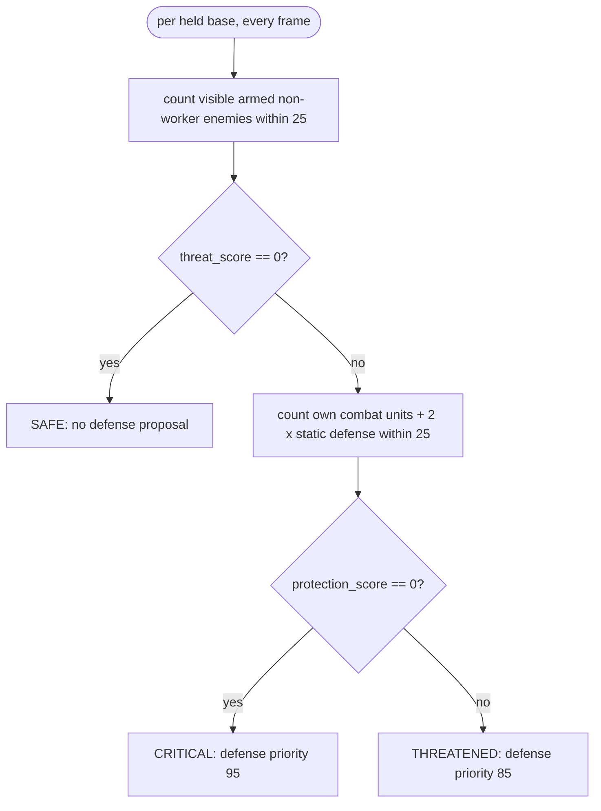

# Base security

A per-base reading of "what do we hold and how threatened is it", so Defense
can react to each base on its own instead of treating the army as defending
one global point. The base inventory is a fact (`BaseSnapshot`, Attention);
the threat/protection reading is a belief (`BaseAssessment`, Awareness).

Source: `bot/world/attention/facts/base_facts.py`,
`bot/world/attention/facts/world_facts.py` (`WorldFacts.bases`),
`bot/world/awareness/bases/`.

## Held bases

`WorldFacts.bases` yields one `BaseSnapshot(base_id, position, is_main,
townhall)` per own townhall: `base_id = "base:<tag>"`, `is_main` within 3 of
our start. With no townhall observed it yields the placeholder `own_base` at
our start. See [attention.md](attention.md#bases).

## `BaseSecurityAssessor`

Stateless: recomputed from visible units every frame, no memory.

```text
threat_score      = number of visible, armed, non-worker enemy units within 25 of the base
protection_score  = number of own armed non-worker units within 25
                  + 2 * own Bunkers, Missile Turrets and Planetary Fortresses within 25
nearest_threat    = position of the closest counted enemy

security = SAFE        if threat_score == 0
         = CRITICAL    if threat_score > 0 and protection_score == 0
         = THREATENED  otherwise
```

`BaseAssessment` carries `base_id`, `position`, `is_main`, both scores,
`security` and `nearest_threat_position`; `needs_defense` is `security !=
SAFE`. `BaseAwareness` offers `get(base_id)`, iteration, and `threatened`
(every base that needs defense).

Only enemy **units** count: a proxy Photon Cannon next to a base is not a
threat to it. Protection counts every nearby own combat unit, whichever
mission holds it.



## Why protection never suppresses a proposal

An earlier version required `protection_score < threat_score` to call a base
threatened. That dropped real defense proposals: a Reaper already committed
to a scout happened to stand near the base when an enemy arrived, counted as
protection, and the defense mission that should have preempted it was never
proposed. The assessor cannot know that a nearby unit is leased elsewhere --
only `UnitAllocator` knows, after planners propose. So any real threat
yields a proposal; protection only chooses `CRITICAL` or `THREATENED` and
sizes how many defenders to ask for ([behavior/defense.md](../behavior/defense.md)).

## Who reads it

| Reader | Uses |
| --- | --- |
| `DefenseAssessor` / `DefensePlanner` | `threatened`, scores, `nearest_threat_position` |
| `DefendBaseExecutor` | `get(target_key)` for the siege anchor origin |
| `MapControlAssessor` / `MapControlExecutor` | `threatened` as strategic danger; `SAFE` bases as retreat targets |
| `BansheeHarassExecutor` | `SAFE` bases as the regroup point |
| `StandingAssessor` | bases ordered by distance from our start (anchor), `threatened` (combat posture) |
| `SpatialFieldModel` | base positions for the friendly value |
| `TerritoryAssessor` | base positions as friendly infrastructure; each base placed in its region |

## Deliberately not built

- Hysteresis on `BaseSecurityLevel`: a scout wandering in and out of 25 tiles
  flaps the level. `MacroPosture` shows the pattern if it is needed.
- Confidence: `SAFE` is instantaneous and unobserved space reads `SAFE`.
- Combat-simulation scores instead of unit counts.
- Worker rushes: enemy workers never count as a threat.
- Enemy structures as threats.
- Tracking whether a base already has a live defense mission, to taper the
  requested size while reinforcements arrive.
